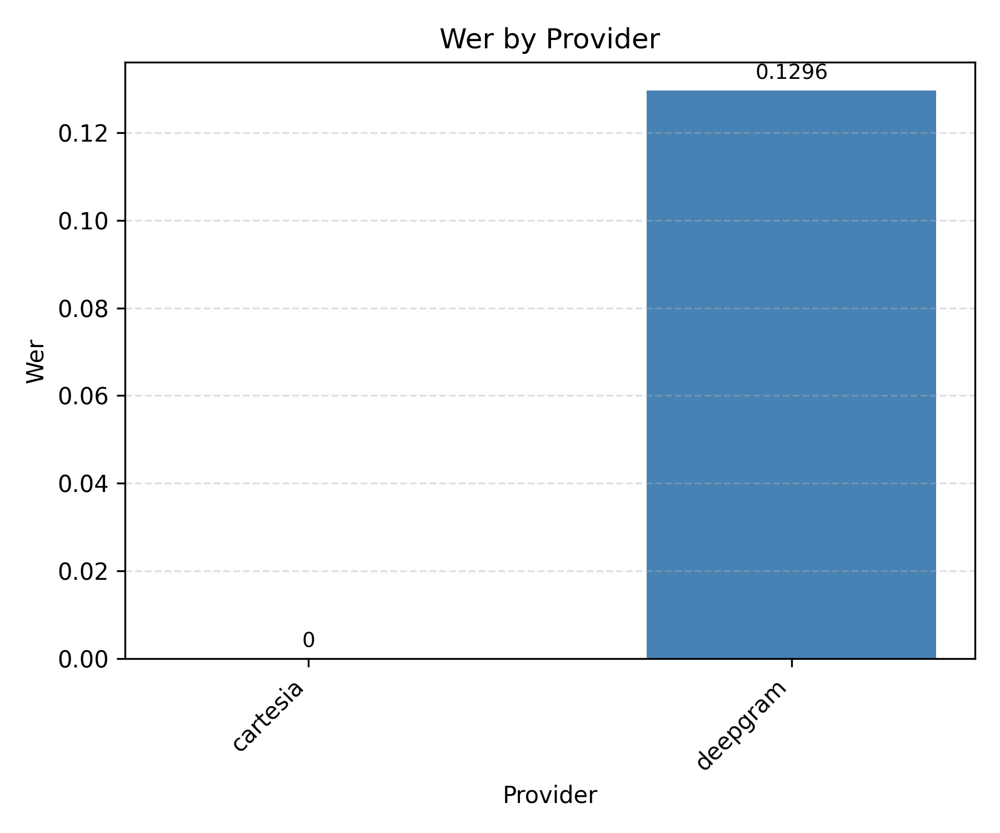
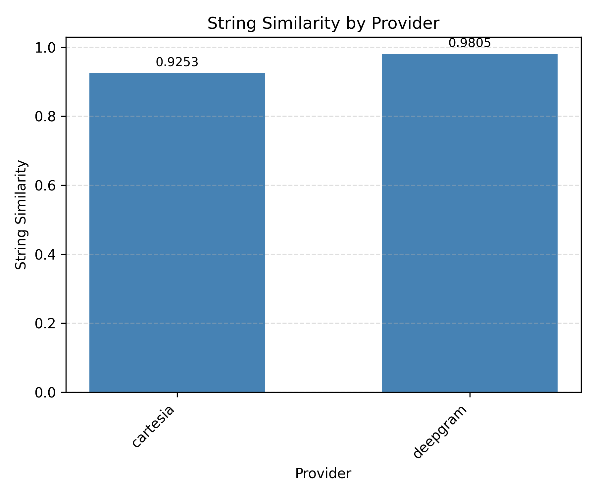
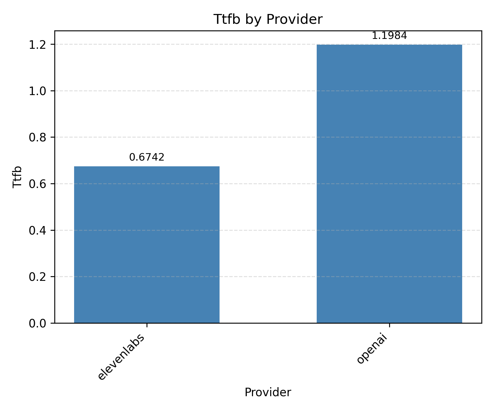
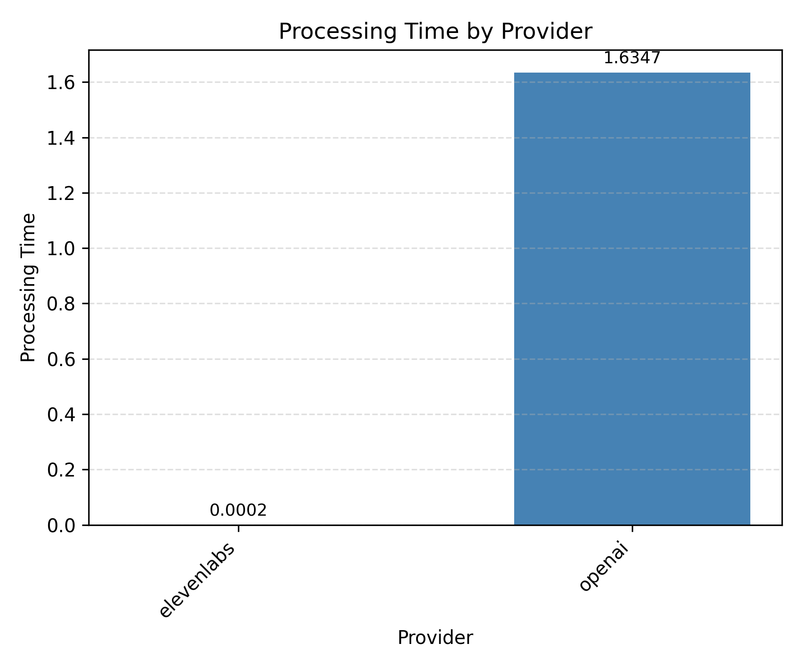

# Pense

An open-source simulation and testing framework for voice agents.

With Pense, you can move from a slow, manual testing to a fast, automated, and repeatable testing process:

- Evaluate different components of your voice agents across multiple vendors in isolation
- Create comprehensive test suites that verify both conversational responses and tool usage
- Simulate entire conversations spanning thousands of scenarios across multiple user personas

Pense is built on top of [pipecat](https://github.com/pipecat-ai/pipecat), a framework for building voice agents.

## Setup

We use `uv` to manage the dependencies. Make sure you have it installed on your system.

Create the virtual environment and install the dependencies.

```bash
uv sync --frozen
```

Copy `.env.example` to `.env` and fill in the API keys for the providers you want to evaluate. All modules (agent, stt, tts, llm) will use this single `.env` file:

## Speech To Text (STT)

To evaluate different STT providers, first make sure to organize the input data in the following structure:

```bash
├── /path/to/data
│   └── stt.csv
│   └── audios/
│       └── audio_1.wav
│       └── audio_2.wav
```

`stt.csv` should have the following format:

```csv
id,text
audio_1,"Hi"
audio_2,"Madam, my name is Geeta Shankar"
```

All audio files should be in WAV format and placed in the `audios/` folder. The file names should match the `id` column in `stt.csv`.

Set the required environment variables for the STT provider you want to evaluate:

```bash
# For Sarvam
export SARVAM_API_KEY=your_key

# For Deepgram
export DEEPGRAM_API_KEY=your_key

# For OpenAI
export OPENAI_API_KEY=your_key

# For Google
export GOOGLE_APPLICATION_CREDENTIALS=/path/to/credentials.json
```

```python
import asyncio
from pense.stt import eval, leaderboard

# Run STT evaluation
asyncio.run(eval(
    provider="deepgram",  # deepgram, openai, cartesia, google, gemini, sarvam, elevenlabs, smallest, groq
    language="english",   # english, hindi, or kannada
    input_dir="/path/to/data",  # should contain stt.csv and audios/ folder
    output_dir="/path/to/output",
    debug=True,           # optional: run on first 5 audio files only
    debug_count=5,        # optional: number of files in debug mode
))
```

You can use the sample inputs provided in [`pense/stt/examples/sample_input`](pense/stt/examples/sample_input) to test the evaluation script.

Sample output:

```
--------------------------------
Processing audio [1/2]: audio_1.wav
Transcript: Hi
--------------------------------
Processing audio [2/2]: audio_2.wav
Transcript: Madam, my name is Geeta Shankar
```

The output of the evaluation script will be saved in the output directory.

```bash
/path/to/output/<provider>
├── results.log
├── results.csv
└── metrics.json
```

`results.csv` will have the following columns:

```csv
id,gt,pred,wer,string_similarity,llm_judge_score,llm_judge_reasoning
3_1_english_baseline,"Please write Rekha Kumari, sister.", Please write Reha Kumari's sister.,0.4,0.927536231884058,False,"The source says 'Rekha Kumari, sister' which indicates the name is 'Rekha Kumari' and she is a sister. The transcription says 'Reha Kumari's sister', which changes the name to 'Reha Kumari' and refers to her sister, not Rekha Kumari herself. The name is different ('Rekha' vs 'Reha') and the relationship is also changed (from identifying Rekha Kumari as the sister to referring to the sister of Reha Kumari). Therefore, the values do not match."
```

The definition of all the metrics we compute are stored in [`pense/stt/metrics.py`](pense/stt/metrics.py).

`metrics.json` will have the following format:

```json
{
  "wer": 0.12962962962962962,
  "string_similarity": 0.8792465033551621,
  "llm_judge_score": 1.0
}
```

- `wer`: Mean Word Error Rate (WER) across all audio files
- `string_similarity`: Mean string similarity score across all audio files
- `llm_judge_score`: Mean LLM Judge score across all audio files

`results.log` contains the full logs of the evaluation script including terminal output and debug information.

You can checkout [`pense/stt/examples/sample_output`](pense/stt/examples/sample_output) to see a sample output of the evaluation script.

**Function Parameters:**

| Parameter | Type | Required | Default | Description |
|-----------|------|----------|---------|-------------|
| `provider` | str | Yes | - | STT provider: deepgram, openai, cartesia, google, gemini, sarvam, elevenlabs, smallest, groq |
| `input_dir` | str | Yes | - | Path to input directory containing stt.csv and audios/ folder |
| `output_dir` | str | No | "./out" | Path to output directory for results |
| `language` | str | No | "english" | Language of audio files: english, hindi, or kannada |
| `input_file_name` | str | No | "stt.csv" | Name of input CSV file |
| `debug` | bool | No | False | Run on first N audio files only |
| `debug_count` | int | No | 5 | Number of files in debug mode |
| `ignore_retry` | bool | No | False | Skip retry if not all audios processed |
| `overwrite` | bool | No | False | Overwrite existing results instead of resuming from checkpoint |

After you have multiple provider runs under `/path/to/output`, you can summarize accuracy and latency in one shot:

```python
from pense.stt import leaderboard

leaderboard(
    output_dir="/path/to/output",
    save_dir="./leaderboards"
)
```

The script scans each run directory, reads `metrics.json` and `results.csv`, then writes `stt_leaderboard.xlsx` plus individual metric charts (e.g., `wer.png`, `string_similarity.png`, `llm_judge_score.png`) inside the save directory so you can compare providers side-by-side (`pense/stt/leaderboard.py`).

You can checkout [`pense/stt/examples/leaderboard`](pense/stt/examples/leaderboard) to see a sample output of the leaderboard script.

<table>
  <tr>
    <td></td>
    <td></td>
    <td></td>
  </tr>
</table>

## Text To Speech (TTS)

To evaluate different TTS providers, first prepare an input CSV file with the following structure:

```csv
id,text
row_1,hello world
row_2,this is a test
```

The CSV should have two columns: `id` (unique identifier for each text) and `text` (the text strings you want to synthesize into speech).

Set the required environment variables for the TTS provider you want to evaluate:

```bash
# For Cartesia
export CARTESIA_API_KEY=your_key

# For OpenAI
export OPENAI_API_KEY=your_key

# For ElevenLabs
export ELEVENLABS_API_KEY=your_key

# For Google
export GOOGLE_APPLICATION_CREDENTIALS=/path/to/credentials.json
```

```python
import asyncio
from pense.tts import eval, leaderboard

# Run TTS evaluation
asyncio.run(eval(
    provider="google",      # cartesia, openai, groq, google, elevenlabs, sarvam
    language="english",     # english, hindi, or kannada
    input="/path/to/input.csv",
    output_dir="/path/to/output",
    debug=True,             # optional: run on first 5 texts only
    debug_count=5,          # optional: number of texts in debug mode
))
```

You can use the sample inputs provided in [`pense/tts/examples/sample.csv`](pense/tts/examples/sample.csv) to test the evaluation script.

Sample output:

```
--------------------------------
Streaming text [1/2]: <text_1>
Creating new audio file at /path/to/audio_1.wav
Appending audio chunk to /path/to/audio_1.wav
--------------------------------
Streaming text [2/2]: <text_2>
Creating new audio file at /path/to/audio_2.wav
Appending audio chunk to /path/to/audio_2.wav
```

The output of the evaluation script will be saved in the output directory.

```bash
/path/to/output/provider
├── audios
│   ├── 1.wav
│   ├── 2.wav
├── logs
├── results.log
├── results.csv
└── metrics.json
```

`results.csv` will have the following columns:

```csv
id,text,audio_path,llm_judge_score,llm_judge_reasoning
row_1,hello world,./out/audios/1.wav,True,"The provided audio says 'hello world'. The pronunciation is clear, and the words match exactly."
row_2,this is a test,./out/audios/2.wav,True,"The audio clearly says 'this is a test' without any deviations or mispronunciations."
```

`metrics.json` will have the following format:

```json
{
  "llm_judge_score": 1.0,
  "ttfb": {
    "mean": 0.3538844585418701,
    "std": 0.026930570602416992,
    "values": [0.3808150291442871, 0.3269538879394531]
  },
  "processing_time": {
    "mean": 0.00022804737091064453,
    "std": 2.7060508728027344e-5,
    "values": [0.0002009868621826172, 0.0002551078796386719]
  }
}
```

- `llm_judge_score`: Mean LLM Judge score across all audio files
- `ttfb`: Time to First Byte in seconds (mean, std, and per-text values)
- `processing_time`: Time taken by the service to respond in seconds (mean, std, and per-text values)

`logs` contain the full logs of the evaluation script including all the pipecat logs whereas `results.log` contains only the terminal output of the evaluation script as shown in the sample output above.

You can checkout [`pense/tts/examples/sample_output`](pense/tts/examples/sample_output) to see a sample output of the evaluation script.

**Function Parameters:**

| Parameter | Type | Required | Default | Description |
|-----------|------|----------|---------|-------------|
| `input` | str | Yes | - | Path to input CSV file containing texts to synthesize |
| `provider` | str | No | "google" | TTS provider: cartesia, openai, groq, google, elevenlabs, sarvam |
| `language` | str | No | "english" | Language: english, hindi, or kannada |
| `output_dir` | str | No | "./out" | Path to output directory for results |
| `debug` | bool | No | False | Run on first N texts only |
| `debug_count` | int | No | 5 | Number of texts in debug mode |
| `port` | int | No | 8765 | WebSocket port for TTS bot |

To benchmark several TTS runs, generate the combined workbook and chart with:

```python
from pense.tts import leaderboard

leaderboard(
    output_dir="/path/to/output",
    save_dir="./leaderboards"
)
```

`pense/tts/leaderboard.py` mirrors the STT workflow, emitting `tts_leaderboard.xlsx` plus individual metric charts (e.g., `llm_judge_score.png`, `ttfb.png`, `processing_time.png`) so you can spot which provider balances latency and judge scores best.

You can checkout [`pense/tts/examples/leaderboard`](pense/tts/examples/leaderboard) to see a sample output of the leaderboard script.

<table>
  <tr>
    <td></td>
    <td></td>
    <td></td>
  </tr>
</table>

## LLM tests

To evaluate LLM behavior through test cases, define your system prompt, tools, and test cases directly in Python.

Set the required environment variables:

```bash
# For OpenAI provider
export OPENAI_API_KEY=your_key

# For OpenRouter provider
export OPENROUTER_API_KEY=your_key
```

```python
import asyncio
from pense.llm import tests

# Define your tools
tools = [
    {
        "type": "client",
        "name": "plan_next_question",
        "description": "Plan the next question to ask",
        "parameters": [
            {
                "id": "next_unanswered_question_index",
                "type": "integer",
                "description": "Index of next question",
                "required": True
            },
            {
                "id": "questions_answered",
                "type": "array",
                "description": "List of answered question indices",
                "items": {"type": "integer"},
                "required": True
            }
        ]
    }
]

# Define your test cases
test_cases = [
    {
        "history": [
            {"role": "assistant", "content": "Hello! What is your name?"},
            {"role": "user", "content": "Aman Dalmia"}
        ],
        "evaluation": {
            "type": "tool_call",
            "tool_calls": [
                {
                    "tool": "plan_next_question",
                    "arguments": {
                        "next_unanswered_question_index": 2,
                        "questions_answered": [1]
                    }
                }
            ]
        },
        "settings": {"language": "english"}
    },
    {
        "history": [
            {"role": "assistant", "content": "What is your phone number?"},
            {"role": "user", "content": "Can I skip this question?"}
        ],
        "evaluation": {
            "type": "response",
            "criteria": "The assistant should allow the user to skip giving their phone number."
        }
    }
]

# Run LLM tests
result = asyncio.run(tests.run(
    system_prompt="You are a helpful assistant filling out a form...",
    tools=tools,
    test_cases=test_cases,
    output_dir="./out",
    model="openai/gpt-4.1",
    provider="openrouter",
    run_name="my_test_run",  # optional: name for this run
))
```

**Provider Options:**

- `openai`: Use OpenAI's API directly. Model names should match OpenAI's naming convention (e.g., `gpt-4.1`, `gpt-4o`).
- `openrouter`: Use OpenRouter's API to access multiple LLM providers. Model names should match OpenRouter's naming convention (e.g., `openai/gpt-4.1`, `anthropic/claude-3-opus`).

**Function Parameters:**

| Parameter | Type | Required | Default | Description |
|-----------|------|----------|---------|-------------|
| `system_prompt` | str | Yes | - | System prompt for the LLM |
| `tools` | list | Yes | - | List of tool definitions |
| `test_cases` | list | Yes | - | List of test case dicts with 'history', 'evaluation', optional 'settings' |
| `output_dir` | str | No | "./out" | Output directory for results |
| `model` | str | No | "gpt-4.1" | Model name |
| `provider` | str | No | "openrouter" | LLM provider: openai or openrouter |
| `run_name` | str | No | None | Optional name for output folder |

You can reference the sample configuration in [`pense/llm/examples/tests/config.json`](pense/llm/examples/tests/config.json) for test case structure examples.

The script will run each test case for each variable value (e.g., for each language) and output:

- Pass/fail status for each test case
- Summary statistics showing total passed/failed tests
- Detailed output for failed test cases including the test case, actual output, and evaluation metrics

The output of the script will be saved in the output directory.

```bash
/path/to/output/<test_config_name>/<model_name>
├── results.json
├── metrics.json
├── logs
```

`results.json` contains the detailed results for each test case:

```json
[
  {
    "output": {
      "response": "Sure, I can help you with that.", // either the output is a string response
      "tool_calls": [ // or the output is a list of tool calls - not both simultaneously
        {
          "tool": "plan_next_question",
          "arguments": {
            "next_unanswered_question_index": 2,
            "questions_answered": [1]
          }
        }
      ]
    },
    "metrics": {
      "passed": true
    },
    "test_case": {
      "history": [...],
      "evaluation": {...}
    }
  }
]
```

`metrics.json` contains summary statistics:

```json
{
  "total": 5,
  "passed": 4
}
```

You can checkout [`pense/llm/examples/tests/sample_output`](pense/llm/examples/tests/sample_output) to see a sample output of the evaluation script.

Sample output 1:

```
✅ Test case 1 passed
----------------------------------------
✅ Test case 2 passed
----------------------------------------
🎉 All tests passed!
```

Sample output 2:

```
❌ Test case 1 failed
----------------------------------------
✅ Test case 2 passed
----------------------------------------
✅ Total Passed: 1/2 (50.0%)
❌ Total Failed: 1/2 (50.0%)
Failed test cases:
========================================
History:


assistant: Namaste, I'm Nurse Anitha. To start, what name should I write for you?
user: My name is Geetha Shankar. I am 24 years old and live in Hosahalli village, Holenarasipura taluk, Hassan district


Expected output:
{'type': 'tool_call', 'tool_calls': [{'tool': 'plan_next_question', 'arguments': {'next_unanswered_question_index': 3, 'questions_answered': [1, 2, 4]}}]}
----------------------------------------
Output:
{'response': '', 'tool_calls': [{'tool': 'plan_next_question', 'arguments': {'next_unanswered_question_index': 3, 'questions_answered': [1, 2]}}, {'tool': 'plan_next_question', 'arguments': {'next_unanswered_question_index': 4, 'questions_answered': [1, 2]}}]}
----------------------------------------
Metrics:
{'passed': False}
----------------------------------------
========================================
```

Once you have results for multiple models or scenarios, compile a leaderboard CSV and comparison chart:

```python
from pense.llm import tests

tests.leaderboard(
    output_dir="/path/to/output",
    save_dir="./leaderboard"
)
```

`pense/llm/tests_leaderboard.py` walks every `<test_config_name>/<model>` folder under the output root, computes pass percentages, and saves `llm_leaderboard.csv` plus `llm_leaderboard.png` to the chosen save directory for quick reporting.

`llm_leaderboard.csv` has the following format:

```csv
model,test_config_name,overall
openai__gpt-4.1,80.0,80.0
openai__gpt-4o,100.0,100.0
```

Each column after `model` represents a test config (scenario), and `overall` is the aggregate pass percentage across all configs.

You can checkout [`pense/llm/examples/tests/leaderboard`](pense/llm/examples/tests/leaderboard) to see a sample output of the leaderboard script.


### Low-level API for Single Test Cases

For more control, you can run individual test cases or inference:

```python
import asyncio
from pense.llm import tests

# Run a single test case
result = asyncio.run(tests.run_test(
    chat_history=[
        {"role": "assistant", "content": "Hello! What is your name?"},
        {"role": "user", "content": "Aman Dalmia"}
    ],
    evaluation={
        "type": "tool_call",
        "tool_calls": [{"tool": "plan_next_question", "arguments": {...}}]
    },
    system_prompt="You are a helpful assistant...",
    model="gpt-4.1",
    provider="openrouter",
    tools=[...]  # optional tool definitions
))

# Run LLM inference without evaluation
result = asyncio.run(tests.run_inference(
    chat_history=[...],
    system_prompt="You are a helpful assistant...",
    model="gpt-4.1",
    provider="openrouter",
    tools=[...]
))
```

## LLM simulations

Run fully automated, text-only conversations between two LLMs—the "agent" plus multiple users having specific personas to mimic specific scenarios given by you.

Each simulation pairs every persona with every scenario. The runner fans out into separate folders named `simulation_persona_<n>_scenario_<m>` and saves transcripts, evaluation results, plus logs for inspection. Use these artifacts to verify that the agent follows your instructions (e.g., responds appropriately, calls the right tools at the right times, and terminates the call correctly), then iterate on the prompts/config as needed.

After each simulation, an LLM judge evaluates the transcript against all `evaluation_criteria`. Each criterion produces a match (true/false) and reasoning. The results are aggregated across all simulations at the end of the run.

Set the required environment variables:

```bash
# For OpenAI provider
export OPENAI_API_KEY=your_key

# For OpenRouter provider
export OPENROUTER_API_KEY=your_key
```

```python
import asyncio
from pense.llm import simulations

# Define personas
personas = [
    {
        "characteristics": "A shy mother named Geeta, 39 years old, gives short answers",
        "gender": "female",
        "language": "english"
    }
]

# Define scenarios
scenarios = [
    {"description": "User completes the form without any issues"},
    {"description": "User hesitates and wants to skip some questions"}
]

# Define evaluation criteria
evaluation_criteria = [
    {
        "name": "question_completeness",
        "description": "Whether all the questions in the form were covered"
    },
    {
        "name": "assistant_behavior",
        "description": "Whether the assistant asks one concise question per turn"
    }
]

# Define tools available to the agent
tools = [
    {
        "type": "client",
        "name": "plan_next_question",
        "description": "Plan the next question",
        "parameters": [
            {"id": "next_unanswered_question_index", "type": "integer", "description": "Next question index", "required": True}
        ]
    }
]

# Run simulations
result = asyncio.run(simulations.run(
    system_prompt="You are a helpful nurse filling out a form...",
    tools=tools,
    personas=personas,
    scenarios=scenarios,
    evaluation_criteria=evaluation_criteria,
    output_dir="./out",
    model="openai/gpt-4.1",
    provider="openrouter",
    parallel=1,                 # number of simulations to run in parallel
    agent_speaks_first=True,    # agent initiates conversation
    max_turns=50,               # max assistant turns
))
```

**Provider Options:**

- `openai`: Use OpenAI's API directly. Model names should match OpenAI's naming convention (e.g., `gpt-4.1`, `gpt-4o`).
- `openrouter`: Use OpenRouter's API to access multiple LLM providers. Model names should match OpenRouter's naming convention (e.g., `openai/gpt-4.1`, `anthropic/claude-3-opus`).

**Function Parameters:**

| Parameter | Type | Required | Default | Description |
|-----------|------|----------|---------|-------------|
| `system_prompt` | str | Yes | - | System prompt for the bot/agent |
| `tools` | list | Yes | - | List of tool definitions |
| `personas` | list | Yes | - | List of persona dicts with 'characteristics', 'gender', 'language' |
| `scenarios` | list | Yes | - | List of scenario dicts with 'description' |
| `evaluation_criteria` | list | Yes | - | List of criteria dicts with 'name' and 'description' |
| `output_dir` | str | No | "./out" | Output directory for results |
| `model` | str | No | "gpt-4.1" | Model name for both agent and user |
| `provider` | str | No | "openrouter" | LLM provider: openai or openrouter |
| `parallel` | int | No | 1 | Number of parallel simulations |
| `agent_speaks_first` | bool | No | True | Whether agent initiates conversation |
| `max_turns` | int | No | 50 | Maximum assistant turns |

You can reference the sample configuration in [`pense/llm/examples/simulation/config.json`](pense/llm/examples/simulation/config.json) for structure examples.

Sample output:

```
--------------------------------
Running simulation simulation_persona_1_scenario_1
Persona:
You are a mother; name is Geeta Prasad, 39 years old lives at Flat 302, Sri Venkateshwara Nilaya, near Hanuman Temple, Indiranagar. Phone number is plus nine one, nine eight triple three, forty-seven twenty-nine zero; never had a stillbirth or a baby who died soon after birth, but has had one baby who died on the third day after delivery; never had three or more miscarriages in a row; in her last pregnancy she wasn't admitted for high blood pressure or eclampsia; only carrying one baby as per the scan; blood group is O positive, so there are no Rh-related issues; did experience light vaginal spotting once during this pregnancy but otherwise no pelvic mass or complications; uncertain about her exact blood-pressure reading, but recalls that it was around 150/95 mmHg at booking; does not have diabetes, heart disease, kidney disease, or epilepsy; does have asthma and uses an inhaler daily; has never had tuberculosis or any other serious medical condition; longer drinks alcohol or uses substances, having stopped completely after learning she was pregnant; is very shy and reserved and uses short answers to questions
Gender: female
Language: english
Scenario:
the mother answers all the questions and completes the form, don't ask any further questions after the form is filled
--------------------------------
[Agent]: To get started with your antenatal visit details, could you please tell me your full name, including both your first name and last name?
[User]: Geeta Prasad.
tool call: plan_next_question invoked with arguments: {'questions_answered': [1], 'next_unanswered_question_index': 2}
[Agent]: Thank you. Could you please provide your full address, including your house number, street, area, and city or village?
[User]: Flat 302, Sri Venkateshwara Nilaya, near Hanuman Temple, Indiranagar.
tool call: plan_next_question invoked with arguments: {'questions_answered': [2], 'next_unanswered_question_index': 3}
[Agent]: Thank you. Now, could you let me know your 10-digit telephone number, please?
[User]: Nine eight triple three, forty-seven twenty-nine zero.
tool call: plan_next_question invoked with arguments: {'questions_answered': [3]}
tool call: end_call invoked by LLM
--------------------------------
Running simulation simulation_persona_1_scenario_2
...
```

The output of the simulation will be saved in the output directory:

```bash
/path/to/output
├── simulation_persona_1_scenario_1
│   ├── transcript.json          # full conversation transcript
│   ├── evaluation_results.csv   # per-criterion evaluation results
│   ├── config.json              # persona and scenario for this simulation
│   ├── logs                     # timestamped pipeline logs
│   └── results.log              # terminal output of the simulation
├── simulation_persona_1_scenario_2
│   └── ...
├── results.csv                  # aggregated results for all simulations
└── metrics.json                 # summary statistics for each criterion
```

`config.json` in each simulation directory contains the persona and scenario used for that specific simulation:

```json
{
  "persona": {
    "characteristics": "description of user personality, background, and behavior",
    "gender": "female",
    "language": "english"
  },
  "scenario": {
    "description": "the scenario description for this simulation"
  }
}
```

`evaluation_results.csv` contains the evaluation results for each criterion in a simulation:

```csv
name,match,reasoning
question_completeness,True,"The assistant asked for the user's full name, address, and telephone number..."
assistant_behavior,True,"The assistant asked one concise question per turn..."
```

`results.csv` aggregates the match scores across all simulations:

```csv
name,question_completeness,assistant_behavior
simulation_persona_1_scenario_1,1.0,1.0
simulation_persona_1_scenario_2,1.0,1.0
simulation_persona_1_scenario_3,1.0,1.0
```

`metrics.json` provides summary statistics (mean, std, values) for each evaluation criterion:

```json
{
  "question_completeness": {
    "mean": 1.0,
    "std": 0,
    "values": [1.0, 1.0, 1.0]
  },
  "assistant_behavior": {
    "mean": 1.0,
    "std": 0.0,
    "values": [1.0, 1.0, 1.0]
  }
}
```

`logs` contains the full logs of the simulation including all the pipecat logs whereas `results.log` contains only the terminal output of the simulation as shown in the sample output above.

You can checkout [`pense/llm/examples/simulation/sample_output`](pense/llm/examples/simulation/sample_output) to see a sample output of the simulation.

Once you have results for multiple models, compile a leaderboard:

```python
from pense.llm import simulations

simulations.leaderboard(
    output_dir="/path/to/output",
    save_dir="./leaderboard"
)
```

### Low-level API for Single Simulations

For more control, you can run a single simulation directly:

```python
import asyncio
from pense.llm import simulations

result = asyncio.run(simulations.run_simulation(
    bot_system_prompt="You are a helpful assistant...",
    tools=[...],
    user_system_prompt="You are simulating a user with persona...",
    evaluation_criteria=[
        {"name": "completeness", "description": "..."},
    ],
    bot_model="gpt-4.1",
    user_model="gpt-4.1",
    bot_provider="openrouter",
    user_provider="openrouter",
    agent_speaks_first=True,
    max_turns=50,
    output_dir="./out"  # optional
))
```

## Voice agent simulations

Run full voice agent simulations with STT, LLM, and TTS components.

Each simulation pairs every persona with every scenario. The runner saves transcripts, audio files, evaluation results, and logs for inspection.

**Supported Providers:**

- **STT**: deepgram, google, openai, elevenlabs, sarvam, cartesia
- **TTS**: cartesia, google, openai, elevenlabs, sarvam
- **LLM**: openrouter, openai

Set the required environment variables for the providers you want to use:

```bash
# For Deepgram STT
export DEEPGRAM_API_KEY=your_key

# For Google STT/TTS
export GOOGLE_APPLICATION_CREDENTIALS=/path/to/credentials.json

# For OpenAI STT/LLM/TTS
export OPENAI_API_KEY=your_key

# For OpenRouter LLM
export OPENROUTER_API_KEY=your_key

# For Cartesia STT/TTS
export CARTESIA_API_KEY=your_key

# For ElevenLabs STT/TTS
export ELEVENLABS_API_KEY=your_key

# For Sarvam STT/TTS
export SARVAM_API_KEY=your_key
```

```python
import asyncio
from pense.agent import simulation, STTConfig, TTSConfig, LLMConfig

# Define personas
personas = [
    {
        "characteristics": "A shy mother named Geeta, 39 years old, gives short answers",
        "gender": "female",
        "language": "english",
        "interruption_sensitivity": "medium"  # none, low, medium, high
    }
]

# Define scenarios
scenarios = [
    {"description": "User completes the form without any issues"},
    {"description": "User hesitates and wants to skip some questions"}
]

# Define evaluation criteria
evaluation_criteria = [
    {
        "name": "question_completeness",
        "description": "Whether all the questions in the form were covered"
    },
    {
        "name": "assistant_behavior",
        "description": "Whether the assistant asks one concise question per turn"
    }
]

# Define tools available to the agent
tools = [
    {
        "type": "client",
        "name": "plan_next_question",
        "description": "Plan the next question",
        "parameters": [
            {"id": "next_unanswered_question_index", "type": "integer", "description": "Next question index", "required": True},
            {"id": "questions_answered", "type": "array", "description": "Answered indices", "items": {"type": "integer"}, "required": True}
        ]
    }
]

# Run voice agent simulations
result = asyncio.run(simulation.run(
    system_prompt="You are a helpful nurse filling out a form...",
    tools=tools,
    personas=personas,
    scenarios=scenarios,
    evaluation_criteria=evaluation_criteria,
    output_dir="./out",
    stt=STTConfig(provider="google"),
    tts=TTSConfig(provider="google"),
    llm=LLMConfig(provider="openrouter", model="openai/gpt-4.1"),
    agent_speaks_first=True,
    max_turns=50,
    port=8765,
))
```

**Function Parameters:**

| Parameter | Type | Required | Default | Description |
|-----------|------|----------|---------|-------------|
| `system_prompt` | str | Yes | - | System prompt for the voice agent |
| `tools` | list | Yes | - | List of tool definitions |
| `personas` | list | Yes | - | List of persona dicts with 'characteristics', 'gender', 'language', optional 'interruption_sensitivity' |
| `scenarios` | list | Yes | - | List of scenario dicts with 'description' |
| `evaluation_criteria` | list | Yes | - | List of criteria dicts with 'name' and 'description' |
| `output_dir` | str | No | "./out" | Output directory for results |
| `stt` | STTConfig | No | Google | STT configuration |
| `tts` | TTSConfig | No | Google | TTS configuration |
| `llm` | LLMConfig | No | OpenRouter/gpt-4.1 | LLM configuration |
| `agent_speaks_first` | bool | No | True | Whether agent initiates conversation |
| `max_turns` | int | No | 50 | Maximum assistant turns |
| `port` | int | No | 8765 | Base WebSocket port |

You can reference the sample configuration in [`pense/agent/examples/simulation/sample_short_english.json`](pense/agent/examples/simulation/sample_short_english.json) for structure examples.

Sample output:

```
--------------------------------
Running simulation simulation_persona_1_scenario_1
Persona:
You are a mother; name is Geeta Prasad, 39 years old lives at Flat 302, Sri Venkateshwara Nilaya, near Hanuman Temple, Indiranagar. Phone number is plus nine one, nine eight triple three, forty-seven twenty-nine zero; never had a stillbirth or a baby who died soon after birth, but has had one baby who died on the third day after delivery; never had three or more miscarriages in a row; in her last pregnancy she wasn't admitted for high blood pressure or eclampsia; only carrying one baby as per the scan; blood group is O positive, so there are no Rh-related issues; did experience light vaginal spotting once during this pregnancy but otherwise no pelvic mass or complications; uncertain about her exact blood-pressure reading, but recalls that it was around 150/95 mmHg at booking; does not have diabetes, heart disease, kidney disease, or epilepsy; does have asthma and uses an inhaler daily; has never had tuberculosis or any other serious medical condition; longer drinks alcohol or uses substances, having stopped completely after learning she was pregnant; is very shy and reserved and uses short answers to questions
Gender: female
Language: english
Scenario:
the mother answers all the questions and completes the form, don't ask any further questions after the form is filled
--------------------------------

[User]: Hi.
Creating new audio file at out/agent-sim/simulation_persona_1_scenario_1/audios/0_user.wav
[User (transcribed)]: Hi.
Creating new audio file at out/agent-sim/simulation_persona_1_scenario_1/audios/1_bot.wav
Appending audio chunk to out/agent-sim/simulation_persona_1_scenario_1/audios/1_bot.wav
[Agent]: Hello! I'm here to help you with your antenatal visit. May I please have your full name, including both first and last name?
Appending audio chunk to out/agent-sim/simulation_persona_1_scenario_1/audios/1_bot.wav
[User]: Geeta Prasad.
Creating new audio file at out/agent-sim/simulation_persona_1_scenario_1/audios/1_user.wav
[User (transcribed)]: Gita Prasad.
[Agent]: Thank you, Gita. Can you please tell me your full address where you currently live?
Creating new audio file at out/agent-sim/simulation_persona_1_scenario_1/audios/2_bot.wav
[User]: Flat 302, Sri Venkateshwara Nilaya, near Hanuman Temple, Indiranagar.
[User (transcribed)]: 302. Sri Venkateshwara Nilaya, Nirhanuman
[User (transcribed)]: Temple in Duranagar.
Creating new audio file at out/agent-sim/simulation_persona_1_scenario_1/audios/2_user.wav
Creating new audio file at out/agent-sim/simulation_persona_1_scenario_1/audios/3_bot.wav
Appending audio chunk to out/agent-sim/simulation_persona_1_scenario_1/audios/3_bot.wav
.
.
.
```

The output of the evaluation script will be saved in the output directory.

```bash
/path/to/output/
├── simulation_persona_1_scenario_1
│   ├── audios
│   │    ├── 0_user.wav
│   │    ├── 1_bot.wav
│   │    ├── 1_user.wav
│   │    ...
│   ├── logs
│   ├── results.log
│   ├── evaluation_results.csv   # per-criterion evaluation results with latency metrics
│   ├── stt_results.csv           # detailed per-row STT evaluation results
│   ├── metrics.json
│   ├── stt_outputs.json
│   ├── tool_calls.json
│   ├── transcript.json
│   ├── config.json              # persona and scenario for this simulation
│   └── conversation.wav         # combined audio file of the entire conversation
├── simulation_persona_1_scenario_2
├── simulation_persona_1_scenario_3
├── results.csv                  # aggregated results for all simulations
└── metrics.json                 # summary statistics for each criterion
```

Each `simulation_persona_*_scenario_*` directory contains:

- `audios/`: alternating `*_user.wav` and `*_bot.wav` clips for every turn so you can audit microphone and synthesis quality at each step.
- `logs`: full logs of the simulation including all the pipecat logs
- `results.log`: only the terminal output of the simulation as shown in the sample output above.
- `evaluation_results.csv`: per-criterion evaluation results including evaluation criteria, latency metrics (ttft and processing_time for each processor), and STT LLM judge score.
- `stt_results.csv`: detailed per-row STT evaluation results comparing STT outputs with user messages from the transcript, including score and reasoning for each row.
- `metrics.json`: latency traces grouped by processor for both `ttft` (time to first token) and `processing_time`, reported separately for STT, LLM, and TTS providers.
- `stt_outputs.json`: The output of the STT step for each turn in the voice agent being evaluated.
- `tool_calls.json`: chronologically ordered tool calls made by the agent.
- `transcript.json`: full conversation transcript - alternating `user`/`assistant` turns. If the conversation ends due to `max_turns`, an `end_reason` message with `"role": "end_reason"` and `"content": "max_turns"` is appended.
- `config.json`: persona dict and scenario dict used for this simulation
- `conversation.wav`: combined audio file containing the entire conversation, generated by concatenating all individual audio files from the `audios/` directory in chronological order

**Max Turns:** You can optionally specify `max_turns` in the config to limit the maximum number of assistant turns in a conversation. When `max_turns` is reached, the conversation will end gracefully after the current turn completes (ensuring the final assistant message is recorded), and an `end_reason` message will be added to the transcript. The default value is 50 turns.

`config.json` in each simulation directory contains the persona and scenario used for that specific simulation:

```json
{
  "persona": {
    "characteristics": "description of user personality, background, and behavior",
    "gender": "female",
    "language": "english",
    "interruption_sensitivity": "medium"
  },
  "scenario": {
    "description": "the scenario description for this simulation"
  }
}
```

`evaluation_results.csv` contains the evaluation results for each criterion, latency metrics, and STT LLM judge score in a simulation:

```csv
name,value,reasoning
question_completeness,1,"The assistant asked for the user's full name, address, and telephone number..."
assistant_behavior,1,"The assistant asked one concise question per turn..."
ttft,0.6209,""
processing_time,0.6209,""
stt_llm_judge_score,0.95,""
```

Note: For latency metrics (`ttft` and `processing_time`), one row is added per processor with the mean value. The `reasoning` column is empty for latency metrics and STT LLM judge score. Evaluation criteria use `value` of 1 for True (match) and 0 for False (no match).

`stt_results.csv` contains detailed per-row STT evaluation results:

```csv
reference,prediction,score,reasoning
"Hi.","Hi.",1,"The transcription matches exactly."
"Geeta Prasad.","Gita Prasad.",0,"The name 'Geeta' was transcribed as 'Gita'..."
```

`results.csv` aggregates the match scores across all simulations:

```csv
name,question_completeness,assistant_behavior,stt_llm_judge_score
simulation_persona_1_scenario_1,1.0,1.0,0.95
simulation_persona_1_scenario_2,1.0,0.0,0.92
simulation_persona_1_scenario_3,1.0,1.0,0.98
```

`metrics.json` provides summary statistics (mean, std, values) for each evaluation criterion and STT LLM judge score:

```json
{
  "question_completeness": {
    "mean": 1.0,
    "std": 0.0,
    "values": [1.0, 1.0, 1.0]
  },
  "assistant_behavior": {
    "mean": 0.6666666666666666,
    "std": 0.5773502691896257,
    "values": [1.0, 0.0, 1.0]
  },
  "stt_llm_judge": {
    "mean": 0.95,
    "std": 0.03,
    "values": [0.95, 0.92, 0.98]
  }
}
```

You can checkout [`pense/agent/examples/simulation/sample_output`](pense/agent/examples/simulation/sample_output) to see a sample output of the voice agent simulation.

### Low-level API for Single Simulations

For more control, you can run a single voice agent simulation directly:

```python
import asyncio
from pense.agent import simulation

# Run a single simulation with custom parameters
result = asyncio.run(simulation.run_single(
    system_prompt="You are simulating a user with persona...",
    language="english",
    gender="female",
    evaluation_criteria=[
        {"name": "completeness", "description": "..."},
    ],
    output_dir="./out",
    interrupt_probability=0.5,  # 0.0 to 1.0
    port=8765,
    agent_speaks_first=True,
    max_turns=50,
))
```

## Talk to the agent

`pense/agent/test.py` spins up the fully interactive STT → LLM → TTS pipeline so you can speak with the agent in real time.

1. Make sure your `.env` file has the required API keys (defaults use OpenAI STT + LLM and Google TTS).
2. Pick or edit a config file. `pense/agent/examples/test/config.json` is a ready-to-use config file.
   You can configure the providers for STT, LLM, and TTS in the config file as shown below:

   **Supported Providers:**

   - **STT**: deepgram, google, openai, elevenlabs, sarvam, cartesia
   - **TTS**: elevenlabs, cartesia, google, openai, deepgram, sarvam
   - **LLM**: openrouter, openai

   ```json
   {
     "system_prompt": "You are a helpful assistant.",
     "language": "english",
     "stt": {
       "provider": "deepgram"
     },
     "tts": {
       "provider": "cartesia",
       "voice_id": "YOUR_VOICE_ID"
     },
     "llm": {
       "provider": "openrouter", // or "openai"
       "model": "openai/gpt-4o-2024-11-20" // or "gpt-4.1"
     },
     "tools": [
       {
         "type": "client",
         "name": "get_weather",
         "description": "Get the current weather",
         "parameters": [
           {
             "id": "location",
             "type": "string",
             "description": "The city and state, e.g. San Francisco, CA",
             "required": true
           }
         ]
       }
     ]
   }
   ```

3. Start the runner (this feature is CLI-only as it requires an interactive browser session):

```bash
pense agent test -c pense/agent/examples/test/config.json -o ./out/run
```

Once you run it, you can open `http://localhost:7860/client/` in your browser. Click **Connect**, and begin talking to the agent through your browser.

> **⚠️ Important**  
> Avoid using your laptop's speaker and microphone at the same time. Audio from the speaker can be picked up by the microphone, interrupting the agent with its own voice.  
> **Use a headphone with a built-in microphone.**

The client UI streams the conversation transcript in real time, while the **Metrics** tab mirrors the live latency statistics reported by the pipeline as shown in the images below:


Every user/bot audio turn is persisted inside `<output_dir>/audios` (see a sample output folder for the exact layout). The terminal also logs each transcript message and every function/tool call issued by the LLM so you can audit the interaction without leaving your shell.

`transcript.json` in the output directory has the full transcript with function calls.

You can checkout `pense/agent/examples/test/sample_output` as a sample output of the agent conversation which contains all the audio turns and logs from the conversation.

## Documentation

Pense documentation is built using [MkDocs](https://www.mkdocs.org) with the [Material theme](https://squidfunk.github.io/mkdocs-material/).

### Building Documentation Locally

1. **Install documentation dependencies:**

```bash
uv pip install -r requirements-docs.txt
```

2. **Preview documentation locally:**

```bash
mkdocs serve
```

This will start a local server at `http://127.0.0.1:8000` where you can preview the documentation.

## TODOs

- Add support for running openai STT on the TTS outputs and evaluating it.
- Add multiple dialects and accents in the voice agent simulation
- Support for adding knowledge base to agent/llm simulations
- Generate test cases instead of manually having to create them.
- Build a UI to go along with this.
- Currently, only user can speak first. Add support for the agent to speak first as well. Configurable.
- Store transcripts and tool calls in the output directory when talking to an agent.
- Support for adding custom config for each provider for each component to override the defaults.
- Support for other telephony providers and be able to connect to a given agent.
- Instructions on how to evaluate someone's own models not added to pipecat yet.
- Evaluate even non-pipecat models

## Bugs

- EL is getting affected for one audio file based on the index of the audio file in the list of audio files to be run!
