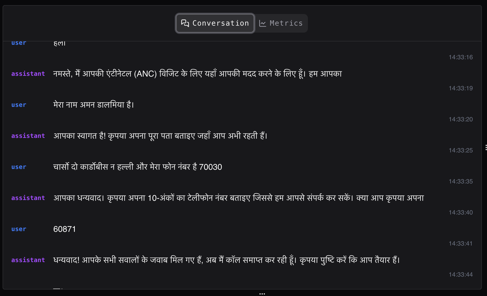
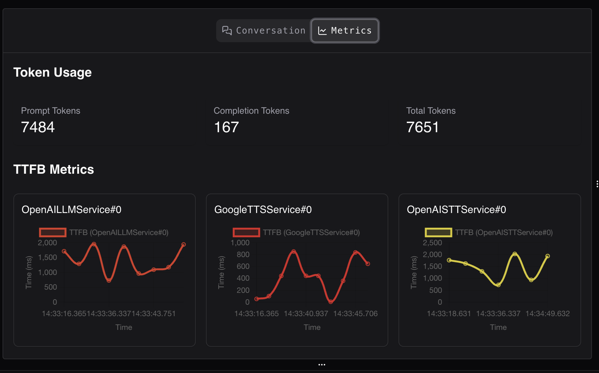
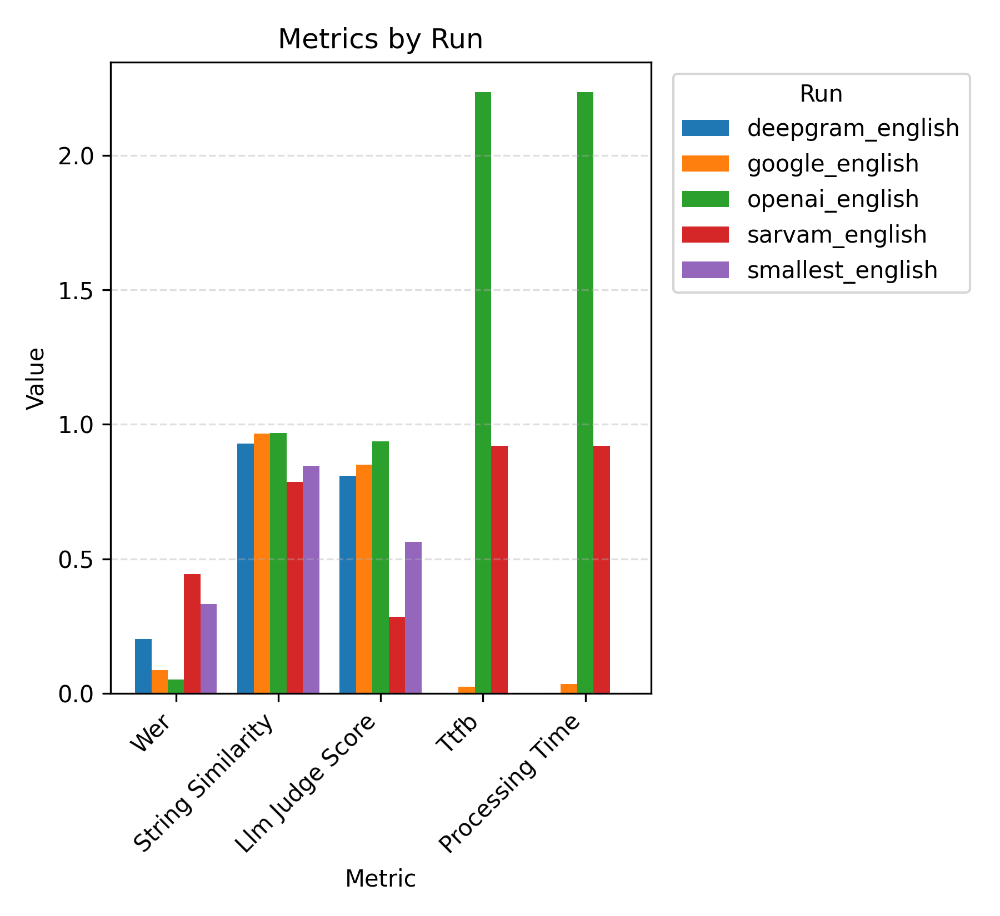

# Pense

An open-source simulation and testing framework for voice agents.

With Pense, you can move from a slow, manual testing to a fast, automated, and repeatable testing process:

- Evaluate different components of your voice agents across multiple vendors in isolation
- Create comprehensive test suites that verify both conversational responses and tool usage
- Simulate entire conversations spanning thousands of scenarios across multiple user personas

Pense is built on top of [pipecat](https://github.com/pipecat-ai/pipecat), a framework for building voice agents.

## Setup

We use `uv` to manage the dependencies. Make sure you have it installed on your system.

Create the virtual environment and install the dependencies.

```bash
uv sync --frozen
```

Copy `.env.example` to `.env` and fill in the API keys for the providers you want to evaluate. All modules (agent, stt, tts, llm) will use this single `.env` file:

## Talk to the agent

`pense/agent/test.py` spins up the fully interactive STT → LLM → TTS pipeline so you can speak with the agent in real time.

1. Make sure your `.env` file has the required API keys (defaults use OpenAI STT + LLM and Google TTS).
2. Pick or edit a config file. `pense/agent/examples/test/config.json` is a ready-to-use config file.
   You can configure the providers for STT, LLM, and TTS in the config file as shown below:

   **Supported Providers:**

   - **STT**: deepgram, google, openai, elevenlabs, sarvam, cartesia, smallest
   - **TTS**: elevenlabs, cartesia, google, openai, smallest, deepgram, sarvam
   - **LLM**: openrouter, openai

   ```json
   {
     "system_prompt": "You are a helpful assistant.",
     "language": "english",
     "stt": {
       "provider": "deepgram"
     },
     "tts": {
       "provider": "cartesia",
       "voice_id": "YOUR_VOICE_ID"
     },
     "llm": {
       "provider": "openrouter", // or "openai"
       "model": "openai/gpt-4o-2024-11-20" // or "gpt-4.1"
     },
     "tools": [
       {
         "type": "client",
         "name": "get_weather",
         "description": "Get the current weather",
         "parameters": [
           {
             "id": "location",
             "type": "string",
             "description": "The city and state, e.g. San Francisco, CA",
             "required": true
           }
         ]
       }
     ]
   }
   ```

3. Start the runner:

```bash
pense agent test -c pense/agent/examples/test/config.json -o ./out/run
```

Once you run it, you can open `http://localhost:7860/client/` in your browser. Click **Connect**, and begin talking to the agent through your browser.

> **⚠️ Important**  
> Avoid using your laptop's speaker and microphone at the same time. Audio from the speaker can be picked up by the microphone, interrupting the agent with its own voice.  
> **Use a headphone with a built-in microphone.**

The client UI streams the conversation transcript in real time, while the **Metrics** tab mirrors the live latency statistics reported by the pipeline as shown in the images below:





Every user/bot audio turn is persisted inside `<output_dir>/audios` (see a sample output folder for the exact layout). The terminal also logs each transcript message and every function/tool call issued by the LLM so you can audit the interaction without leaving your shell.

`transcript.json` in the output directory has the full transcript with function calls.

You can checkout `pense/agent/examples/test/sample_output` as a sample output of the agent conversation which contains all the audio turns and logs from the conversation.

## Speech To Text (STT)

To evaluate different STT providers, first make sure to organize the input data in the following structure:

```bash
├── /path/to/data
│   └── stt.csv
│   └── audios/wav
│       └── audio_1.wav
│       └── audio_2.wav
│   └── audios/pcm16
│       └── audio_1.wav
│       └── audio_2.wav
```

`stt.csv` should have the following format:

```csv
id,text
audio_1,"Hi"
audio_2,"Madam, my name is Geeta Shankar"
```

Store the audios in both `wav` and `pcm16` formats as different providers support different formats. The evaluation script will automatically select the right format for the provider you choose to evaluate.

Set the required environment variables for the STT provider you want to evaluate:

```bash
# For Sarvam
export SARVAM_API_KEY=your_key

# For Deepgram
export DEEPGRAM_API_KEY=your_key

# For OpenAI
export OPENAI_API_KEY=your_key

# For Google
export GOOGLE_APPLICATION_CREDENTIALS=/path/to/credentials.json
```

```bash
pense stt eval -p <provider> -l <language> -i /path/to/data -o /path/to/output -d
```

You can use the sample inputs provided in [`pense/stt/examples/sample_input`](pense/stt/examples/sample_input) to test the evaluation script.

Sample output:

```
Created new user transcript
Starting new audio streaming: /path/to/audio_1.wav
Finished streaming audio: /path/to/audio_1.wav
appending to last user transcript: <transcript>.
--------------------------------
Created new user transcript
Starting new audio streaming: /path/to/audio_2.wav
Finished streaming audio: /path/to/audio_2.wav
appending to last user transcript: <transcript_part_1>,
appending to last user transcript: <transcript_part_2>,
```

The output of the evaluation script will be saved in the output directory.

```bash
/path/to/output
├── sarvam_english
│   ├── logs
│   ├── results.log
│   ├── results.csv
│   └── metrics.json
```

`results.csv` will have the following columns:

```csv
id,gt,pred,wer,string_similarity,llm_judge_score,llm_judge_reasoning
3_1_english_baseline,"Please write Rekha Kumari, sister.", Please write Reha Kumari's sister.,0.4,0.927536231884058,False,"The source says 'Rekha Kumari, sister' which indicates the name is 'Rekha Kumari' and she is a sister. The transcription says 'Reha Kumari's sister', which changes the name to 'Reha Kumari' and refers to her sister, not Rekha Kumari herself. The name is different ('Rekha' vs 'Reha') and the relationship is also changed (from identifying Rekha Kumari as the sister to referring to the sister of Reha Kumari). Therefore, the values do not match."
```

The definition of all the metrics we compute are stored in [`pense/stt/metrics.py`](pense/stt/metrics.py).

`metrics.json` will have the following format:

```json
[
  {
    "wer": 0.12962962962962962 // mean of the Word Error Rate (WER) across all audio files
  },
  {
    "string_similarity": 0.8792465033551621 // mean of the string similarity score across all audio files
  },
  {
    "llm_judge_score": 1.0 // mean of the LLM Judge score across all audio files
  },
  {
    "metric_name": "ttfb", // Time to First Byte in seconds
    "processor": "SarvamSTTService#0",
    "mean": 2.3087445222414456,
    "std": 2.4340144350359867,
    "values": [
      // values for each audio file
      0.48694515228271484, 0.006701946258544922, 0.4470040798187256, 2.5300347805023193,
      0.2064838409423828, 6.574702978134155, 3.0182559490203857, 2.9680559635162354,
      7.94110107421875, 0.08572530746459961, 2.0372867584228516, 0.4102351665496826,
      3.3011457920074463
    ]
  },
  {
    "metric_name": "processing_time", // Time taken by the service to respond in seconds
    "processor": "SarvamSTTService#0",
    "mean": 2.3089125706599307,
    "std": 2.4341351775837228,
    "values": [
      // values for each audio file
      0.48702311515808105, 0.006762981414794922, 0.4470367431640625, 2.530163049697876,
      0.2065589427947998, 6.575268745422363, 3.0185441970825195, 2.9680910110473633,
      7.941352128982544, 0.08578085899353027, 2.0373899936676025, 0.4102756977081299,
      3.3016159534454346
    ]
  }
]
```

`logs` contain the full logs of the evaluation script including all the pipecat logs whereas `results.log` contains only the terminal output of the evaluation script as shown in the sample output above.

You can checkout [`pense/stt/examples/sample_output`](pense/stt/examples/sample_output) to see a sample output of the evaluation script.

For more details, run `pense stt eval -h`.

```bash
usage: eval.py [-h] [-p {deepgram,deepgram-flux,openai,cartesia,smallest,groq,google,sarvam}] [-l {english,hindi}] -i
               INPUT_DIR [-o OUTPUT_DIR] [-d]

options:
  -h, --help            show this help message and exit
  -p {deepgram,deepgram-flux,openai,cartesia,smallest,groq,google,sarvam}, --provider {deepgram,deepgram-flux,openai,cartesia,smallest,groq,google,sarvam}
                        STT provider to use for evaluation
  -l {english,hindi}, --language {english,hindi}
                        Language of the audio files
  -i INPUT_DIR, --input-dir INPUT_DIR
                        Path to the input directory containing the audio files and gt.json
  -o OUTPUT_DIR, --output-dir OUTPUT_DIR
                        Path to the output directory to save the results
  -d, --debug           Run the evaluation on the first 5 audio files
```

After you have multiple provider runs under `/path/to/output`, you can summarize accuracy and latency in one shot:

```bash
pense stt leaderboard -o /path/to/output -s ./leaderboards
```

The script scans each run directory, reads `metrics.json` and `results.csv`, then writes `stt_leaderboard.xlsx` plus `all_metrics_by_run.png` inside the save directory so you can compare providers side-by-side (`pense/stt/leaderboard.py`).

You can checkout [`pense/stt/examples/leaderboard`](pense/stt/examples/leaderboard) to see a sample output of the leaderboard script.



## Text To Speech (TTS)

To evaluate different TTS providers, first prepare an input CSV file with the following structure:

```csv
id,text
row_1,hello world
row_2,this is a test
```

The CSV should have two columns: `id` (unique identifier for each text) and `text` (the text strings you want to synthesize into speech).

Set the required environment variables for the TTS provider you want to evaluate:

```bash
# For Smallest
export SMALLEST_API_KEY=your_key

# For Cartesia
export CARTESIA_API_KEY=your_key

# For OpenAI
export OPENAI_API_KEY=your_key

# For ElevenLabs
export ELEVENLABS_API_KEY=your_key

# For Google
export GOOGLE_APPLICATION_CREDENTIALS=/path/to/credentials.json
```

```bash
pense tts eval -p <provider> -l <language> -i /path/to/input.csv -o /path/to/output
```

You can use the sample inputs provided in [`pense/tts/examples/sample.csv`](pense/tts/examples/sample.csv) to test the evaluation script.

Sample output:

```
--------------------------------
Streaming text [1/2]: <text_1>
Creating new audio file at /path/to/audio_1.wav
Appending audio chunk to /path/to/audio_1.wav
--------------------------------
Streaming text [2/2]: <text_2>
Creating new audio file at /path/to/audio_2.wav
Appending audio chunk to /path/to/audio_2.wav
```

The output of the evaluation script will be saved in the output directory.

```bash
/path/to/output/provider
├── audios
│   ├── 1.wav
│   ├── 2.wav
├── logs
├── results.log
├── results.csv
└── metrics.json
```

`results.csv` will have the following columns:

```csv
id,text,audio_path,llm_judge_score,llm_judge_reasoning
row_1,hello world,./out/smallest/audios/1.wav,True,"The provided audio says 'hello world'. The pronunciation is clear, and the words match exactly."
row_2,this is a test,./out/smallest/audios/2.wav,True,"The audio clearly says 'this is a test' without any deviations or mispronunciations."
```

`metrics.json` will have the following format:

```json
[
  {
    "llm_judge_score": 1.0 // mean of the LLM Judge score across all audio files
  },
  {
    "metric_name": "ttfb", // Time to First Byte in seconds
    "processor": "SmallestTTSService#0",
    "mean": 0.3538844585418701,
    "std": 0.026930570602416992,
    "values": [0.3808150291442871, 0.3269538879394531] // values for each text input
  },
  {
    "metric_name": "processing_time", // Time taken by the service to respond in seconds
    "processor": "SmallestTTSService#0",
    "mean": 0.00022804737091064453,
    "std": 2.7060508728027344e-5,
    "values": [0.0002009868621826172, 0.0002551078796386719] // values for each text input
  }
]
```

`logs` contain the full logs of the evaluation script including all the pipecat logs whereas `results.log` contains only the terminal output of the evaluation script as shown in the sample output above.

You can checkout [`pense/tts/examples/sample_output`](pense/tts/examples/sample_output) to see a sample output of the evaluation script.

For more details, run `pense tts eval -h`.

```bash
usage: eval.py [-h] [-p {cartesia,openai,groq,google,elevenlabs,sarvam}]
               [-l {english,hindi,kannada}] -i INPUT [-o OUTPUT_DIR] [-d]

options:
  -h, --help            show this help message and exit
  -p {cartesia,openai,groq,google,elevenlabs,sarvam}, --provider {cartesia,openai,groq,google,elevenlabs,sarvam}
                        TTS provider to use for evaluation
  -l {english,hindi,kannada}, --language {english,hindi,kannada}
                        Language of the audio files
  -i INPUT, --input INPUT
                        Path to the input CSV file containing the texts to synthesize
  -o OUTPUT_DIR, --output-dir OUTPUT_DIR
                        Path to the output directory to save the results
  -d, --debug           Run the evaluation on the first 5 audio files
```

To benchmark several TTS runs, generate the combined workbook and chart with:

```bash
pense tts leaderboard -o /path/to/output -s ./leaderboards
```

`pense/tts/leaderboard.py` mirrors the STT workflow, emitting `tts_leaderboard.xlsx` plus `all_metrics_by_run.png` so you can spot which provider balances latency and judge scores best.

You can checkout [`pense/tts/examples/leaderboard`](pense/tts/examples/leaderboard) to see a sample output of the leaderboard script.


## LLM tests

To evaluate LLM behavior through test cases, prepare a JSON configuration file with test cases and evaluation criteria.

The test configuration file should have the following structure:

```json
{
  "params": {
    "model": "gpt-4.1" // the name of the openai model
  },
  "system_prompt": "You are a helpful assistant...", // the system prompt for the LLM.
  "tools": [
    // array of tools that the LLM can call. Each tool should have:
    {
      "type": "client", // the type of the tool. Currently only "client" is supported
      "name": "plan_next_question", // the name of the tool
      "description": "Tool description...", // the description of the tool
      "parameters": [
        // array of parameters that the tool accepts
        {
          "id": "next_unanswered_question_index", // the id of the parameter
          "type": "integer", // the type of the parameter
          "description": "Parameter description...", // the description of the parameter
          "required": true // whether the parameter is required
        }
      ]
    }
  ],
  "test_cases": [
    // array of test cases, each containing:
    {
      "history": [
        // the conversation history uptil the point of the test
        {
          "role": "assistant",
          "content": "Hello! What is your name?"
        },
        {
          "role": "user",
          "content": "Aman Dalmia"
        }
      ],
      "evaluation": {
        // the evaluation criteria for the test
        "type": "tool_call", // the type of evaluation. Either "tool_call" or "response". "tool_call" means that the LLM's tool calls will be evaluated against the expected tool calls.
        "tool_calls": [
          // array of tool calls that the LLM is expected to make. Each tool call should have:
          {
            "tool": "plan_next_question", // the name of the tool
            "arguments": {
              // the arguments that the tool accepts
              "next_unanswered_question_index": 2, // the value of the parameter
              "questions_answered": [1] // the value of the parameter
            }
          }
        ]
      },
      "settings": {
        // optional settings for this test case
        "language": "hindi" // language for the LLM to respond in (defaults to "english")
      }
    },
    {
      "history": [
        {
          "role": "assistant",
          "content": "Hello! Let's fill out your ANC form. What is your name?"
        },
        {
          "role": "user",
          "content": "Aman Dalmia"
        },
        {
          "role": "assistant",
          "content": "Thanks, what is your phone number?"
        },
        {
          "role": "user",
          "content": "Can I skip this question?"
        }
      ],
      "evaluation": {
        "type": "response", // `response` means that the LLM response will be evaluated using an LLM judge with custom criteria
        "criteria": "The assistant should allow the user to skip giving their phone number if asked to skip, and not press them further to answer or call the plan_next_question tool for that question.", // the criteria for evaluating the agent response
        "positive_examples": [], // array of positive examples that the LLM is expected to respond with
        "negative_examples": [] // array of negative examples that the LLM is expected to respond with
      }
    }
  ]
}
```

Set the required environment variables:

```bash
# For OpenAI provider
export OPENAI_API_KEY=your_key

# For OpenRouter provider
export OPENROUTER_API_KEY=your_key
```

```bash
pense llm tests run -c /path/to/test_config.json -o /path/to/output_dir -m <model_name> -p <provider>
```

**Provider Options:**

- `openai`: Use OpenAI's API directly. Model names should match OpenAI's naming convention (e.g., `gpt-4.1`, `gpt-4o`).
- `openrouter`: Use OpenRouter's API to access multiple LLM providers. Model names should match OpenRouter's naming convention (e.g., `openai/gpt-4.1`, `anthropic/claude-3-opus`).

**Examples:**

```bash
# Using OpenAI provider with OpenAI model name
pense llm tests run -c /path/to/config.json -o ./out -m gpt-4.1 -p openai

# Using OpenRouter provider with OpenRouter model name
pense llm tests run -c /path/to/config.json -o ./out -m openai/gpt-4.1 -p openrouter
```

You can use the sample test configuration provided in [`pense/llm/examples/tests/config.json`](pense/llm/examples/tests/config.json) to test the evaluation script.

The script will run each test case for each variable value (e.g., for each language) and output:

- Pass/fail status for each test case
- Summary statistics showing total passed/failed tests
- Detailed output for failed test cases including the test case, actual output, and evaluation metrics

The output of the script will be saved in the output directory.

```bash
/path/to/output/<test_config_name>/<model_name>
├── results.json
├── metrics.json
├── logs
```

`results.json` contains the detailed results for each test case:

```json
[
  {
    "output": {
      "response": "Sure, I can help you with that.", // either the output is a string response
      "tool_calls": [ // or the output is a list of tool calls - not both simultaneously
        {
          "tool": "plan_next_question",
          "arguments": {
            "next_unanswered_question_index": 2,
            "questions_answered": [1]
          }
        }
      ]
    },
    "metrics": {
      "passed": true
    },
    "test_case": {
      "history": [...],
      "evaluation": {...}
    }
  }
]
```

`metrics.json` contains summary statistics:

```json
{
  "total": 5,
  "passed": 4
}
```

You can checkout [`pense/llm/examples/tests/sample_output`](pense/llm/examples/tests/sample_output) to see a sample output of the evaluation script.

Sample output 1:

```
✅ Test case 1 passed
----------------------------------------
✅ Test case 2 passed
----------------------------------------
🎉 All tests passed!
```

Sample output 2:

```
❌ Test case 1 failed
----------------------------------------
✅ Test case 2 passed
----------------------------------------
✅ Total Passed: 1/2 (50.0%)
❌ Total Failed: 1/2 (50.0%)
Failed test cases:
========================================
History:


assistant: Namaste, I’m Nurse Anitha. To start, what name should I write for you?
user: My name is Geetha Shankar. I am 24 years old and live in Hosahalli village, Holenarasipura taluk, Hassan district


Expected output:
{'type': 'tool_call', 'tool_calls': [{'tool': 'plan_next_question', 'arguments': {'next_unanswered_question_index': 3, 'questions_answered': [1, 2, 4]}}]}
----------------------------------------
Output:
{'response': '', 'tool_calls': [{'tool': 'plan_next_question', 'arguments': {'next_unanswered_question_index': 3, 'questions_answered': [1, 2]}}, {'tool': 'plan_next_question', 'arguments': {'next_unanswered_question_index': 4, 'questions_answered': [1, 2]}}]}
----------------------------------------
Metrics:
{'passed': False}
----------------------------------------
========================================
```

Once you have results for multiple models or scenarios, compile a leaderboard CSV and comparison chart:

```bash
pense llm tests leaderboard -o /path/to/output -s ./leaderboard
```

`pense/llm/tests_leaderboard.py` walks every `<test_config_name>/<model>` folder under the output root, computes pass percentages, and saves `llm_leaderboard.csv` plus `llm_leaderboard.png` to the chosen save directory for quick reporting.

`llm_leaderboard.csv` has the following format:

```csv
model,test_config_name,overall
openai__gpt-4.1,80.0,80.0
openai__gpt-4o,100.0,100.0
```

Each column after `model` represents a test config (scenario), and `overall` is the aggregate pass percentage across all configs.

You can checkout [`pense/llm/examples/tests/leaderboard`](pense/llm/examples/tests/leaderboard) to see a sample output of the leaderboard script.


## LLM simulations

Run fully automated, text-only conversations between two LLMs—the “agent” plus multiple users having specific personas to mimic specific scenarios given by you. Prepare a JSON configuration file as shown below:

```json
{
  "system_prompt": "instructions for the bot",
  "tools": [...], // tool schemas available to the agent LLM
  "personas": [
    // array of persona objects for users in the simulation
    {
      "characteristics": "description of user personality, background, and behavior",
      "gender": "female", // gender of the persona (used in user system prompt)
      "language": "english" // language for both agent and user in the simulation
    }
  ],
  "scenarios": [
    // array of scenario objects to be run with each user persona
    {
      "description": "description of the scenario to be played out"
    }
  ],
  "evaluation_criteria": [
    // array of criteria to evaluate each simulation against
    {
      "name": "question_completeness", // unique name for the criterion
      "description": "Whether all the questions in the form were covered in the conversation" // description used by LLM judge to evaluate
    },
    {
      "name": "assistant_behavior",
      "description": "Whether the assistant asks one concise question per turn; is empathetic and does not repeat the user's answer back to them."
    }
  ],
  "max_turns": 50 // optional: maximum number of assistant turns before ending the conversation (default: 50). When max_turns is reached, an end_reason message is added to the transcript.
}
```

Each simulation pairs every persona with every scenario. The runner fans out into separate folders named `simulation_persona_<n>_scenario_<m>` and saves transcripts, evaluation results, plus logs for inspection. Use the sample persona/scenario set from the example config or replace them with your own scripted behaviors (e.g., "refuses to share phone number until probed twice"). Use these artifacts to verify that the agent follows your instructions (e.g., responds appropriately, calls the right tools at the right times, and terminates the call correctly), then iterate on the prompts/config as needed.

After each simulation, an LLM judge evaluates the transcript against all `evaluation_criteria` defined in the config. Each criterion produces a match (true/false) and reasoning. The results are aggregated across all simulations at the end of the run.

**Max Turns:** You can optionally specify `max_turns` in the config to limit the maximum number of assistant turns in a conversation. When `max_turns` is reached, the conversation will end gracefully after the current turn completes, and an `end_reason` message with `"role": "end_reason"` and `"content": "max_turns"` will be added to the transcript. The default value is 50 turns.

Set the required environment variables:

```bash
# For OpenAI provider
export OPENAI_API_KEY=your_key

# For OpenRouter provider
export OPENROUTER_API_KEY=your_key
```

Then launch simulations:

```bash
pense llm simulations run \
  -c /path/to/config.json \
  -o /path/to/output \
  -m <model_name> \
  -p <provider>
```

**Provider Options:**

- `openai`: Use OpenAI's API directly. Model names should match OpenAI's naming convention (e.g., `gpt-4.1`, `gpt-4o`).
- `openrouter`: Use OpenRouter's API to access multiple LLM providers. Model names should match OpenRouter's naming convention (e.g., `openai/gpt-4.1`, `anthropic/claude-3-opus`).

**Examples:**

```bash
# Using OpenAI provider with OpenAI model name
pense llm simulations run \
  -c pense/llm/examples/simulation/config.json \
  -o ./out \
  -m gpt-4.1 \
  -p openai

# Using OpenRouter provider with OpenRouter model name
pense llm simulations run \
  -c pense/llm/examples/simulation/config.json \
  -o ./out \
  -m openai/gpt-4.1 \
  -p openrouter
```

You can use the sample configuration provided in [`pense/llm/examples/simulation/config.json`](pense/llm/examples/simulation/config.json) to test the simulation.

Sample output:

```
--------------------------------
Running simulation simulation_persona_1_scenario_1
Persona:
You are a mother; name is Geeta Prasad, 39 years old lives at Flat 302, Sri Venkateshwara Nilaya, near Hanuman Temple, Indiranagar. Phone number is plus nine one, nine eight triple three, forty-seven twenty-nine zero; never had a stillbirth or a baby who died soon after birth, but has had one baby who died on the third day after delivery; never had three or more miscarriages in a row; in her last pregnancy she wasn't admitted for high blood pressure or eclampsia; only carrying one baby as per the scan; blood group is O positive, so there are no Rh-related issues; did experience light vaginal spotting once during this pregnancy but otherwise no pelvic mass or complications; uncertain about her exact blood-pressure reading, but recalls that it was around 150/95 mmHg at booking; does not have diabetes, heart disease, kidney disease, or epilepsy; does have asthma and uses an inhaler daily; has never had tuberculosis or any other serious medical condition; longer drinks alcohol or uses substances, having stopped completely after learning she was pregnant; is very shy and reserved and uses short answers to questions
Gender: female
Language: english
Scenario:
the mother answers all the questions and completes the form, don't ask any further questions after the form is filled
--------------------------------
[Agent]: To get started with your antenatal visit details, could you please tell me your full name, including both your first name and last name?
[User]: Geeta Prasad.
tool call: plan_next_question invoked with arguments: {'questions_answered': [1], 'next_unanswered_question_index': 2}
[Agent]: Thank you. Could you please provide your full address, including your house number, street, area, and city or village?
[User]: Flat 302, Sri Venkateshwara Nilaya, near Hanuman Temple, Indiranagar.
tool call: plan_next_question invoked with arguments: {'questions_answered': [2], 'next_unanswered_question_index': 3}
[Agent]: Thank you. Now, could you let me know your 10-digit telephone number, please?
[User]: Nine eight triple three, forty-seven twenty-nine zero.
tool call: plan_next_question invoked with arguments: {'questions_answered': [3]}
tool call: end_call invoked by LLM
--------------------------------
Running simulation simulation_persona_1_scenario_2
Persona:
You are a mother; name is Geeta Prasad, 39 years old lives at Flat 302, Sri Venkateshwara Nilaya, near Hanuman Temple, Indiranagar. Phone number is plus nine one, nine eight triple three, forty-seven twenty-nine zero; never had a stillbirth or a baby who died soon after birth, but has had one baby who died on the third day after delivery; never had three or more miscarriages in a row; in her last pregnancy she wasn't admitted for high blood pressure or eclampsia; only carrying one baby as per the scan; blood group is O positive, so there are no Rh-related issues; did experience light vaginal spotting once during this pregnancy but otherwise no pelvic mass or complications; uncertain about her exact blood-pressure reading, but recalls that it was around 150/95 mmHg at booking; does not have diabetes, heart disease, kidney disease, or epilepsy; does have asthma and uses an inhaler daily; has never had tuberculosis or any other serious medical condition; longer drinks alcohol or uses substances, having stopped completely after learning she was pregnant; is very shy and reserved and uses short answers to questions
Gender: female
Language: english
Scenario:
the mother hesitates in directly answering some questions and wants to skip answering them at first but answers later on further probing
--------------------------------
[Agent]: Hello! I will help you with filling your antenatal visit form. May I please have your full name, including both your first name and last name?
[User]: ...Uh... it's Geeta.

(pause)

Geeta Prasad.
tool call: plan_next_question invoked with arguments: {'questions_answered': [1], 'next_unanswered_question_index': 2}
[Agent]: Thank you, Geeta Prasad. Could you please share your full address, including your specific place of residence?
[User]: It’s in Indiranagar.

…Flat 302, Sri Venkateshwara Nilaya, near Hanuman Temple, Indiranagar.
tool call: plan_next_question invoked with arguments: {'questions_answered': [2], 'next_unanswered_question_index': 3}
[Agent]: Thank you. Could you please provide your telephone number?
[User]: Do I have to?

(pause)

It’s plus nine one, nine eight triple three, forty-seven twenty-nine zero.
tool call: plan_next_question invoked with arguments: {'questions_answered': [3], 'next_unanswered_question_index': 4}
tool call: end_call invoked by LLM
```

The output of the simulation will be saved in the output directory:

```bash
/path/to/output
├── simulation_persona_1_scenario_1
│   ├── transcript.json          # full conversation transcript
│   ├── evaluation_results.csv   # per-criterion evaluation results
│   ├── config.json              # persona and scenario for this simulation
│   ├── logs                     # timestamped pipeline logs
│   └── results.log              # terminal output of the simulation
├── simulation_persona_1_scenario_2
│   └── ...
├── results.csv                  # aggregated results for all simulations
└── metrics.json                 # summary statistics for each criterion
```

`config.json` in each simulation directory contains the persona and scenario used for that specific simulation:

```json
{
  "persona": {
    "characteristics": "description of user personality, background, and behavior",
    "gender": "female",
    "language": "english"
  },
  "scenario": {
    "description": "the scenario description for this simulation"
  }
}
```

`evaluation_results.csv` contains the evaluation results for each criterion in a simulation:

```csv
name,match,reasoning
question_completeness,True,"The assistant asked for the user's full name, address, and telephone number..."
assistant_behavior,True,"The assistant asked one concise question per turn..."
```

`results.csv` aggregates the match scores across all simulations:

```csv
name,question_completeness,assistant_behavior
simulation_persona_1_scenario_1,1.0,1.0
simulation_persona_1_scenario_2,1.0,1.0
simulation_persona_1_scenario_3,1.0,1.0
```

`metrics.json` provides summary statistics (mean, std, values) for each evaluation criterion:

```json
{
  "question_completeness": {
    "mean": 1.0,
    "std": 0,
    "values": [1.0, 1.0, 1.0]
  },
  "assistant_behavior": {
    "mean": 1.0,
    "std": 0.0,
    "values": [1.0, 1.0, 1.0]
  }
}
```

`logs` contains the full logs of the simulation including all the pipecat logs whereas `results.log` contains only the terminal output of the simulation as shown in the sample output above.

You can checkout [`pense/llm/examples/simulation/sample_output`](pense/llm/examples/simulation/sample_output) to see a sample output of the simulation.

## Voice agent simulations

To run agent simulations with all the three components - STT, LLM, and TTS - prepare a JSON configuration file as shown below.

```json
{
  "system_prompt": "You are a helpful nurse speaking to a pregnant mother who has come for an Antenatal visit (ANC visit).\n\nYou are helping her with filling the ANC visit form which has the following questions:\n\n1: Name of patient (string)\n2: Address (string)\n3: Telephone (number)\n\nYour goal is to get the answer for all these questions from the user. Ask the questions sequentially, one at a time. Make sure to always speak out the next question for the user. They don't know what the next question will be. It is your responsibility to ask them the next question.\n\nDo not repeat the user's answer back to them.\n\nExcept for the questions where a type has been explicitly given beside it, the rest of the questions are boolean questions (yes/no).\n\nIf the user gives an answer that is not valid for a question, then, don't call the `plan_next_question` tool at all.\n\nOnly if the user gives a valid answer to a question, then, call the `plan_next_question` tool.\n\nOnce all the questions have been answered, end the call by calling the `end_call` tool immediately without asking or saying anything else to the user.\n\n# Important instructions\nFor each field, you must make sure that you get valid and complete answers from the user.\n\nName: the full name including both the first name and last name (users might have initials as part of their name - don't ask them to expand it)\nAddress: the full address of the user's specific place of residence\nTelephone: must be a valid 10-digit phone number (don't bug the user to say the number in 10 digits or without spaces or without hyphens or to repeat it as long you can infer the number from your message, irrespective of whatever format it may have been given in - asking for repeating information that is already clear is not a good user experience)\n\nUntil you get a valid and complete response for a specific question from the user, keep probing for more details until you have extracted all the details required to meet the criteria of completeness for that question.\n\nFor the boolean questions, just look for whether the user has that symptom or not. If the user is not able to give a definitive answer to any the boolean questions, try probing once to help them arrive at a definitive answer. If they are still not able to give a definitive true/false answer, mark that response as null.\n\n# Skipping already answered questions\nIt is possible that even though you have asked a particular question, the user's response may end up answering some of the future questions you were going to ask. If the user's response already definitively answers those questions, then, don't repeat those questions again and skip them to move to the next unanswered question.\n\nAfter every valid and complete response given by the user to a question, call the `plan_next_question` tool with the indices of the questions in the list of questions above that the user's response has already answered and the index of the next unanswered question that you are going to ask.\n\nIf the user's response only answers the exact question you asked, then, call `plan_next_question` with `questions_answered` as `[<index_of_that_question>]` and `next_unanswered_question_index` as the index of the next unanswered question based on the conversation history so far.\n\nIf the user's response answers more questions beyond the question you asked, then, call `plan_next_question` with `questions_answered` as `[<index_of_the_first_question_answered>, <index_of_the_second_question_answered>, ....]` and `next_unanswered_question_index` as the index of the next unanswered question based on the conversation history so far.\n\nIf the user's response answers some other question from the form but not the question you asked, then, call `plan_next_question` with `questions_answered` as `[<index_of_the_question_answered>]` and `next_unanswered_question_index` as the index of the question you had originally asked but the user did not answer.\n\nIf the user's response is completely irrelevant to any of the questions in the form, don't call this tool and steer the user back to the conversation.\n\nUse the same index values as mentioned in the list above: from 1-22. So, 1-indexed. Not, 0-indexed.\n\n# Ensuring completion of all questions\n- If the user insists on skipping any question when you asked it, make sure to ask it again later. Before ending the call, make sure to ask all the questions that you asked. Only when all the questions have been asked and answered, then, call the `end_call` tool.\n\n# Style\n- Keep the conversation clear, warm, friendly and empathetic. It should feel like a natural and realistic conversation between a nurse and a mother who is pregnant. Make sure each question that you ask is concise and to the point.\n- Speak in an empathetic, friendly tone like a nurse at a government hospital.\n- Always stay gender neutral and don't say anything that might indicate any gender or name for you or anthropomorphise you in any way.\n", // prompt for the voice agent
  "tools": [
    {
      "type": "client",
      "name": "plan_next_question",
      "description": "Optional, only call this tool if the user gave a valid answer to a valid question that you asked; if yes, then which questions have been answered and which question needs to be asked next; if not, don't call this tool at all",
      "disable_interruptions": false,
      "force_pre_tool_speech": "auto",
      "assignments": [],
      "tool_call_sound": null,
      "tool_call_sound_behavior": "auto",
      "execution_mode": "immediate",
      "expects_response": false,
      "response_timeout_secs": 1,
      "parameters": [
        {
          "id": "next_unanswered_question_index",
          "type": "integer",
          "value_type": "llm_prompt",
          "description": "the index of the next unanswered question that should be asked to the user next. don't repeat questions that have been asked before already in the previous responses.",
          "dynamic_variable": "",
          "constant_value": "",
          "required": true
        },
        {
          "id": "questions_answered",
          "type": "array",
          "description": "Optional, the indices of the questions in the full list of questions that have been answered by the user's last response",
          "items": {
            "type": "integer",
            "description": "the index of each question that got answered by the current response of the user"
          },
          "required": true,
          "value_type": "llm_prompt"
        }
      ]
    }
  ], // tools that the voice agent has access to
  "personas": [
    // array of persona objects for users in the simulation
    {
      "characteristics": "description of user personality, background, and behavior",
      "gender": "female", // gender of the persona (used in user system prompt)
      "language": "english", // language for both agent and user in the simulation
      "interruption_sensitivity": "medium" // interruption sensitivity: "none", "low", "medium", or "high" (maps to probabilities: 0, 0.25, 0.5, 0.8)
    }
  ], // different user personas to evaluate for the voice agent
  "scenarios": [
    // array of scenario objects to be run with each user persona
    {
      "description": "description of the scenario to be played out"
    }
  ], // the different scenarios to evaluate for each persona
  "evaluation_criteria": [
    // array of criteria to evaluate each simulation against
    {
      "name": "question_completeness", // unique name for the criterion
      "description": "Whether all the questions in the form were covered in the conversation" // description used by LLM judge to evaluate
    }
  ],
  "max_turns": 50 // optional: maximum number of assistant turns before ending the conversation (default: 50). When max_turns is reached, the conversation ends gracefully after the current turn completes, and an end_reason message is added to the transcript.
}
```

The voice agent is defined in `pense/agent/bot.py`. For now, the default configuration of the bot uses Deepgram for STT, OpenAI for LLM, and Google for TTS. You can configure the bot to use different providers for STT, LLM, and TTS by modifying the `STTConfig`, `LLMConfig`, and `TTSConfig` classes in `pense/agent/bot.py`. We will soon add support for changing the configuration for each provider for each component to override the defaults.

Set the required environment variables for the providers you want to use:

```bash
# For the default configuration (Deepgram STT + OpenAI LLM + Google TTS)
export DEEPGRAM_API_KEY=your_key
export OPENAI_API_KEY=your_key
export GOOGLE_APPLICATION_CREDENTIALS=/path/to/credentials.json
```

```bash
pense agent simulation -c /path/to/config.json -o /path/to/output
```

You can use the sample configuration provided in [`pense/agent/examples/simulation/sample_short_english.json`](pense/agent/examples/simulation/sample_short_english.json) to test the voice agent simulation.

```bash
pense agent simulation -c pense/agent/examples/simulation/sample_short_english.json -o ./out
```

Sample output:

```
--------------------------------
Running simulation simulation_persona_1_scenario_1
Persona:
You are a mother; name is Geeta Prasad, 39 years old lives at Flat 302, Sri Venkateshwara Nilaya, near Hanuman Temple, Indiranagar. Phone number is plus nine one, nine eight triple three, forty-seven twenty-nine zero; never had a stillbirth or a baby who died soon after birth, but has had one baby who died on the third day after delivery; never had three or more miscarriages in a row; in her last pregnancy she wasn't admitted for high blood pressure or eclampsia; only carrying one baby as per the scan; blood group is O positive, so there are no Rh-related issues; did experience light vaginal spotting once during this pregnancy but otherwise no pelvic mass or complications; uncertain about her exact blood-pressure reading, but recalls that it was around 150/95 mmHg at booking; does not have diabetes, heart disease, kidney disease, or epilepsy; does have asthma and uses an inhaler daily; has never had tuberculosis or any other serious medical condition; longer drinks alcohol or uses substances, having stopped completely after learning she was pregnant; is very shy and reserved and uses short answers to questions
Gender: female
Language: english
Scenario:
the mother answers all the questions and completes the form, don't ask any further questions after the form is filled
--------------------------------

[User]: Hi.
Creating new audio file at out/agent-sim/simulation_persona_1_scenario_1/audios/0_user.wav
[User (transcribed)]: Hi.
Creating new audio file at out/agent-sim/simulation_persona_1_scenario_1/audios/1_bot.wav
Appending audio chunk to out/agent-sim/simulation_persona_1_scenario_1/audios/1_bot.wav
[Agent]: Hello! I’m here to help you with your antenatal visit. May I please have your full name, including both first and last name?
Appending audio chunk to out/agent-sim/simulation_persona_1_scenario_1/audios/1_bot.wav
[User]: Geeta Prasad.
Creating new audio file at out/agent-sim/simulation_persona_1_scenario_1/audios/1_user.wav
[User (transcribed)]: Gita Prasad.
[Agent]: Thank you, Gita. Can you please tell me your full address where you currently live?
Creating new audio file at out/agent-sim/simulation_persona_1_scenario_1/audios/2_bot.wav
[User]: Flat 302, Sri Venkateshwara Nilaya, near Hanuman Temple, Indiranagar.
[User (transcribed)]: 302. Sri Venkateshwara Nilaya, Nirhanuman
[User (transcribed)]: Temple in Duranagar.
Creating new audio file at out/agent-sim/simulation_persona_1_scenario_1/audios/2_user.wav
Creating new audio file at out/agent-sim/simulation_persona_1_scenario_1/audios/3_bot.wav
Appending audio chunk to out/agent-sim/simulation_persona_1_scenario_1/audios/3_bot.wav
.
.
.
```

The output of the evaluation script will be saved in the output directory.

```bash
/path/to/output/
├── simulation_persona_1_scenario_1
│   ├── audios
│   │    ├── 0_user.wav
│   │    ├── 1_bot.wav
│   │    ├── 1_user.wav
│   │    ...
│   ├── logs
│   ├── results.log
│   ├── evaluation_results.csv   # per-criterion evaluation results with latency metrics
│   ├── stt_results.csv           # detailed per-row STT evaluation results
│   ├── metrics.json
│   ├── stt_outputs.json
│   ├── tool_calls.json
│   ├── transcripts.json
│   └── config.json              # persona and scenario for this simulation
├── simulation_persona_1_scenario_2
├── simulation_persona_1_scenario_3
├── results.csv                  # aggregated results for all simulations
└── metrics.json                 # summary statistics for each criterion
```

Each `simulation_persona_*_scenario_*` directory contains:

- `audios/`: alternating `*_user.wav` and `*_bot.wav` clips for every turn so you can audit microphone and synthesis quality at each step.
- `logs`: full logs of the simulation including all the pipecat logs
- `results.log`: only the terminal output of the simulation as shown in the sample output above.
- `evaluation_results.csv`: per-criterion evaluation results including evaluation criteria, latency metrics (ttft and processing_time for each processor), and STT LLM judge score.
- `stt_results.csv`: detailed per-row STT evaluation results comparing STT outputs with user messages from the transcript, including score and reasoning for each row.
- `metrics.json`: latency traces grouped by processor for both `ttft` (time to first token) and `processing_time`, reported separately for STT, LLM, and TTS providers.
- `stt_outputs.json`: The output of the STT step for each turn in the voice agent being evaluated.
- `tool_calls.json`: chronologically ordered tool calls made by the agent.
- `transcripts.json`: full conversation transcript - alternating `user`/`assistant` turns. If the conversation ends due to `max_turns`, an `end_reason` message with `"role": "end_reason"` and `"content": "max_turns"` is appended.
- `config.json`: persona dict and scenario dict used for this simulation

**Max Turns:** You can optionally specify `max_turns` in the config to limit the maximum number of assistant turns in a conversation. When `max_turns` is reached, the conversation will end gracefully after the current turn completes (ensuring the final assistant message is recorded), and an `end_reason` message will be added to the transcript. The default value is 50 turns.

`config.json` in each simulation directory contains the persona and scenario used for that specific simulation:

```json
{
  "persona": {
    "characteristics": "description of user personality, background, and behavior",
    "gender": "female",
    "language": "english",
    "interruption_sensitivity": "medium"
  },
  "scenario": {
    "description": "the scenario description for this simulation"
  }
}
```

`evaluation_results.csv` contains the evaluation results for each criterion, latency metrics, and STT LLM judge score in a simulation:

```csv
name,value,reasoning
question_completeness,1,"The assistant asked for the user's full name, address, and telephone number..."
assistant_behavior,1,"The assistant asked one concise question per turn..."
ttft,0.6209,""
processing_time,0.6209,""
stt_llm_judge_score,0.95,""
```

Note: For latency metrics (`ttft` and `processing_time`), one row is added per processor with the mean value. The `reasoning` column is empty for latency metrics and STT LLM judge score. Evaluation criteria use `value` of 1 for True (match) and 0 for False (no match).

`stt_results.csv` contains detailed per-row STT evaluation results:

```csv
reference,prediction,score,reasoning
"Hi.","Hi.",1,"The transcription matches exactly."
"Geeta Prasad.","Gita Prasad.",0,"The name 'Geeta' was transcribed as 'Gita'..."
```

`results.csv` aggregates the match scores across all simulations:

```csv
name,question_completeness,assistant_behavior,stt_llm_judge_score
simulation_persona_1_scenario_1,1.0,1.0,0.95
simulation_persona_1_scenario_2,1.0,0.0,0.92
simulation_persona_1_scenario_3,1.0,1.0,0.98
```

`metrics.json` provides summary statistics (mean, std, values) for each evaluation criterion and STT LLM judge score:

```json
{
  "question_completeness": {
    "mean": 1.0,
    "std": 0.0,
    "values": [1.0, 1.0, 1.0]
  },
  "assistant_behavior": {
    "mean": 0.6666666666666666,
    "std": 0.5773502691896257,
    "values": [1.0, 0.0, 1.0]
  },
  "stt_llm_judge": {
    "mean": 0.95,
    "std": 0.03,
    "values": [0.95, 0.92, 0.98]
  }
}
```

You can checkout [`pense/agent/examples/simulation/sample_output`](pense/agent/examples/simulation/sample_output) to see a sample output of the voice agent simulation.

## Documentation

Pense documentation is built using [MkDocs](https://www.mkdocs.org) with the [Material theme](https://squidfunk.github.io/mkdocs-material/).

### Building Documentation Locally

1. **Install documentation dependencies:**

```bash
uv pip install -r requirements-docs.txt
```

2. **Preview documentation locally:**

```bash
mkdocs serve
```

This will start a local server at `http://127.0.0.1:8000` where you can preview the documentation.

## TODOs

- Add support for running openai STT on the TTS outputs and evaluating it.
- Add multiple dialects and accents in the voice agent simulation
- Support for adding knowledge base to agent/llm simulations
- Generate test cases instead of manually having to create them.
- Build a UI to go along with this.
- Currently, only user can speak first. Add support for the agent to speak first as well. Configurable.
- Store transcripts and tool calls in the output directory when talking to an agent.
- Support for adding custom config for each provider for each component to override the defaults.
- Support for other telephony providers and be able to connect to a given agent.
- Instructions on how to evaluate someone's own models not added to pipecat yet.
- Evaluate even non-pipecat models

## Bugs

- EL is getting affected for one audio file based on the index of the audio file in the list of audio files to be run!
