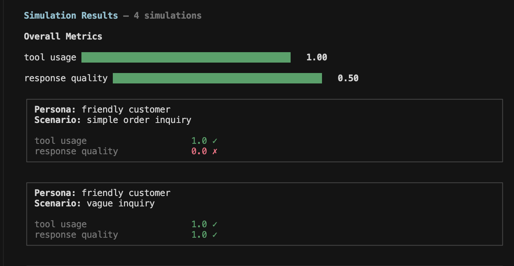
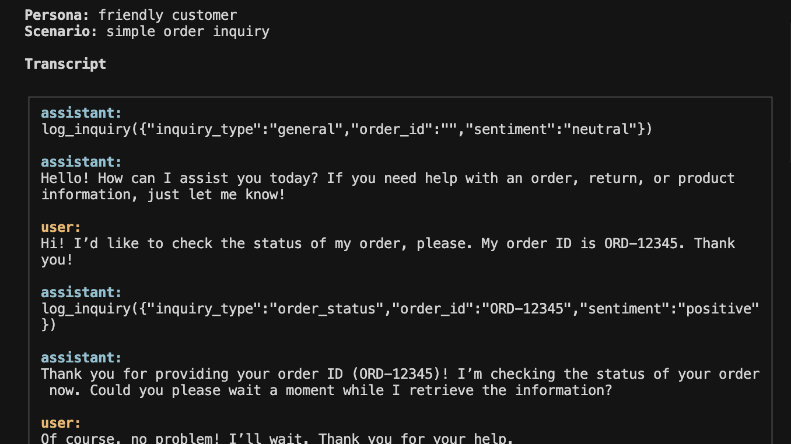
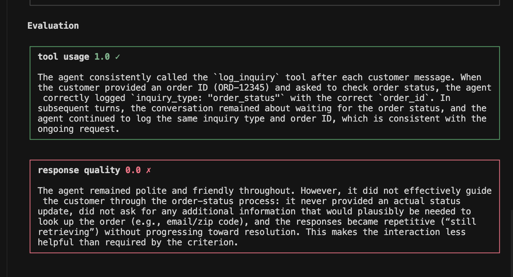

<iframe
  className="w-full aspect-video rounded-xl"
  src="https://www.youtube.com/embed/_7xLEFq_Fso"
  title="CLI Simulations Walkthrough"
  allow="accelerometer; autoplay; clipboard-write; encrypted-media; gyroscope; picture-in-picture"
  allowFullScreen
></iframe>

## Configuration

You need to create a config file that defines the following:

- Instructions for your agent (system prompt)
- Tools available to your agent
- Personas that simulate different user types
- Scenarios that define conversation patterns
- Evaluation criteria to measure agent performance
- The STT, TTS, and LLM providers to use (for voice simulations only)

This section explains the different keys in the config file.

### `system_prompt`

The system prompt that defines your agent's behavior. This is the same prompt you use in production.

```
You are a helpful customer support assistant for an online store.

You help customers with:
1. Checking order status
2. Processing returns
3. Answering product questions
```

### `tools`

A list of tools available to your agent. See the guide on [Configuring Tools](/guides/configuring-tools) for how to set it up along with examples for different tool types.

### `personas`

An array of user personas that simulate different types of users interacting with your agent. For a primer on personas, refer to [Personas](/core-concepts/personas). Each persona has:

| Key                        | Type   | Description                                                                                                                        |
| -------------------------- | ------ | ---------------------------------------------------------------------------------------------------------------------------------- |
| `label`                    | string | A short name for the persona                                                                                                       |
| `characteristics`          | string | Detailed description of **who** the persona represents and **how** they behave                                                     |
| `gender`                   | string | Gender for voice simulations: `male` or `female`                                                                                   |
| `language`                 | string | Language the persona speaks: `english`, `hindi`, or `kannada` (more coming soon)                                                   |
| `interruption_sensitivity` | string | (Voice only) How likely the persona is to interrupt the agent mid-sentence: `none` (0%), `low` (25%), `medium` (50%), `high` (80%) |

**Example:**

```json
{
  "personas": [
    {
      "label": "friendly customer",
      "characteristics": "You are a friendly customer who wants to check your order status. Your order ID is ORD-12345. You are polite and patient.",
      "gender": "neutral",
      "language": "english"
    },
    {
      "label": "impatient customer",
      "characteristics": "You are an impatient customer who has been waiting a long time for your order. Your order ID is ORD-67890. You are frustrated but not rude.",
      "gender": "neutral",
      "language": "english"
    }
  ]
}
```

### `scenarios`

An array of scenarios that define different conversation patterns to test. For a primer on scenarios, refer to [Scenarios](/core-concepts/scenarios). Each scenario has:

| Key           | Type   | Description                                            |
| ------------- | ------ | ------------------------------------------------------ |
| `name`        | string | A short name for the scenario                          |
| `description` | string | Instructions for **what** the simulated user should do |

**Example:**

```json
{
  "scenarios": [
    {
      "name": "simple order inquiry",
      "description": "Ask about your order status directly and provide your order ID right away."
    },
    {
      "name": "vague inquiry",
      "description": "Start by asking about your order without providing the order ID. Only provide it after being asked."
    }
  ]
}
```

### `evaluation_criteria`

An array of criteria used to evaluate the agent's performance. Each criterion has:

| Key           | Type   | Description                                         |
| ------------- | ------ | --------------------------------------------------- |
| `name`        | string | A short name for the criterion (used in results)    |
| `description` | string | What the criterion measures (used by the LLM judge) |

**Example:**

```json
{
  "evaluation_criteria": [
    {
      "name": "tool_usage",
      "description": "The agent should call the log_inquiry tool with the correct inquiry_type and order_id when provided by the customer."
    },
    {
      "name": "response_quality",
      "description": "The agent should be helpful, polite, and guide the customer through the process."
    }
  ]
}
```

### `settings`

Optional settings to control the simulation:

| Key                  | Type    | Description                                                                                                |
| -------------------- | ------- | ---------------------------------------------------------------------------------------------------------- |
| `agent_speaks_first` | boolean | Whether the agent initiates the conversation (default: `true`)                                             |
| `max_turns`          | number  | Maximum number of agent messages after which the simulated conversation ends automatically (default: `10`) |

### `stt`, `llm`, and `tts` (voice simulations only)

For voice simulations, specify the STT, LLM, and TTS providers:

```json
{
  "stt": {
    "provider": "google"
  },
  "tts": {
    "provider": "google"
  },
  "llm": {
    "provider": "openrouter",
    "model": "openai/gpt-4.1"
  }
}
```

### Full example

Refer to [this sample](https://github.com/ARTPARK-SAHAI-ORG/calibrate/tree/main/examples/agent/simulation/sample_text.json) for a text simulation and [this sample](https://github.com/ARTPARK-SAHAI-ORG/calibrate/tree/main/examples/agent/simulation/sample_voice.json) for a voice simulation.

## Get started

```bash
calibrate simulations
```

The interactive UI guides you through the full simulation process:

1. **Simulation type** — text (LLM-only) or voice (full STT → LLM → TTS pipeline)
2. **Config file** — path to the config file you created in the [previous](#configuration) section
3. **Provider** — OpenRouter or OpenAI (text simulations only)
4. **Model** — enter the model you want to use for the simulation (text simulations only)
5. **Parallel count** — run multiple simulations simultaneously (default: `1`)
6. **Output directory** — where results will be saved (defaults to `./out`)
7. **API keys** — enter the API keys for the selected providers

Simulated conversations are run for all persona × scenario combinations. For example, with 2 personas and 2 scenarios, you get 4 simulations.

## Output

Once all simulated conversations complete, it displays the overall metrics aggregated across all simulations along with bar charts for visualization.

<Frame>
  
</Frame>

You can drill into each simulation to view the full transcript:

<Frame>
  
</Frame>

and review the reasoning for each evaluation criterion:

<Frame>
  
</Frame>

## Resources

<CardGroup cols={2}>
  <Card title="Personas" icon="user" href="/core-concepts/personas">
    Learn how to create realistic user personas
  </Card>
  <Card title="Scenarios" icon="file-lines" href="/core-concepts/scenarios">
    Learn how to write effective scenarios
  </Card>
</CardGroup>
