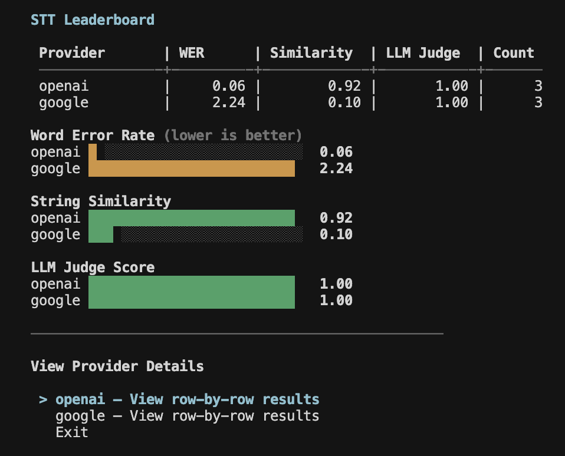
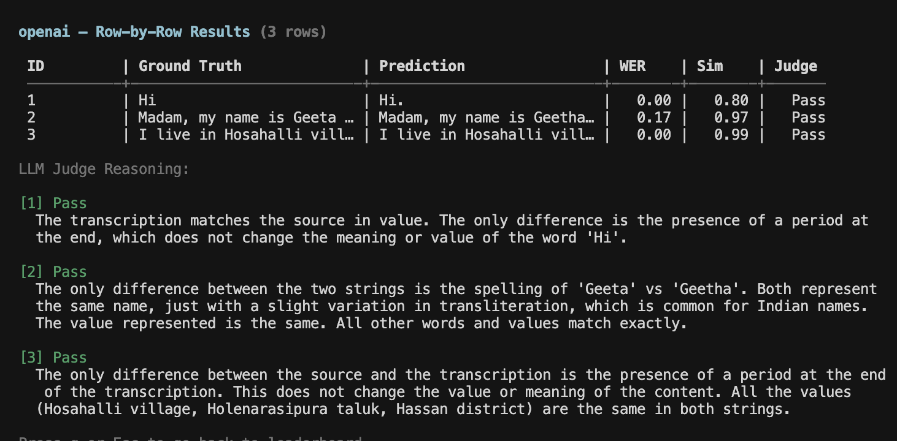

## Get started

```bash
calibrate stt
```

<iframe
  className="w-full aspect-video rounded-xl"
  src="https://www.youtube.com/embed/pFdsOMo_J2s"
  title="CLI Speech-to-Text Evaluation Walkthrough"
  allow="accelerometer; autoplay; clipboard-write; encrypted-media; gyroscope; picture-in-picture"
  allowFullScreen
></iframe>

The interactive UI guides you through the full evaluation process:

1. **Language selection** — pick from 10+ supported Indic languages
2. **Provider selection** — choose providers (only those supporting your language are shown)
3. **Input directory** — path to the directory containing your audio files and reference transcripts

The input directory should have this structure:

```
/path/to/data/
├── stt.csv
└── audios/
    ├── audio_1.wav
    └── audio_2.wav
```

The **stt.csv** file contains the reference transcriptions:

| id      | text                            |
| ------- | ------------------------------- |
| audio_1 | Hi                              |
| audio_2 | Madam, my name is Geeta Shankar |

<Note>
  All audio files should be in WAV format. The evaluation script expects files
  at `audios/<id>.wav` where `<id>` matches the `id` column in your CSV.
</Note>

Refer to the [sample dataset](https://github.com/ARTPARK-SAHAI-ORG/calibrate/tree/main/examples/stt/sample_input) for a template.

4. **Output directory** — where results will be saved (defaults to `./out`)
5. **API keys** — enter the API keys for the selected providers

The evaluation runs providers in parallel (max 2 at a time), showing the transcriptions as they are generated.

## Output

Once all the providers have completed, it displays a leaderboard measuring key metrics along with bar charts for better visualization.

<Frame>
  
</Frame>

You can also view the generated transcript and metrics for each row of your dataset including the LLM judge score and reasoning.

<Frame>
  
</Frame>

<Card
  title="Learn more about metrics"
  icon="chart-bar"
  href="/core-concepts/speech-to-text#metrics"
>
  Detailed explanation of all metrics and why using an LLM Judge is necessary
</Card>

## Resources

<Card title="Integrations" icon="microphone" href="/integrations/stt">
  See the full list of supported providers and their configuration options
</Card>
