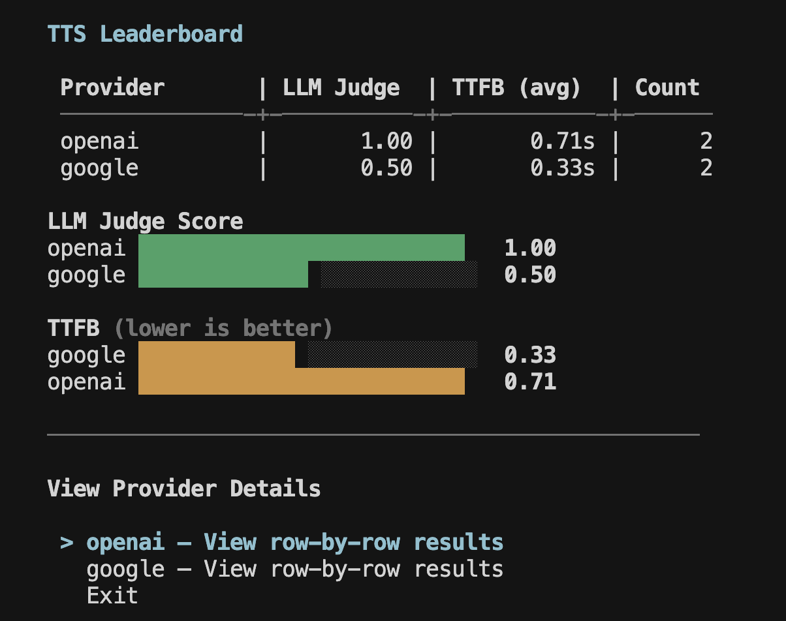
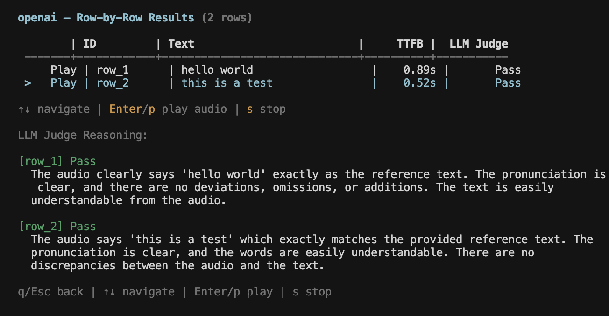

## Get started

```bash
calibrate tts
```

<iframe
  className="w-full aspect-video rounded-xl"
  src="https://www.youtube.com/embed/cMYGuAT8BM8"
  title="CLI Text-to-Speech Evaluation Walkthrough"
  allow="accelerometer; autoplay; clipboard-write; encrypted-media; gyroscope; picture-in-picture"
  allowFullScreen
></iframe>

The interactive UI guides you through the full evaluation process:

1. **Language selection** — pick from 10+ supported Indic languages
2. **Provider selection** — choose providers (only those supporting your language are shown)
3. **Input CSV** — path to CSV file with `id` and `text` columns

The **input CSV** should have this format:

| id    | text                    |
| ----- | ----------------------- |
| row_1 | hello world             |
| row_2 | this is a test          |
| row_3 | how are you doing today |

Refer to [this sample](https://github.com/ARTPARK-SAHAI-ORG/calibrate/tree/main/examples/tts/sample.csv) for a template.

4. **Output directory** — where results will be saved (defaults to `./out`)
5. **API keys** — enter the API keys for the selected providers

The evaluation runs providers in parallel (max 2 at a time), showing the progress as audio files are generated.

## Output

Once all the providers have completed, it displays a leaderboard measuring key metrics along with bar charts for better visualization.

<Frame>
  
</Frame>

You can also view the generated audio and metrics for each row of your dataset including the LLM judge score and reasoning. Use the arrow keys to navigate rows and press **Enter** or **p** to play the generated audio.

<Frame>
  
</Frame>

<Card
  title="Learn more about metrics"
  icon="chart-bar"
  href="/core-concepts/text-to-speech#metrics"
>
  Detailed explanation of all metrics and how LLM Judge works
</Card>

## Resources

<Card title="Integrations" icon="volume-high" href="/integrations/tts">
  See the full list of supported providers and their configuration options
</Card>
