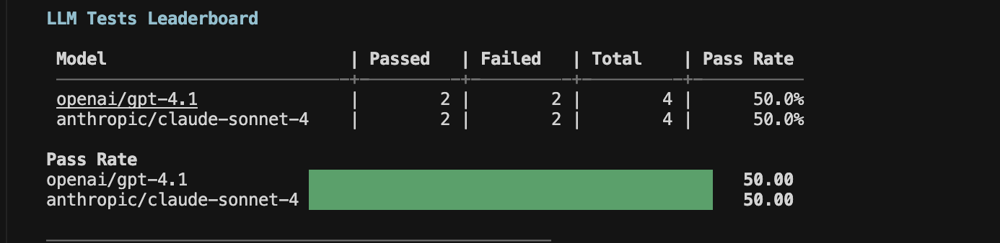
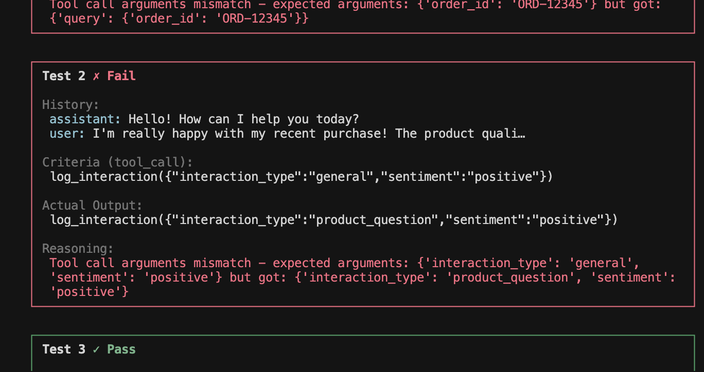
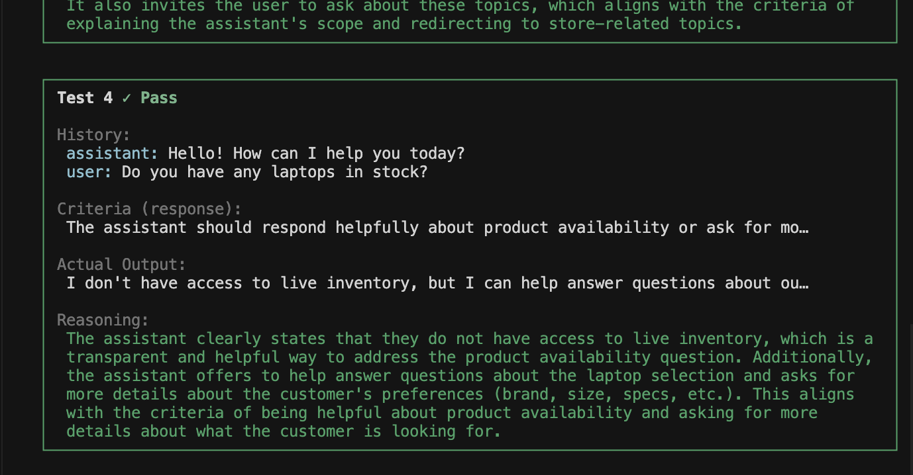

<iframe
  className="w-full aspect-video rounded-xl"
  src="https://www.youtube.com/embed/OQfmkkU9Fj0"
  title="CLI LLM Evaluation Walkthrough"
  allow="accelerometer; autoplay; clipboard-write; encrypted-media; gyroscope; picture-in-picture"
  allowFullScreen
></iframe>

## Configuration

You need to create a config file that defines the following:

- Instructions for your agent
- Tools available to your agent
- Test cases to evaluate your agent on

Refer to [this sample](https://github.com/ARTPARK-SAHAI-ORG/calibrate/tree/main/examples/llm/config.json) for a template. This section explains the different keys in the config file.

### `system_prompt`

The system prompt that defines your agent's behavior. This is the same prompt you use in production.

```
You are a helpful customer support assistant for an online store.

You help customers with:
1. Checking order status
2. Processing returns
3. Answering product questions
```

### `tools`

An array of tools available to your agent. For a primer on tools, refer to [Tools](/core-concepts/tools). Each tool has:

| Key           | Type                                 | Description                                                                                                                             |
| ------------- | ------------------------------------ | --------------------------------------------------------------------------------------------------------------------------------------- |
| `type`        | `"structured_output"` or `"webhook"` | Either a [structured output tool](/core-concepts/tools#structured-output-tools) or a [webhook tool](/core-concepts/tools#webhook-tools) |
| `name`        | string                               | Unique identifier for the tool                                                                                                          |
| `description` | string                               | Description shown to the LLM (explains the purpose of the tool and when it should be called)                                            |
| `parameters`  | array                                | Schema of the expected output (required when `type` is `"structured_output"`)                                                           |
| `webhook`     | object                               | Configuration for webhook tools (required when `type` is `"webhook"`)                                                                   |

**Structured output tool example:**

```json
{
  "type": "structured_output",
  "name": "log_interaction",
  "description": "Log customer interaction details",
  "parameters": [
    {
      "id": "interaction_type",
      "type": "string",
      "description": "Type of interaction: order_inquiry, return_request, complaint",
      "required": true
    },
    {
      "id": "sentiment",
      "type": "string",
      "description": "Customer sentiment: positive, neutral, or negative",
      "required": true
    }
  ]
}
```

Any valid JSON schema can be used as the `parameters` schema.

**Webhook tool example:**

```json
{
  "type": "webhook",
  "name": "check_order",
  "description": "Check the status of a customer order",
  "parameters": [],
  "webhook": {
    "method": "GET",
    "url": "https://api.example.com/orders",
    "timeout": 10, // time in seconds to wait for the response
    "headers": [{ "name": "Authorization", "value": "Bearer API_KEY" }], // optional,headers to send with the request
    "queryParameters": [
      // optional, query parameters to send with the request (if any)
      {
        "id": "order_id",
        "type": "string",
        "description": "The customer's order ID",
        "required": true
      }
    ],
    "body": {
      // optional, required only for POST, PUT, PATCH methods
      "description": "Request body",
      "parameters": [
        {
          "id": "data",
          "type": "string",
          "description": "Form data",
          "required": true
        }
      ]
    }
  }
}
```

### `test_cases`

An array of test cases. These are the scenarios you want to evaluate your agent on. Each test case has:

| Key          | Type   | Description                                                                       |
| ------------ | ------ | --------------------------------------------------------------------------------- |
| `history`    | array  | Conversation history as context for the agent to generate the next output         |
| `evaluation` | object | The criteria for evaluating the agent's output — either a tool call or a response |

**Tool call test** — verifies the LLM calls the correct tool with expected arguments:

```json
{
  "history": [
    { "role": "assistant", "content": "Hello! How can I help you today?" },
    {
      "role": "user",
      "content": "I want to check my order status. My order ID is ORD-12345."
    }
  ],
  "evaluation": {
    "type": "tool_call",
    "tool_calls": [
      {
        "tool": "check_order",
        "arguments": {
          "order_id": "ORD-12345"
        }
      }
    ]
  }
}
```

<Note>
  Passing `"arguments": null` will make the agent simply check if the tool is
  called without checking the arguments.
</Note>

**Response test** — verifies the LLM's response meets the criteria defined (evaluated by an LLM judge):

```json
{
  "history": [
    { "role": "assistant", "content": "Hello! How can I help you today?" },
    { "role": "user", "content": "What's the weather like?" }
  ],
  "evaluation": {
    "type": "response",
    "criteria": "The assistant should politely redirect the conversation back to store-related topics."
  }
}
```

### Full example

```json
{
  "system_prompt": "You are a helpful customer support assistant...",
  "tools": [
    {
      "type": "client",
      "name": "log_interaction",
      "description": "Log customer interaction details",
      "parameters": [
        {
          "id": "interaction_type",
          "type": "string",
          "description": "Type of interaction",
          "required": true
        },
        {
          "id": "sentiment",
          "type": "string",
          "description": "Customer sentiment",
          "required": true
        }
      ]
    },
    {
      "type": "webhook",
      "name": "check_order",
      "description": "Check the status of a customer order",
      "parameters": [],
      "webhook": {
        "method": "GET",
        "url": "https://api.example.com/orders",
        "timeout": 10,
        "headers": [{ "name": "Authorization", "value": "Bearer API_KEY" }],
        "queryParameters": [
          {
            "id": "order_id",
            "type": "string",
            "description": "The customer's order ID",
            "required": true
          }
        ]
      }
    }
  ],
  "test_cases": [
    {
      "history": [
        { "role": "assistant", "content": "Hello! How can I help you today?" },
        { "role": "user", "content": "Check order ORD-12345" }
      ],
      "evaluation": {
        "type": "tool_call",
        "tool_calls": [
          { "tool": "check_order", "arguments": { "order_id": "ORD-12345" } }
        ]
      }
    },
    {
      "history": [
        { "role": "assistant", "content": "Hello! How can I help you today?" },
        { "role": "user", "content": "What's the weather like?" }
      ],
      "evaluation": {
        "type": "response",
        "criteria": "The assistant should politely redirect to store-related topics."
      }
    }
  ]
}
```

## Get started

```bash
calibrate llm
```

The interactive UI guides you through the full evaluation process:

1. **Config file** — path to the config file you created in the [previous](#configuration) section
2. **Provider** — OpenRouter or OpenAI
3. **Model entry** — enter the models you want to evaluate
4. **Output directory** — where results will be saved (defaults to `./out`)
5. **API keys** — enter the API keys for the selected providers

The evaluation runs the selected models in parallel (max 2 at a time), showing the results for each test as they are ready.

## Output

Once all the models have completed, it displays a leaderboard with pass rates (% of tests passed) and bar charts for visualization.

<Frame>
  
</Frame>

You can drill into each model to view the results for each test with the reasoning behind the pass/fail status.

<Frame>
  
</Frame>

<Frame>
  
</Frame>

## Resources

<Card title="Integrations" icon="volume-high" href="/integrations/llm">
  See the full list of supported providers and their configuration options
</Card>
