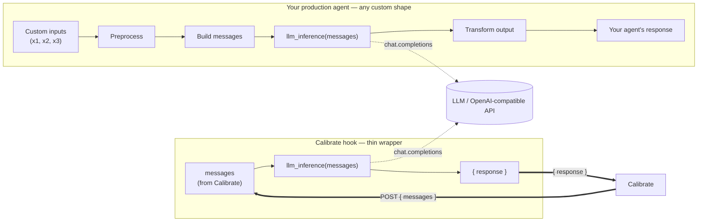

If you already have a deployed agent, you can connect it to Calibrate and run evaluations, benchmarks, and simulations against it — without rebuilding your agent inside Calibrate.

<Tip>
  If you don't have an existing agent and want to build one from scratch within
  Calibrate, see [Core Concepts: Agents](/core-concepts/agents) instead.
</Tip>

## How the connection works

Calibrate does not need to understand your whole agent. It needs a single HTTP
endpoint that follows one contract:

- **Request** — Calibrate `POST`s the conversation so far as a `messages` array.
- **Response** — your endpoint returns a JSON object with the agent's reply: a
  `response` string, and optionally `tool_calls`.

Your agent does **not** have to be OpenAI-compatible, and you do **not** have to
expose your production pipeline — all the custom preprocessing, routing,
retrieval, and output formatting your agent does can stay exactly as it is.

The insight is that however custom your agent's API looks on the outside, it
almost always ends in an LLM call over a `messages` list. That LLM call is what
Calibrate evaluates. So the job is just to expose *that inner call* as a thin
endpoint Calibrate can reach:



Both paths call the **same** `llm_inference(messages)` function, so the endpoint
Calibrate tests is exactly the model logic your agent ships — nothing is
re-implemented or mocked.

### Request format

Calibrate `POST`s to your endpoint with the full conversation history in
chronological order:

```json
{
  "messages": [
    {
      "role": "assistant",
      "content": "Namaste! Main aapki kaise madad kar sakti hoon?"
    },
    { "role": "user", "content": "Meri beti ka vaccination schedule kya hai?" }
  ]
}
```

### Response format

By default, your endpoint returns a `response` field containing the agent's text
reply:

```json
{
  "response": "Aapki beti ka agla vaccination 14 weeks pe hai — OPV aur DPT ke liye."
}
```

If your agent also returns tool calls, expand the body to include a `tool_calls`
array — each item has a `tool` name and an `arguments` object:

```json
{
  "response": "Aapki beti ka agla vaccination 14 weeks pe hai — OPV aur DPT ke liye.",
  "tool_calls": [
    { "tool": "get_schedule", "arguments": { "child_age_weeks": 14 } }
  ]
}
```

Each tool call may also include an optional `output` field — the result the tool
returned when your agent ran it. It can be any JSON value, is shown in the
results view for review only, and never affects whether a test passes or fails:

```json
{
  "tool_calls": [
    {
      "tool": "get_schedule",
      "arguments": { "child_age_weeks": 14 },
      "output": { "next_visit_weeks": 14, "vaccines": ["OPV", "DPT"] }
    }
  ]
}
```

<Warning>
  Your endpoint's output **must** include either a `response` field or a
  `tool_calls` field.
</Warning>

### Wrap your existing LLM call

Concretely, pull the model call out of your agent handler into a reusable
function, then expose a second route that calls it directly.

**Before** — the LLM call is buried inside your request handler:

```python
def inference(x1, x2, x3):
    y1 = preprocess(x1)
    y2 = preprocess(x2)
    y3 = preprocess(x3)

    messages = [
        {"role": "user", "content": "..."},
        {"role": "assistant", "content": "..."},
        {"role": "user", "content": "..."},
    ]

    response = client.chat.completions.create(messages=messages)  # buried here
    return transform(response)

@app.get("/agent")
def agent():
    return inference(x1, x2, x3)
```

**After** — the LLM call is modularized and re-used by a thin Calibrate route:

```python
def llm_inference(messages):
    """The core model call — reused by both your agent and Calibrate."""
    response = client.chat.completions.create(messages=messages)
    return response.choices[0].message.content

def inference(x1, x2, x3):
    y1 = preprocess(x1)
    y2 = preprocess(x2)
    y3 = preprocess(x3)

    messages = [
        {"role": "user", "content": "..."},
        {"role": "assistant", "content": "..."},
        {"role": "user", "content": "..."},
    ]

    response = llm_inference(messages)   # same call, now shared
    return transform(response)

@app.get("/agent")
def agent():
    return inference(x1, x2, x3)

@app.post("/calibrate/test")           # the endpoint you connect to Calibrate
def calibrate_test(body):
    return {"response": llm_inference(body["messages"])}
```

You then point Calibrate at `POST /calibrate/test`, add any authentication
headers your agent requires, and verify the connection — both covered below.

## Create an agent connection

From the sidebar, click **Agents** → **New agent**. Select **Connect your existing agent**, give it a name, and click **Create**.

<Frame>
  
</Frame>

You will be taken to the new agent page where you configure the connection details.

## Configure your connection

The **Connection** tab lets you set up everything Calibrate needs to communicate with your agent:

<Frame>
  
</Frame>

Fill in the following:

1. **Agent URL** (required) — The HTTPS endpoint where your agent is deployed (e.g. `https://your-agent.example.com/chat`). Calibrate will send a `POST` request to this URL with conversation messages.

2. **Headers** (optional) — Add any headers your agent needs for authentication or custom metadata (e.g. `Authorization: Bearer YOUR_API_KEY`). Click **+ Add header** to add multiple headers.

The request and response formats your endpoint must follow are described in
[How the connection works](#how-the-connection-works) above.

## Verify your connection

Before running any tests, we need to verify we can connect to your agent and that it returns the output in the correct format.

Click the **Verify** button in the **Connection check** panel. A dialog will open where you can customize the sample request that will be sent to your agent:

<Frame>
  
</Frame>

- Edit the **Messages** to set the conversation history for the test request.
- The **Request body preview** on the right updates live so you can see the exact JSON that will be sent.
- Click **Send & Verify** to send the request to your agent.

After verification:

- ✅ **Verified** — Your agent is reachable and returns the correct format
- ❌ **Failed** — The panel will show the error along with the actual output received from your agent so you can debug and try again.

<Note>
  Connection verification is required before running LLM tests, benchmarks or
  simulations
</Note>

Even after your agent is verified, if you make any changes to your agent you can come back here and verify the connection again.

## Enable benchmarking across models

Calibrate supports [benchmarking](/quickstart/text-to-text#find-the-best-llm-for-your-agent) different LLMs on your dataset to find the best model for your agent. For this, you need to instrument your agent API to support a `model` field in the request body that Calibrate will send along with the conversation history.

<Warning>
  Your agent is responsible for reading the `model` parameter and setting the
  right model to perform the actual inference. Calibrate sends this field but
  does not control which model your agent uses.
</Warning>

To get started, turn on **Support benchmarking different models** from the **Connection** tab.

<Frame>
  
</Frame>

When enabled:

1. Select your **Model provider** from the dropdown (OpenRouter, OpenAI, Anthropic, Google, etc.). This represents the provider you have configured for your agent on your system.
2. Calibrate will include a `model` field in the request body:

```json
{
  "messages": [...],
  "model": "openai/gpt-4.1"
}
```

Depending on the provider you have selected, the format of the `model` field will be different. For example, if you have selected `OpenRouter`, the `model` field will be `openrouter/gpt-4.1`. If you have selected OpenAI, the `model` field will just be `gpt-4.1`.

3. When running a benchmark via **Compare models**, Calibrate will verify the connection for each selected model before starting the evaluation. See [this](/quickstart/text-to-text#verifying-agent-connection) for details.

## Next steps

<CardGroup cols={2}>
  <Card title="Run LLM Tests" icon="list-check" href="/quickstart/text-to-text">
    Create and run test cases against your agent
  </Card>
  <Card
    title="Find the best LLM"
    icon="list-check"
    href="/quickstart/text-to-text#find-the-best-llm-for-your-agent"
  >
    Compare the performance of different LLMs on your agent
  </Card>
  <Card title="Run Simulations" icon="play" href="/quickstart/simulations">
    Simulate conversations with realistic personas
  </Card>
</CardGroup>
