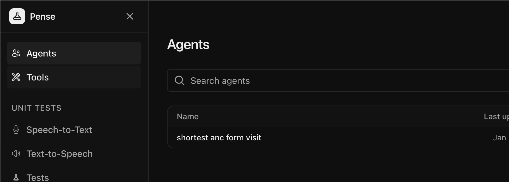
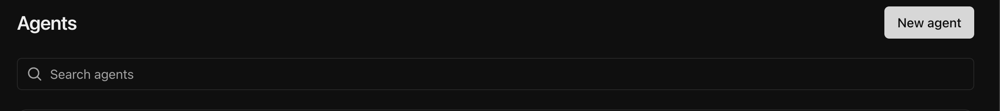
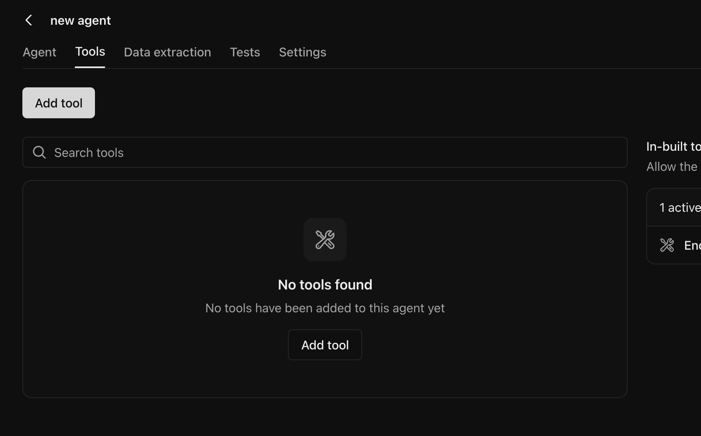
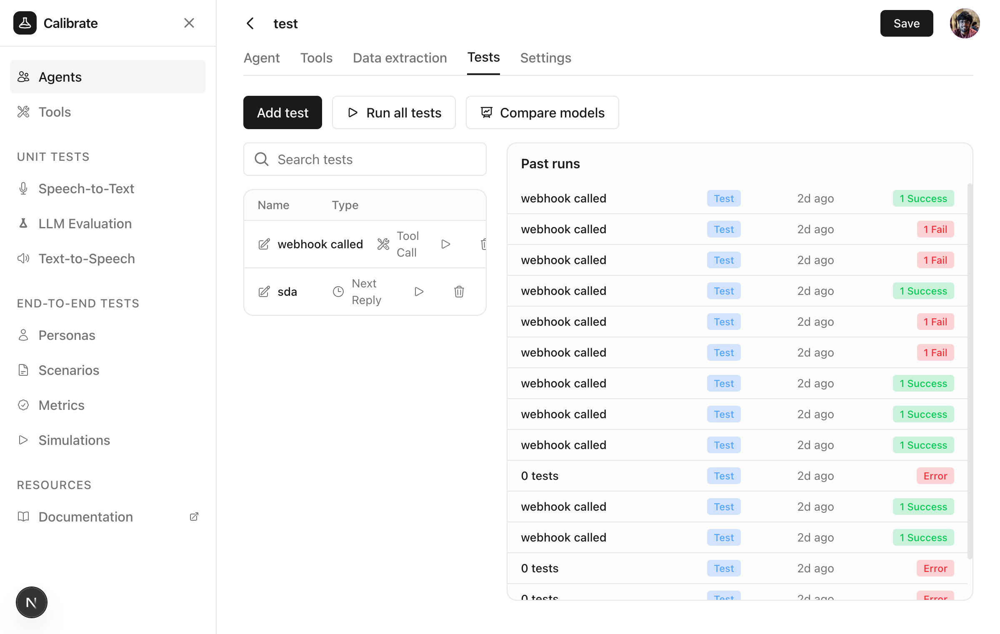
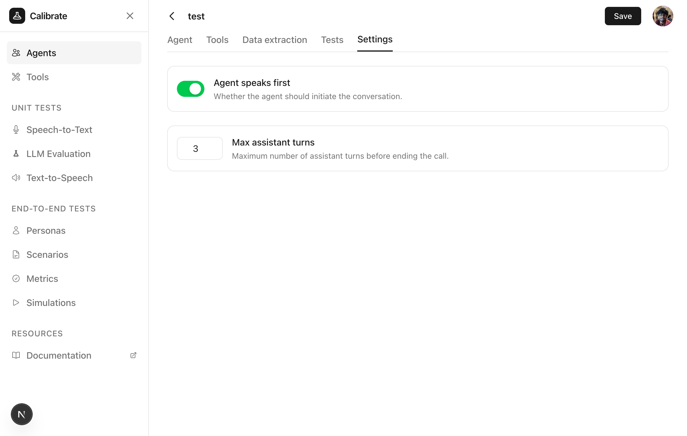

An agent is a core building block of Pense. Agents can:

- Process voice conversations using Speech To Text (STT) and Text To Speech (TTS)
- Respond intelligently using LLM models following the instructions given to them
- Use tools for structured data extraction

## Quickstart

### Navigate to Agents

From the sidebar, click **Agents** to view your existing agents or create a new one.

<Frame>
  
</Frame>

### Create a new agent

Click the **New agent** button in the top right corner, fill the name of the agent and hit **Create agent**.

<Frame>
  
</Frame>

Once ready, you'll be taken to the agent page.

<Frame>
  
</Frame>

### Agent instructions

Fill out the **System prompt** field to define the context for the agent, the agent's persona, how it is supposed to behave and any guidelines it should follow. Write clear instructions:

<Tip>
  Be specific about the agent's tone, capabilities, and limitations in the
  system prompt.
</Tip>

For detailed guidance on writing effective system prompts, see [ElevenLabs Prompting Guide](https://elevenlabs.io/docs/agents-platform/best-practices/prompting-guide) and [OpenAI Prompt Engineering Guide](https://platform.openai.com/docs/guides/prompt-engineering).

Click **Save** in the top right to save your configuration.

### Configure providers

Select the Speech To Text (STT), Text To Speech (TTS) and LLM model/provider for the agent.

Click **Save** in the top right to save your configuration.

### Add tools

Click **Attach tool** to enable structured outputs by the agent. See the [Tools guide](/core-concepts/tools) for how to create tools.

<Frame>
  
</Frame>

### Set up data extraction

Define fields for extracting structured data from conversations

<Frame>
  
</Frame>

### Add tests

Add tests to the agent to evaluate its performance. See the [LLM Testing guide](/quickstart/text-to-text) for how to create tests.

<Frame>
  
</Frame>

### Advanced Settings

<Frame>
  
</Frame>

Click **Save** in the top right to save your configuration.

## Next Steps

<CardGroup cols={2}>
  <Card title="Run LLM Tests" icon="flask" href="/quickstart/text-to-text">
    Test your agent's responses and tool usage
  </Card>
  <Card title="Run Simulations" icon="play" href="/quickstart/simulations">
    Simulate conversations with the agent to identify issues before deployment
  </Card>
</CardGroup>
