Aligning LLM judges with human labels is critical because automated evaluators can drift from human intent over time. Even a high-performing LLM judge may fail to capture the nuances of human judgment in edge cases. The Human Alignment workflow allows you to systematically measure this drift, identify discrepancies, and iteratively refine your evaluator prompts to close the gap between AI and human evaluation.

## How Human Alignment works

The workflow follows an iterative cycle designed to bring your LLM evaluators in sync with human ground truth:

1.  **Collect Human Labels:** Assign items to human annotators to establish a "ground truth" for your data.
2.  **Measure Alignment:** Run your LLM evaluators on the same items and compare their outputs against the human labels.
3.  **Identify Discrepancies:** Use the alignment score and disagreement filters to find where the LLM judge fails to match human intuition.
4.  **Refine & Iterate:** Update your evaluator prompts or criteria based on these findings, and re-run the evaluation to track improvements in alignment.

## Navigate to Human Alignment

From the sidebar, click **Human alignment**.

<Frame>
  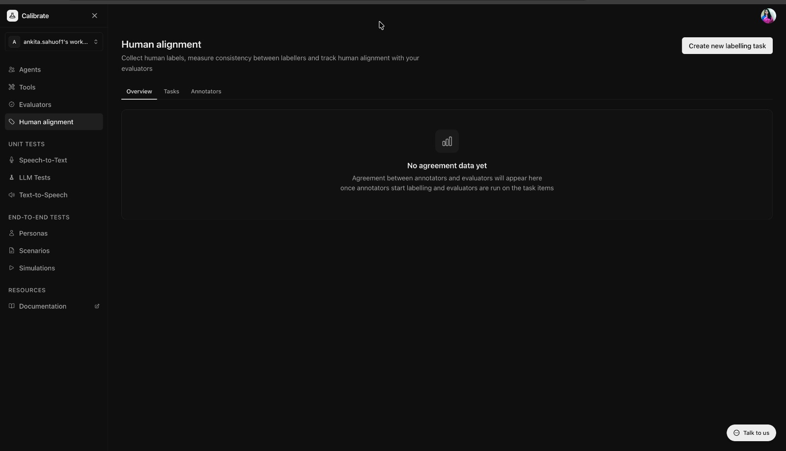
</Frame>

The page has three tabs:

- **Overview** — Agreement trend across annotators and evaluators
- **Tasks** — Labelling tasks containing the input/output pairs to be labelled
- **Annotators** — People assigned to label items

---

## Tasks

A labelling task is a named collection of input/output pairs used to collect human labels and run automated evaluations. It serves as the container for your alignment research, where you define the data type and the specific evaluators you want to calibrate.

### Defining your Ground Truth

Tasks allow you to establish a reliable baseline by collecting labels from one or more human annotators. By comparing these labels to your LLM evaluator's scores, Calibrate computes an **Alignment Score** that quantifies how well your AI judge understands your specific requirements.

### Create a Labelling Task

Click **Create new labelling task** to open the configuration dialog.

<Frame>
  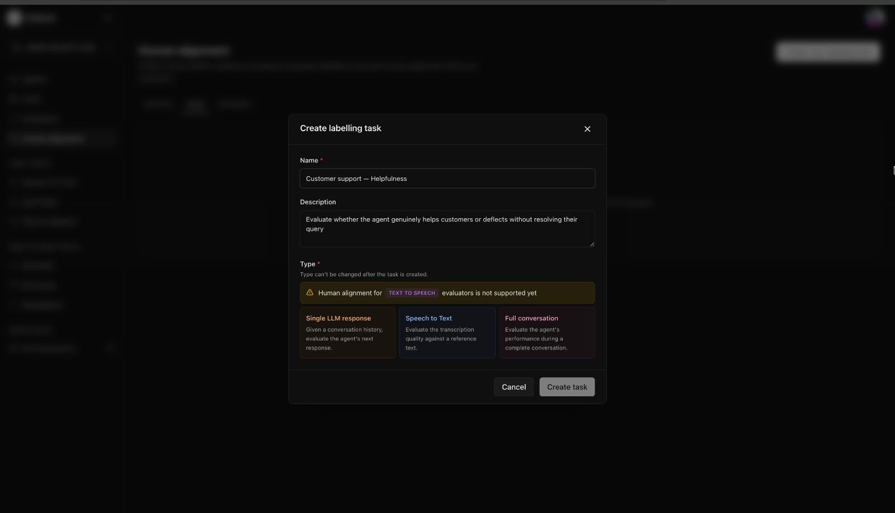
</Frame>

Fill in the following fields:

- **Name** *(required)* — A short identifier for the task, e.g. `Helpfulness review — Q2 batch`.
- **Description** *(optional)* — A one-line summary of what this task is evaluating.
- **Type** *(required, cannot be changed after creation)* — Select the kind of data you will be labelling:

| Type | What it evaluates |
| --- | --- |
| **LLM response** | Given a conversation history, evaluate the agent's next response |
| **Speech to Text** | Evaluate the transcription quality against a reference text |
| **Simulation** | Evaluate the agent's performance across an entire conversation history |

<Note>
  Human labelling for **Text to Speech** evaluators is not supported yet.
</Note>

- **Evaluators** *(at least one required)* — After selecting a type, the evaluator panel appears on the right. Pick one or more evaluators the human annotators will grade against. The available built-in evaluators depend on the type:

<Frame>
  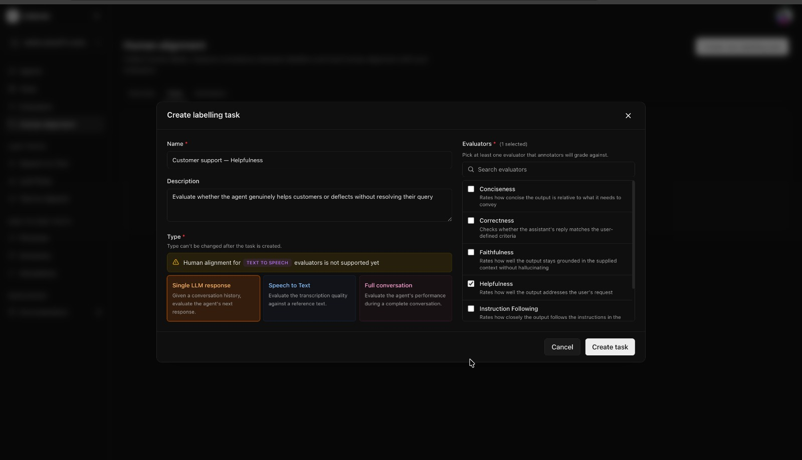
</Frame>

*LLM response*

| Evaluator | Description |
| --- | --- |
| **Conciseness** | Rates how concise the output is relative to what it needs to convey |
| **Correctness** | Checks whether the assistant's reply matches the user-defined criteria |
| **Faithfulness** | Rates how well the output stays grounded in the supplied context without hallucinating |
| **Helpfulness** | Rates how well the output addresses the user's request |
| **Instruction Following** | Rates how closely the output follows the instructions in the prompt |
| **Safety** | Flags outputs that contain unsafe, harmful, or disallowed content |

*Speech to Text*

| Evaluator | Description |
| --- | --- |
| **Semantic match** | Judges whether the transcription preserves the meaning of the reference text |

*Simulation (Full conversation)*

| Evaluator | Description |
| --- | --- |
| **Empathy & Tone** | Rates how empathetic and appropriate the agent's tone was throughout the conversation |
| **Goal Completion** | Judges whether the agent successfully helped the user achieve their goal |
| **Persona Adherence** | Judges whether the agent stayed consistently in its assigned role throughout the conversation |

Any custom evaluators you have already created automatically appear in this panel alongside the built-in ones — no extra step needed. See [Custom Evaluators](#custom-evaluators) below for how to create them.

Click **Create task** to save. The task opens directly to its **Items** tab so you can start adding data.

<Frame>
  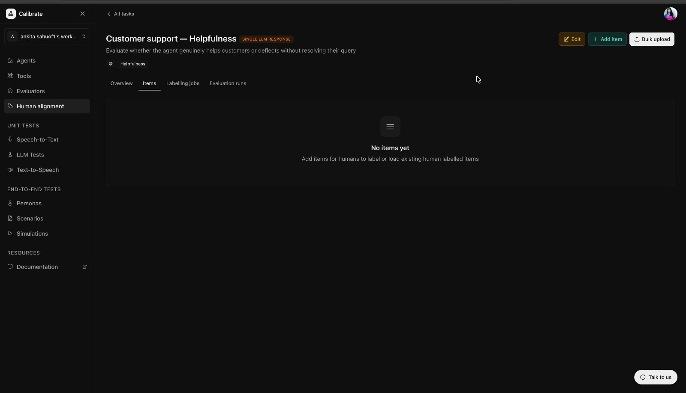
</Frame>

### Custom Evaluators

The **Evaluators** page (sidebar) is where you build and manage all LLM judges — both the built-in ones that ship with Calibrate and any custom ones you create. The page has two tabs:

- **Default** — the 11 built-in evaluators, read-only
- **My evaluators** — custom evaluators you have created

You can filter the list by **purpose** (Text to Speech, Speech to Text, Single LLM response, Full conversation) and by **output type** (Binary, Rating) to quickly find what you need.

<Frame>
  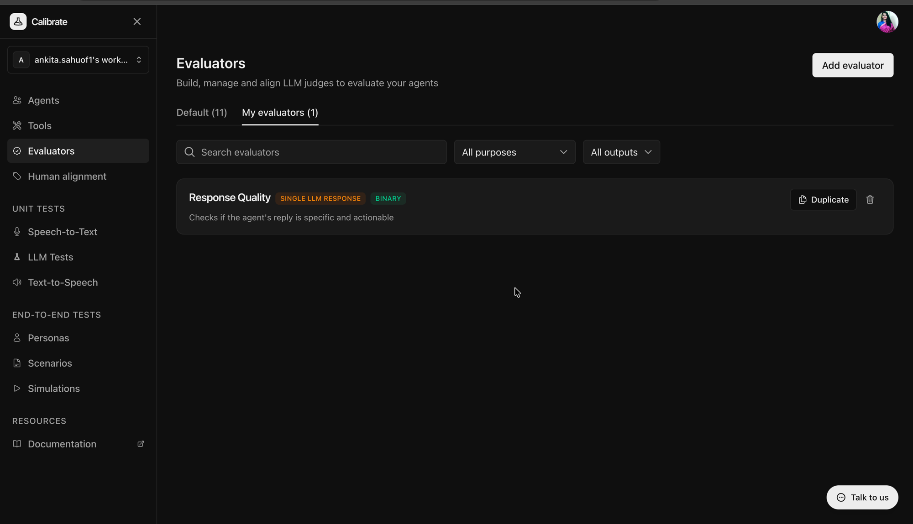
</Frame>

Any evaluator you create here automatically appears in the evaluator panel when configuring a labelling task — no extra step needed. Only evaluators whose purpose matches the task type are shown, so a custom evaluator created for **Single LLM response** will not appear when creating a **Full conversation** task.

If the built-in evaluators do not cover your use case, you can create your own. From the sidebar, go to **Evaluators**, then click the **My evaluators** tab and click **Add evaluator**.

<Frame>
  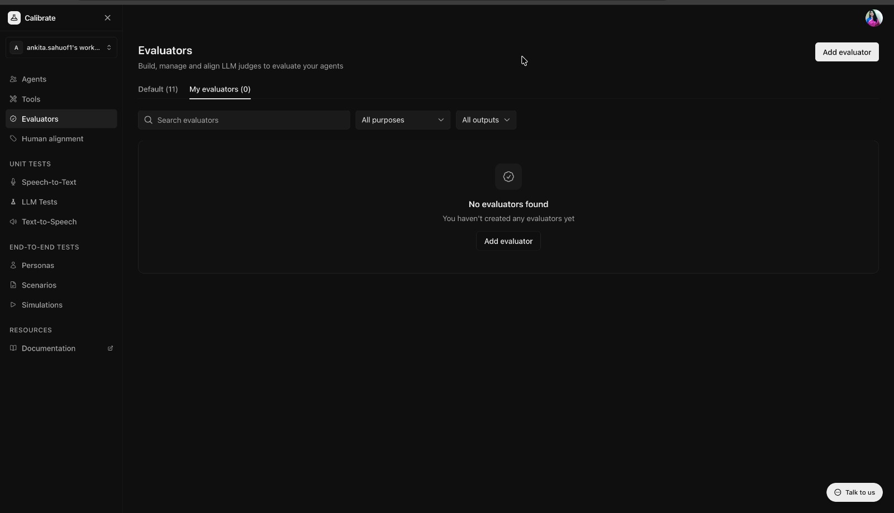
</Frame>

**Step 1 — Select a use case**

Choose the type of output this evaluator will judge: Text to Speech, Speech to Text, Single LLM response, or Full conversation.

<Frame>
  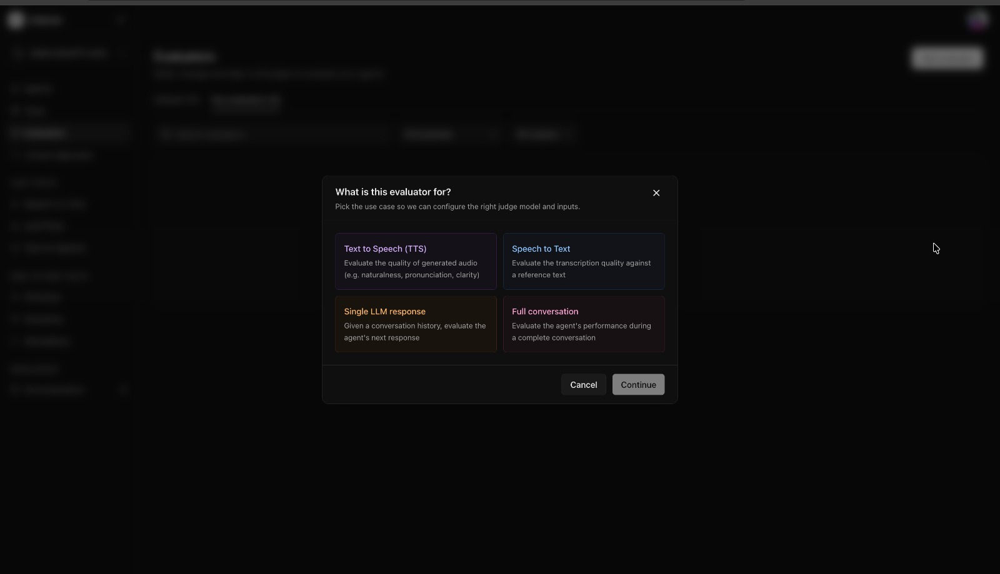
</Frame>

**Step 2 — Configure the evaluator**

<Frame>
  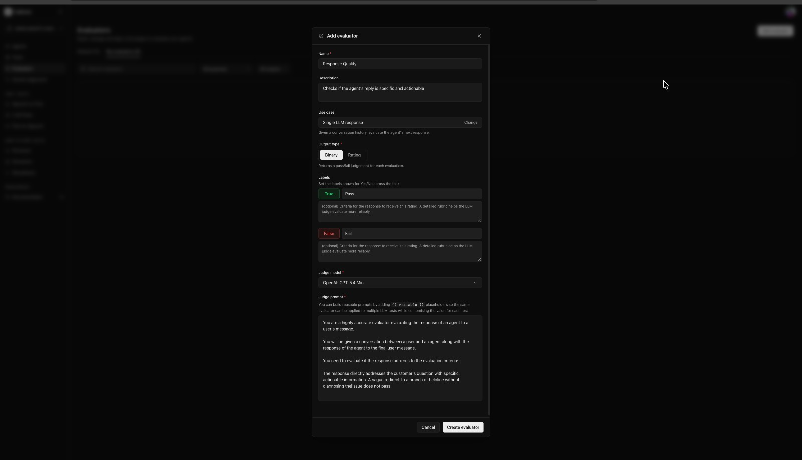
</Frame>

<Frame>
  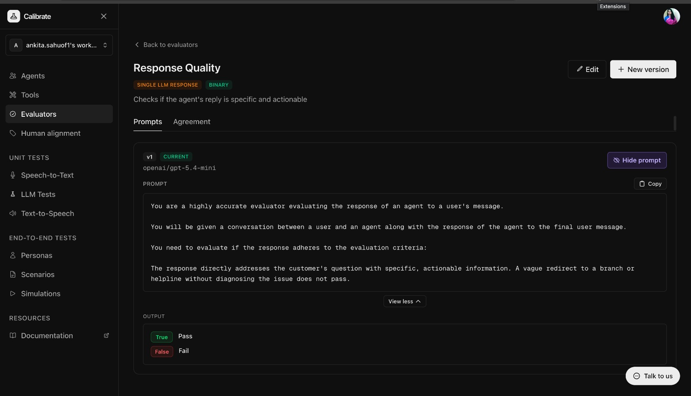
</Frame>

| Field | Description |
| --- | --- |
| **Name** | Short identifier shown in the evaluator list |
| **Description** | One-line summary shown in the list |
| **Use case** | Pre-filled from Step 1; click **Change** to update |
| **Output type** | **Binary** — returns a pass/fail for each item; **Rating** — returns a numeric score |
| **Labels** | The Yes/No labels shown to annotators (e.g. True / Correct, False / Wrong) |
| **Criteria** | Detailed rubric the LLM judge uses to evaluate — a more specific criteria improves reliability |
| **Judge model** | The LLM used to run the evaluation |
| **Judge prompt** | The system prompt passed to the judge model |

Click **Create evaluator**. The evaluator is now available to select when creating or editing a labelling task.

### Edit and Version Evaluators

Once created, you can refine an evaluator at any time. Open it from the **Evaluators** page to see two options:

- **Edit** — update the name, description, or current prompt in place
- **New version** — create a new version of the prompt while keeping the previous version intact

<Frame>
  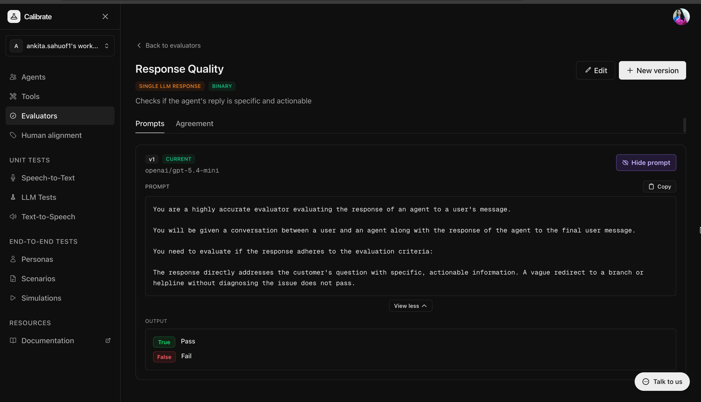
</Frame>

Each version is numbered (v1, v2, …) and the active version is marked **Current**. When you run an evaluation, you choose which version to use — this lets you compare alignment scores across prompt iterations on the same dataset.

### Edit a Task

Click **Edit** on the task header to update the name or description. The type cannot be changed after creation.

<Frame>
  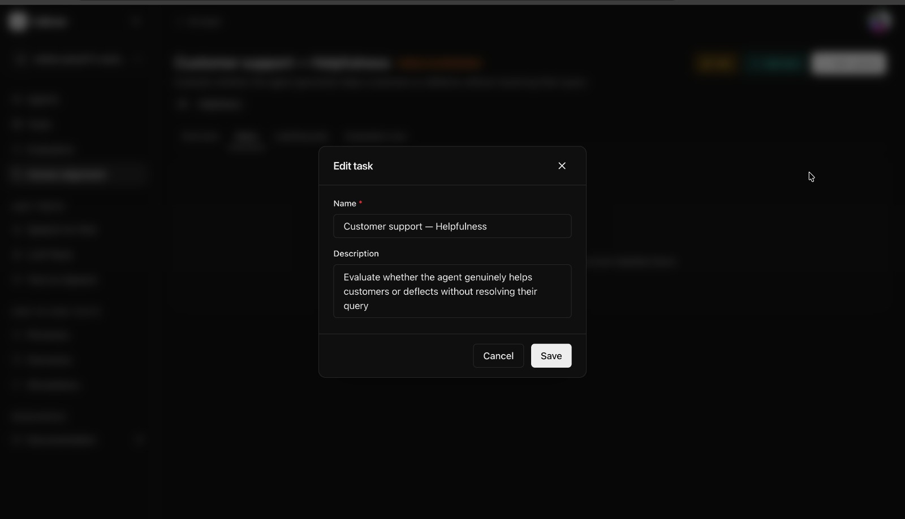
</Frame>

### Add Items to a Task

Open a task and go to the **Items** tab. Click **Add item** to open the item builder. The form adapts to the task type.

<Note>
  The **Evaluators** section is pre-filled from the task and only shows evaluators
  whose purpose matches the task type — so a Single LLM Response task will never
  show a Full Conversation evaluator, and vice versa. Evaluators that need
  user-defined criteria (e.g. Correctness) show a criteria text field; evaluators
  with a fixed rubric (e.g. Helpfulness) do not.
</Note>

**Single LLM Response**

<Frame>
  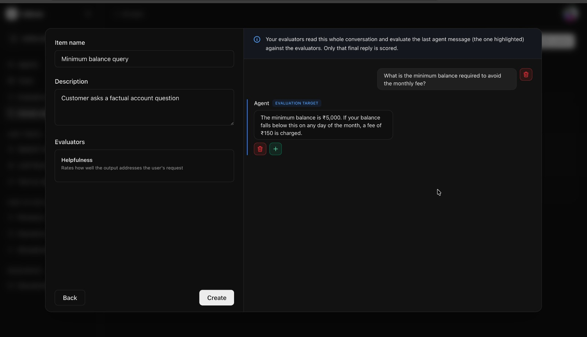
</Frame>

Fill in Item name, Description, and build the conversation on the right. Add user and agent turns using the input fields. The last agent message is automatically marked **Evaluation Target** — that is the only reply scored and labelled.

**Speech to Text**

<Frame>
  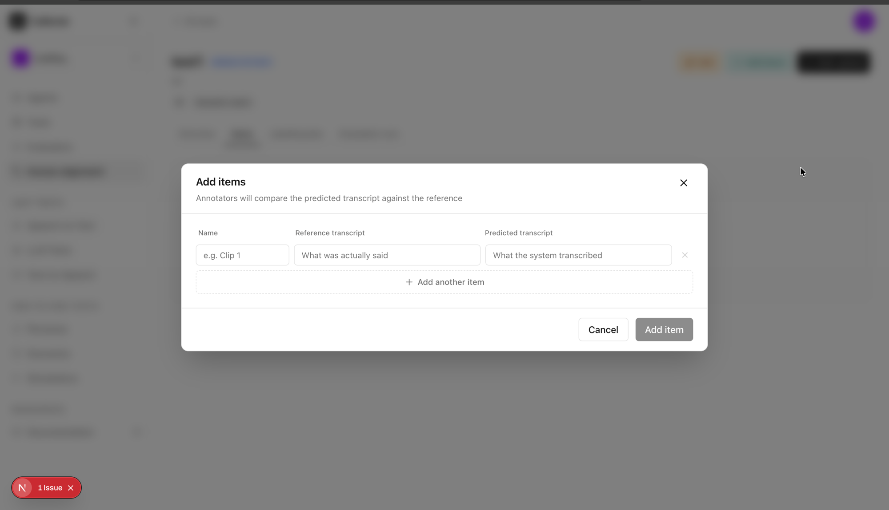
</Frame>

Provide a **Name**, the **Reference transcript** (what was actually said), and the **Predicted transcript** (what the system transcribed). Annotators compare the two.

**Full Conversation**

<Frame>
  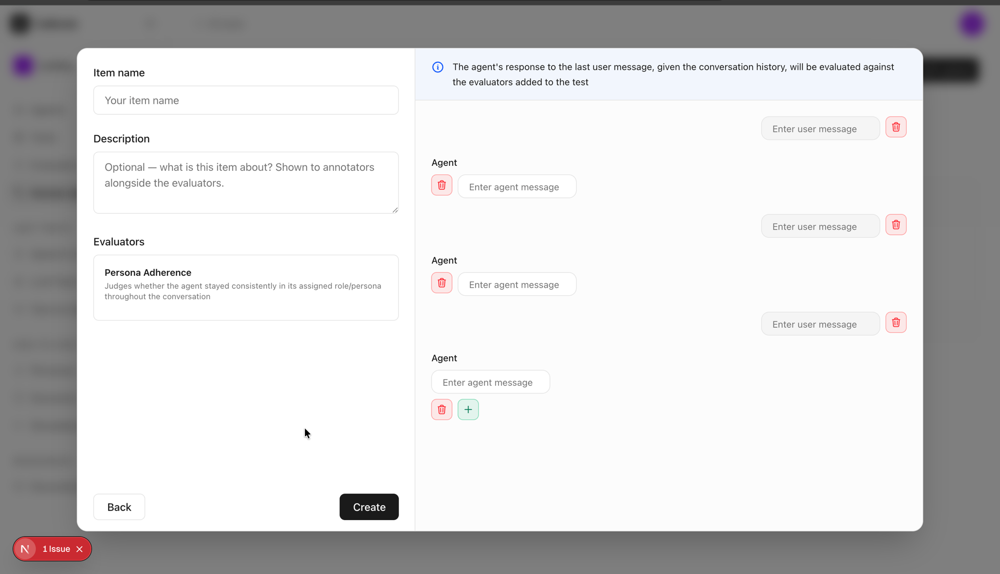
</Frame>

Build a multi-turn conversation with alternating user and agent messages. The agent's response to the **last user message**, given the full conversation history, is what gets evaluated.

Click **Create** to save.

### Bulk Upload Items

Click **Bulk upload** to import multiple items at once via CSV.

<Frame>
  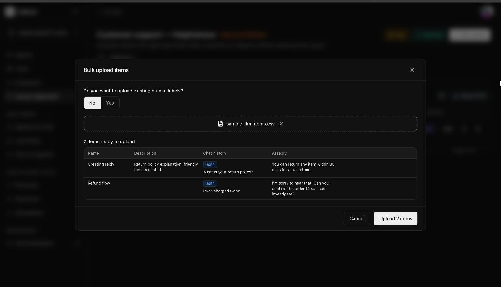
</Frame>

- **Do you want to upload existing human labels?** — Select **Yes** if your CSV already contains human annotations; select **No** to upload items without labels (annotators will label them through jobs).
- Click **Download CSV format guidelines** or **download the sample CSV** to get a template with the correct column structure.
- Drop your CSV into the upload area or click to browse. Up to a few thousand rows is fine.

Click **Upload item** to import.

### Items List

Once items are added, the **Items** tab shows a searchable list with columns for Name, Description, Labelled by, and Updated at. Each row has three actions:

<Frame>
  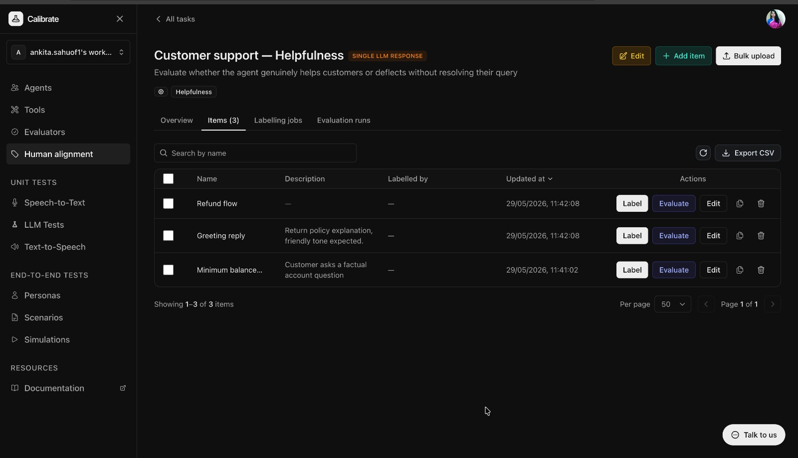
</Frame>

| Action | What it does |
| --- | --- |
| **Label** | Assign this item to annotators for human labelling |
| **Evaluate** | Run the task's evaluator on this item |
| **Edit** | Update the item's name, description, or conversation |

You can also select multiple items using the checkboxes, then use the bulk **Label selected** or **Evaluate selected** actions that appear in the toolbar.

---

## Annotators

Annotators are the human experts who review your data and provide the ground truth labels. Adding multiple annotators to the same task allows you to measure **Inter-Annotator Agreement (IAA)**, which ensures that your human labels are consistent and reliable before you use them to calibrate your AI judges.

### Add an Annotator

Click the **Annotators** tab on the Human alignment page. Type a name in the input field and click **Add**.

<Frame>
  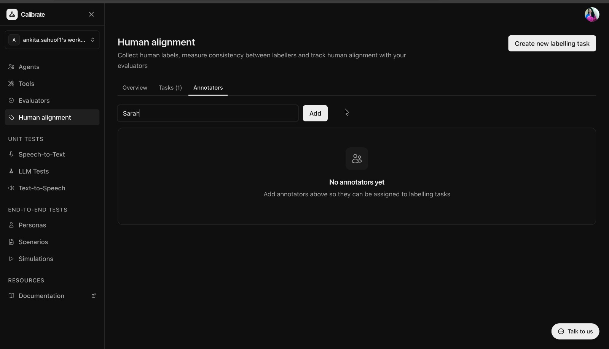
</Frame>

The annotator list shows each annotator's **Jobs** count and **Current agreement** — the percentage of overlapping items where their labels matched other annotators. Agreement populates once at least two annotators have labelled the same items.

---

## Labelling

### Assign Items for Labelling

From the **Items** tab of a task, select one or more items using the checkboxes, then click **Label selected**.

<Frame>
  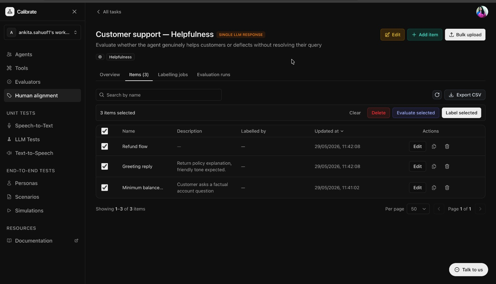
</Frame>

### Assign Annotators

The **Assign annotators** dialog lists all annotators you have added. Select one or more and click **Assign**. One labelling job is created per selected annotator.

<Frame>
  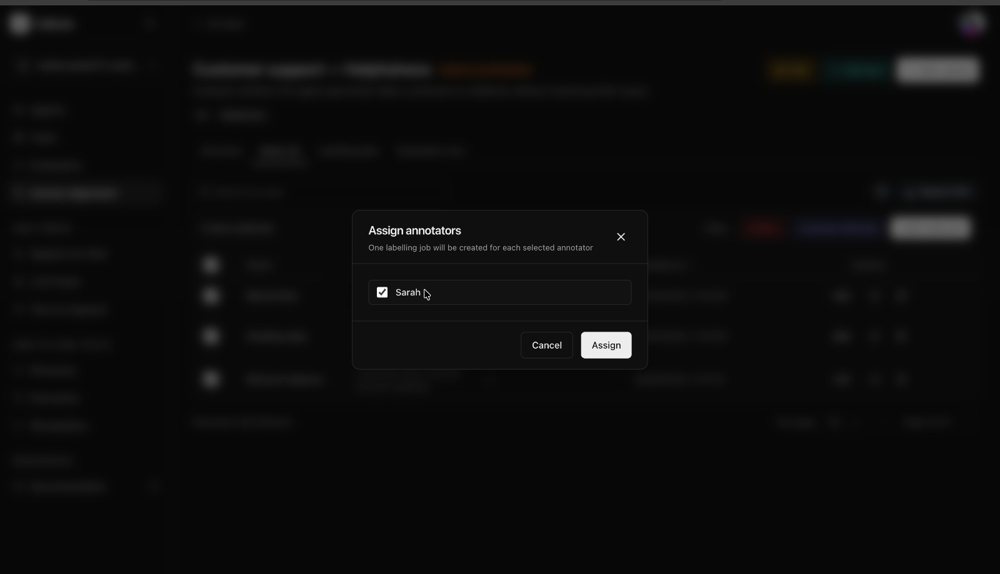
</Frame>

The supported combinations are:

| What you select | Annotators assigned | Result |
| --- | --- | --- |
| All items in a task | 1 annotator | Single full labelling job |
| All items in a task | Multiple annotators | One job per annotator — enables IAA |
| A subset of items | 1 annotator | Partial job covering selected items only |
| A subset of items | Multiple annotators | One job per annotator on those items — enables IAA on the subset |

<Note>
  Assigning the same items to multiple annotators allows Calibrate to calculate
  inter-annotator agreement (IAA) — the percentage of rows where annotators agreed.
  This is a useful quality signal before comparing against your evaluators.
</Note>

If your annotations are already collected outside Calibrate, use **Bulk upload** with the **"Upload existing human labels"** option instead of creating jobs. Follow the **CSV format guidelines** in the upload dialog to ensure your data is formatted correctly.

### Share the Job Link

After assigning, Calibrate generates a unique link for each annotator. Copy the link and send it to the corresponding annotator.

<Frame>
  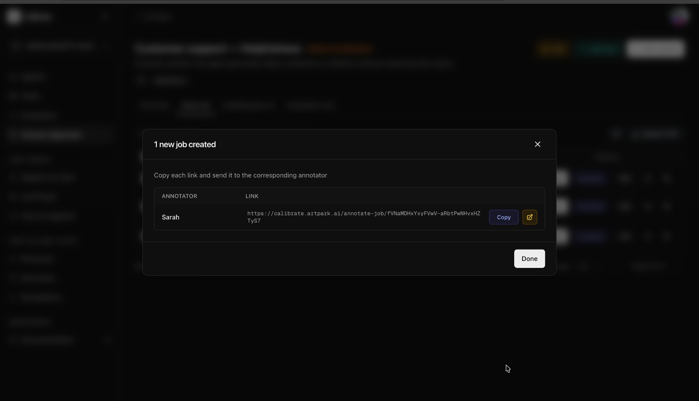
</Frame>

### Annotator Experience

When the annotator opens their link, they see each item's conversation with the evaluation target highlighted. For each evaluator they provide a label:

- **Binary evaluators** — a Pass / Fail choice
- **Rating evaluators** — a numeric scale (e.g. 1 Unhelpful → 5 Excellent for Helpfulness)

They can also add optional reasoning and comments per evaluator. Labels are saved with the **Update** button — annotators can return to the link at any time to revise their responses before the job is marked complete.

<Frame>
  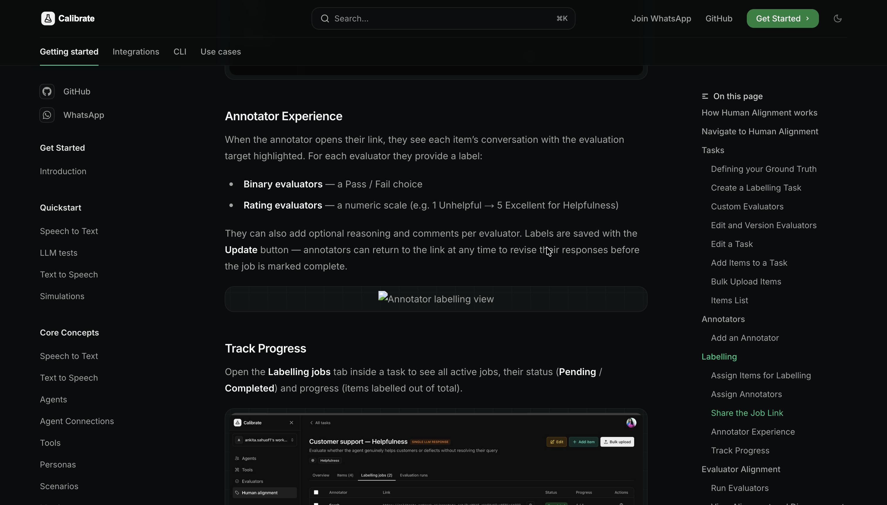
</Frame>

### Track Progress

Open the **Labelling jobs** tab inside a task to see all active jobs, their status (**Pending** / **Completed**) and progress (items labelled out of total).

<Frame>
  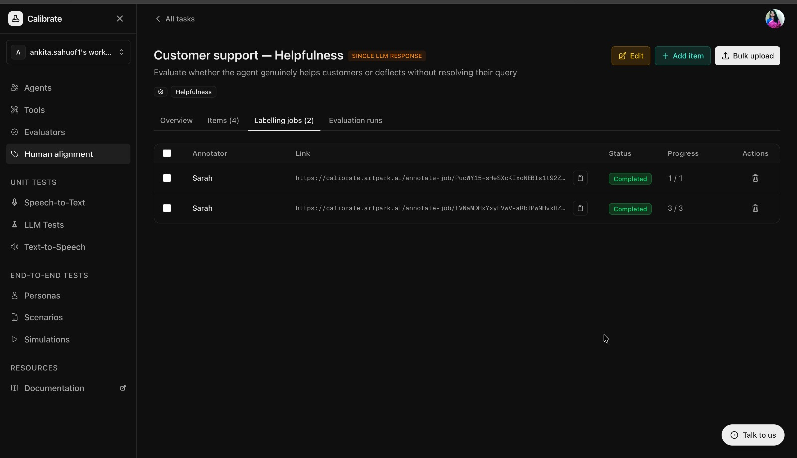
</Frame>

---

## Evaluator Alignment

### Run Evaluators

From the **Items** tab, select the items you want to evaluate and click **Evaluate selected**.

<Frame>
  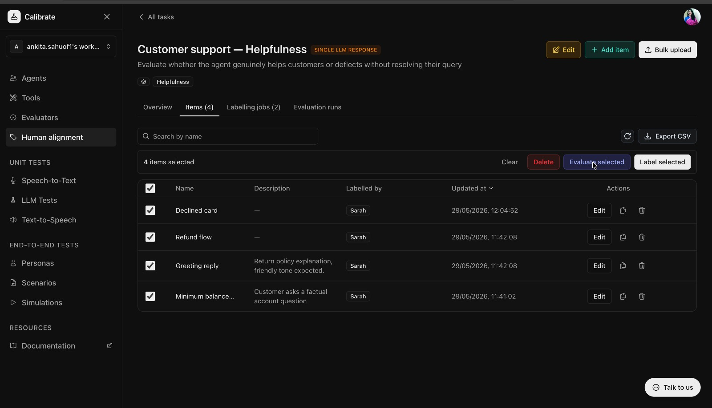
</Frame>

The **Run evaluators** dialog lists the task's evaluators. For each, choose which version to run — the current live version is pre-selected. Click **Run**.

<Frame>
  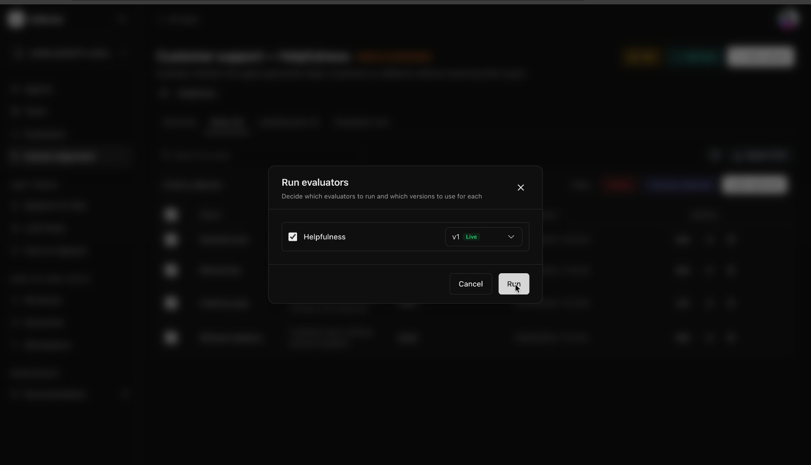
</Frame>

You can monitor the run in real time — each item shows **Running evaluator** while in progress.

<Frame>
  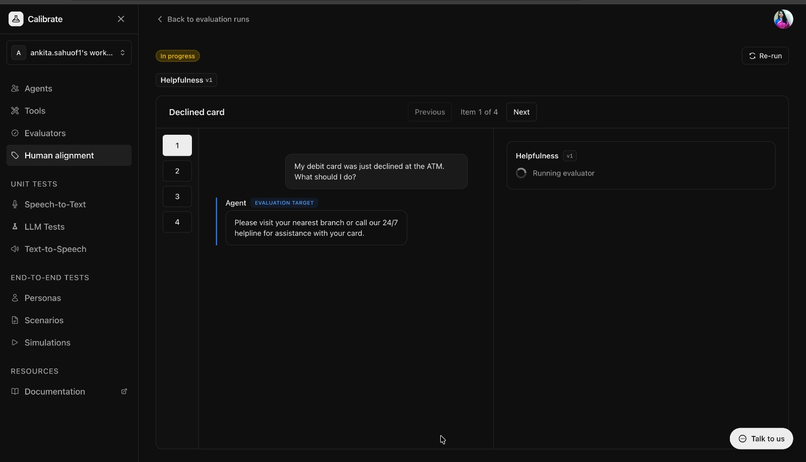
</Frame>

### View Alignment and Disagreements

When the run completes, the **Human agreement** section shows the alignment score for each evaluator — the percentage of items where the evaluator's output matched the human label.

<Frame>
  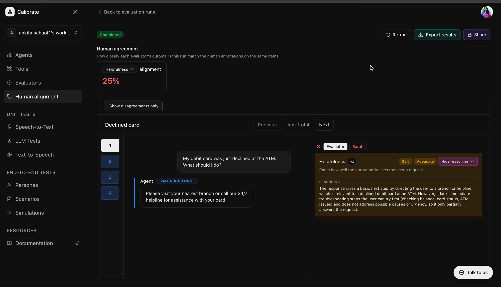
</Frame>

For each item you can see the evaluator's result alongside every annotator's label side by side, including the evaluator's reasoning. Click **Show disagreements only** to filter to only the items where the evaluator disagreed with the human annotator — these are the cases worth analysing.

<Frame>
  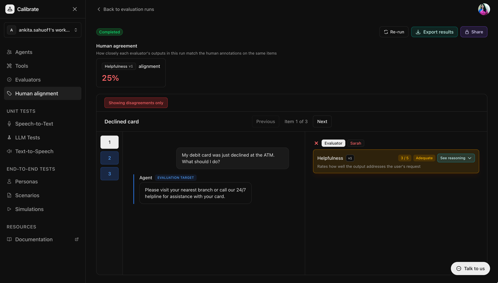
</Frame>

A low alignment score is not a failure — it is a signal that your evaluator prompt needs calibration. For example, if the evaluator rates every response the same while humans see meaningful variation, the prompt criteria likely needs to be more specific about what distinguishes each rating level.

### Export Results

Click **Export results** to download the full run as a CSV for offline analysis.

### Iterate on Evaluator Prompts

Use the disagreements to identify patterns — prompt ambiguity, edge cases the evaluator misses, or criteria that need tightening. Then go to **Evaluators**, click the evaluator you want to improve, and click **New version** to create an updated prompt version.

<Frame>
  
</Frame>

The evaluator detail page has two tabs:

**Prompts** — shows every version of the evaluator's judge model and prompt. The version marked **Current** is the live version that runs when you select this evaluator in a run.

<Frame>
  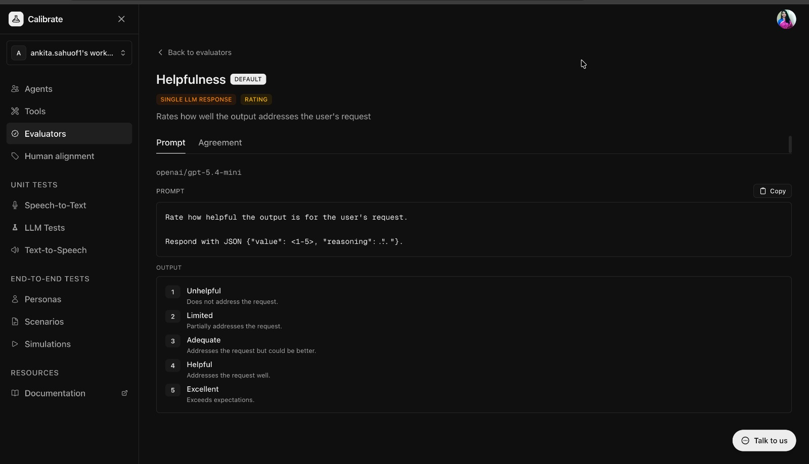
</Frame>

**Agreement** — shows the alignment trend chart across versions. Each point on the chart is one evaluation run, plotted against the evaluator version used. As you refine the prompt and re-run, you can see whether agreement with human annotators is improving.

<Frame>
  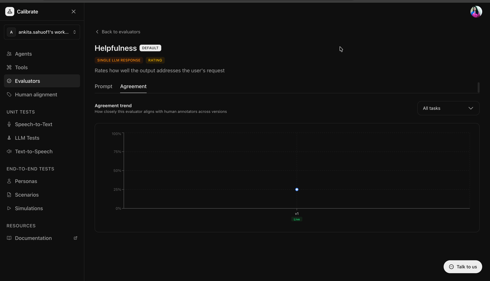
</Frame>

Go back to your task, run the new version on the same items, and compare the new alignment score. Repeat this cycle — export disagreements, refine the prompt, create a new version, re-run — until the agreement trend reaches a satisfactory level.

---

## Metrics

### Alignment Score

The Alignment Score measures the percentage of items where the LLM evaluator's output matches the label provided by human annotators. For binary evaluators (Pass/Fail), this is a simple percentage of agreement. For rating evaluators, the score reflects how closely the numeric ratings align. A high alignment score indicates that your evaluator is a reliable proxy for human judgment, while a low score suggests that the evaluator's criteria or judge model needs refinement.

### Inter-Annotator Agreement (IAA)

Inter-Annotator Agreement (IAA) measures the consistency between different human labellers on the same set of items. It is calculated as the percentage of overlapping rows where two or more annotators provided the same label. IAA serves as a vital quality signal: if humans cannot agree on a label, it is unrealistic to expect an LLM judge to align perfectly. High IAA confirms that the labelling task is well-defined and that the human labels provide a reliable ground truth for your evaluators.

