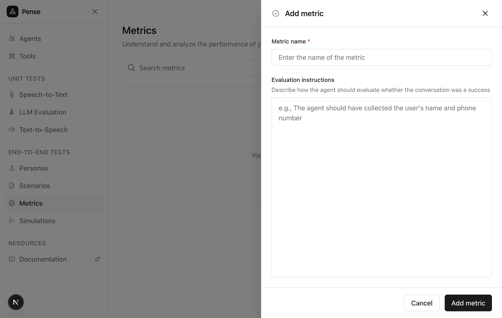

Metrics define how to evaluate whether a conversation was successful in [agent simulations](/quickstart/simulations).

## How metrics work

After each simulated conversation completes, an LLM judge reviews the full conversation transcript and evaluates it against each metric you have defined for the simulation. For every metric, the judge assigns a binary **pass** or **fail** result based on your evaluation instructions.

This means your evaluation instructions should be written clearly enough for an LLM to make a definitive yes/no decision about whether the criteria were met.

## Quickstart

### Create a new metric

From the sidebar, click **Metrics** to view your existing metrics. Click **Add metric** to create a new metric.

<Frame>
  
</Frame>

### Add the name and evaluation instructions

Give a meaningful name to the metric (e.g. `Data collection success`) and define how to evaluate success.

<Frame>
  
</Frame>

#### Guidelines for evaluation instructions

Define clear, measurable criteria that an LLM can evaluate with a yes/no answer:

1. **Success conditions**: what must happen for the metric to pass?
2. **Failure conditions**: what indicates failure?
3. **Edge cases**: any special considerations?

**Example evaluation instructions:**

```text
The agent should have collected the user's name and phone number
during the conversation.

Success criteria:
- Customer's full name was captured
- Phone number was captured in valid format (10 digits)
- Information was confirmed with the customer

The metric fails if:
- Either name or phone was not collected
- Information was not verified with the customer
```

### Save the metric

Click **Add metric** to create the metric.

## Best practices

### Metrics vs personas vs scenarios

| Aspect  | Metric                             | Persona                                  | Scenario                               |
| ------- | ---------------------------------- | ---------------------------------------- | -------------------------------------- |
| Focus   | HOW to evaluate                    | WHO and HOW to behave                    | WHAT to do                             |
| Content | Success criteria, evaluation rules | Demographics, behavior                   | Task, goal, situation                  |
| Example | "Agent collected name and phone"   | "A 45-year-old farmer who speaks slowly" | "Call to inquire about crop insurance" |

## Example metrics

### Data collection success

```text
The agent should have collected the user's name and phone number.

Success criteria:
- Customer's full name was captured
- Phone number was captured in valid format
- Information was confirmed with the customer
```

### Issue resolution

```text
The agent should have successfully resolved the customer's issue
or clearly explained the next steps.

Success criteria:
- The customer's problem was clearly understood
- A solution was provided OR clear next steps were given
- The customer expressed satisfaction or understanding
```

### Appointment booking

```text
The agent should have successfully booked an appointment.

Success criteria:
- Date and time were confirmed
- Patient/customer name was collected
- Purpose of appointment was noted
- Confirmation details were provided
```

## Next steps

<CardGroup cols={2}>
  <Card title="Create personas" icon="user" href="/core-concepts/personas">
    Define who your simulated users are
  </Card>
  <Card
    title="Create scenarios"
    icon="file-lines"
    href="/core-concepts/scenarios"
  >
    Define what your simulated users should do
  </Card>
</CardGroup>
