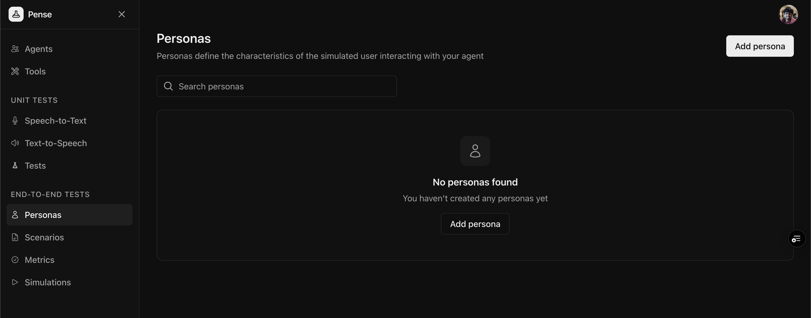
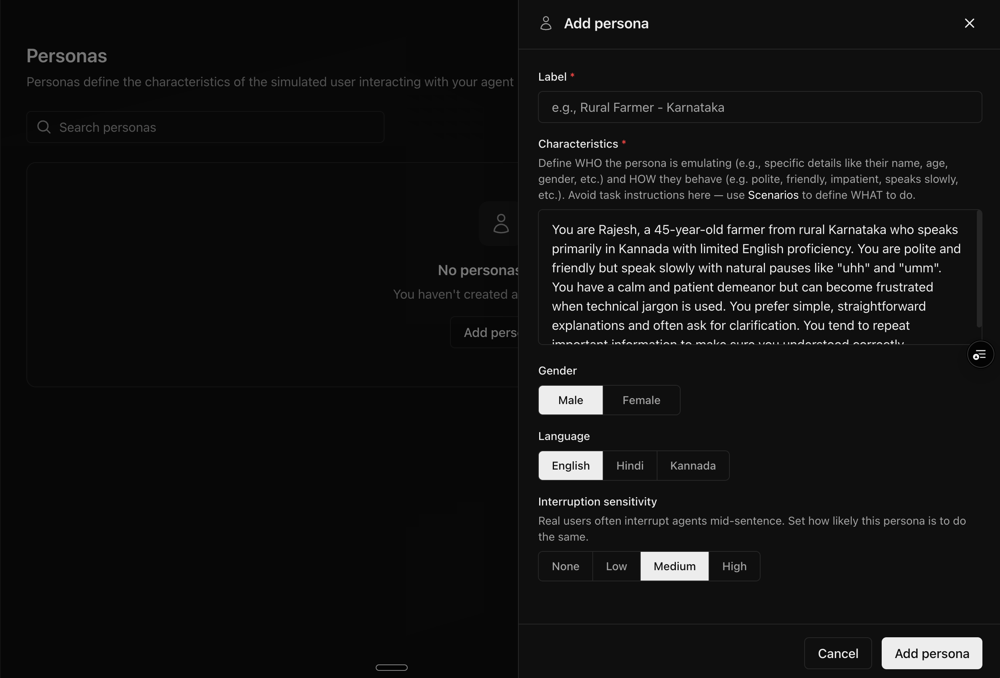

Personas define facts for simulated users that interact with your agent in [agent simulations](/quickstart/simulations). They determine `WHO` the simulated user is and `HOW` they behave during conversations.

## Quickstart

### Create a new persona

From the sidebar, click **Personas** to view your existing personas. Click **Add persona** to create a new persona.

<Frame>
  
</Frame>

### Add the label and characteristics

<Frame>
  
</Frame>

Give a meaningful label to the persona (e.g. `shy, pregnant mother in her third trimester`) and define its characteristics.

#### Guidelines for defining characteristics

Define two key aspects:

1. **WHO**: Specific details about the persona
   - Name, age, occupation
   - Location, background
   - Language proficiency
   - Any other relevant details required for your agent simulation

2. **HOW**: Behavioral traits
   - Communication style (polite, impatient, formal)
   - Speech patterns (slow, uses filler words)
   - Temperament (calm, easily frustrated)

**Example Characteristics:**

```text
You are Rajesh, a 45-year-old farmer from rural Karnataka who
speaks primarily in Kannada with limited English proficiency.

You are polite and friendly but speak slowly with natural
pauses like "uhh" and "umm". You have a calm and patient
demeanor but can become frustrated when technical jargon is used.

You prefer simple, straightforward explanations and often ask
for clarification. You tend to repeat important information
to make sure you understood correctly.
```

<Note>
  Avoid including task instructions in characteristics. Use
  [**Scenarios**](/core-concepts/scenarios) to define WHAT the persona should
  do.
</Note>

### Configure voice settings

Select the gender and language for the persona.

### Define interruption sensitivity

Real users often interrupt agents mid-sentence. Configure how likely this persona is to interrupt:

| Level      | Behavior                   |
| ---------- | -------------------------- |
| **None**   | Persona never interrupts   |
| **Low**    | 25% chance of interrupting |
| **Medium** | 50% chance of interrupting |
| **High**   | 80% chance of interrupting |

### Save the Persona

Click **Add persona** to create the persona.

## Best Practices

### Creating realistic personas

1. **Be specific**: Include concrete details (name, age, occupation, etc.)
2. **Define communication style**: How do they speak? Fast, slow, formal, casual?
3. **Include limitations**: Language proficiency, technical knowledge, etc.
4. **Add emotional traits**: Patient, impatient, friendly, formal

### Personas vs Scenarios

| Aspect  | Persona                                  | Scenario                               |
| ------- | ---------------------------------------- | -------------------------------------- |
| Focus   | WHO and HOW                              | WHAT to do                             |
| Content | Demographics, behavior                   | Task, goal, situation                  |
| Example | "A 45-year-old farmer who speaks slowly" | "Call to inquire about crop insurance" |

## Next Steps

<CardGroup cols={2}>
  <Card title="Create Scenarios" icon="file-lines" href="/guides/scenarios">
    Define what your personas should do in simulations
  </Card>
  <Card title="Run Simulations" icon="comments" href="/guides/simulations">
    Test your agent with combinations of personas and scenarios
  </Card>
</CardGroup>
