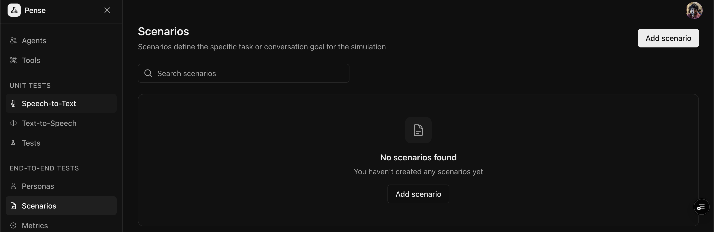
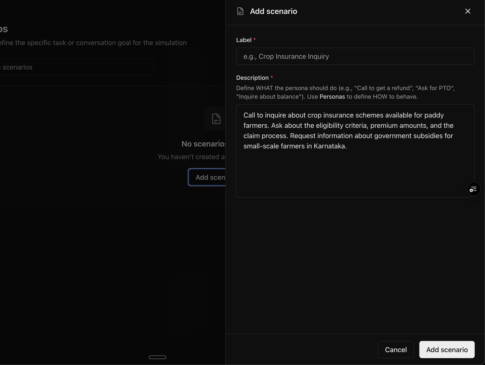

Scenarios define the specific task or goal for your [personas](/core-concepts/personas) in [agent simulations](/quickstart/simulations). They describe `WHAT` the simulated user should do during the conversation.

## Quickstart

### Create a new scenario

From the sidebar, click **Scenarios** to view your existing scenarios. Click **Add scenario** to create a new scenario.

<Frame>
  
</Frame>

### Add the label and description

Give a meaningful label to the scenario (e.g. `crop insurance inquiry`) and define the task or goal clearly.

<Note>
  Avoid defining personality traits in scenarios. Use
  [**Personas**](/core-concepts/personas) to define `HOW` the simulated user
  behaves
</Note>

<Frame>
  
</Frame>

### Save the scenario

Click **Add scenario** to create the scenario.

## Best Practices

### Writing Effective Scenarios

1. **Be specific**: Include concrete details (order numbers, dates, amounts)
2. **Set clear objectives**: What should the user aim to achieve?
3. **Include conversation flow hints**: What questions should they ask?
4. **Add realistic context**: Why is the user calling?

### Scenarios vs Personas

| Aspect  | Scenario                              | Persona                                  |
| ------- | ------------------------------------- | ---------------------------------------- |
| Focus   | WHAT to do                            | WHO and HOW                              |
| Content | Task, goal, situation                 | Demographics, behavior                   |
| Example | "Call to get a refund for order #123" | "A busy professional who speaks quickly" |

### Scenario Complexity Levels

| Level       | Description                      | Example                                             |
| ----------- | -------------------------------- | --------------------------------------------------- |
| **Simple**  | Single task, straightforward     | "Check account balance"                             |
| **Medium**  | Multiple questions, some details | "Inquire about insurance and ask about eligibility" |
| **Complex** | Edge cases, negotiations         | "Dispute a charge and escalate if unsatisfied"      |

## Next Steps

<CardGroup cols={2}>
  <Card title="Create Personas" icon="user" href="/guides/personas">
    Define who your simulated users are and how they behave
  </Card>
  <Card title="Run Simulations" icon="comments" href="/guides/simulations">
    Test your agent with combinations of personas and scenarios
  </Card>
</CardGroup>
