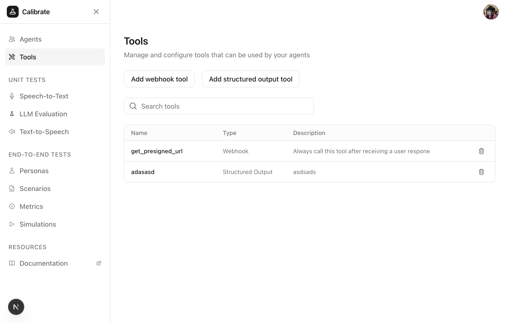
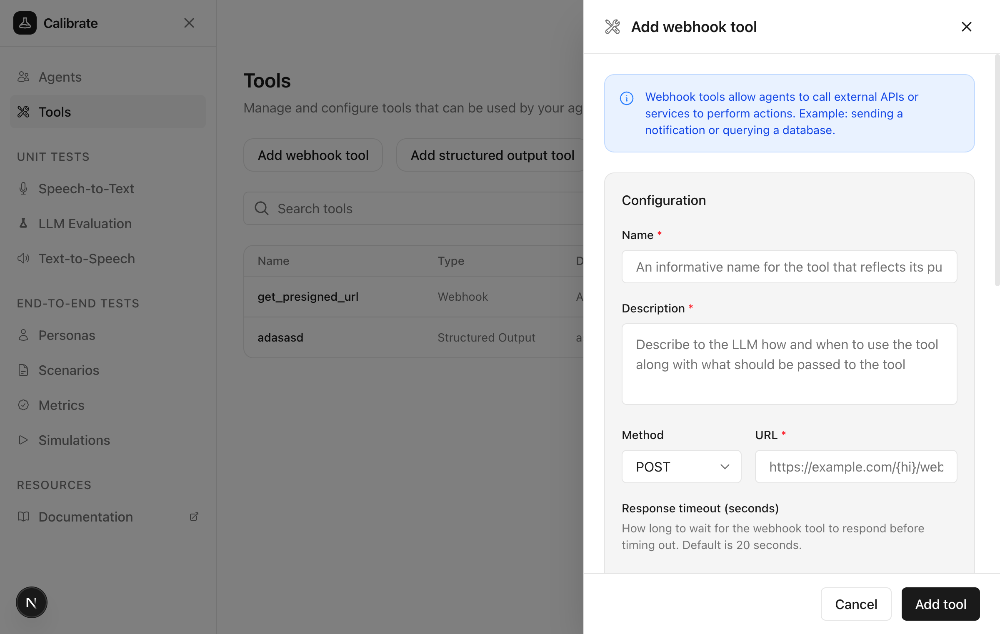
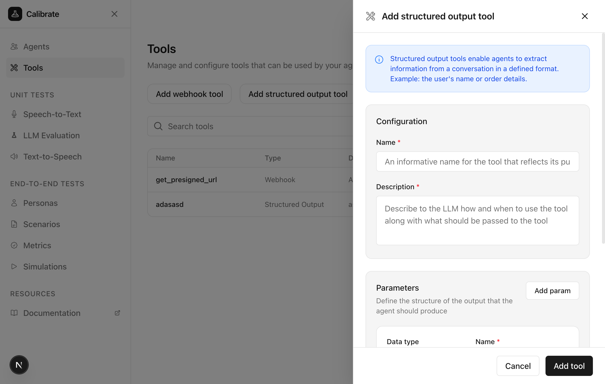

Tools extend your agents' capabilities by enabling them to perform actions and produce structured outputs. There are two types of tools available:

- **Webhook tools** — Call external APIs or services to perform actions
- **Structured output tools** — Extract information from conversations in a defined format

## Navigate to Tools

From the sidebar, click **Tools** to view and manage your tools.

<Frame>
  
</Frame>

## Webhook Tools

Webhook tools allow agents to call external APIs or services to perform actions like sending notifications or querying databases.

### Create a Webhook Tool

Click **Add webhook tool** to open the configuration panel.

<Frame>
  
</Frame>

### Configure the Tool

Provide the following details:

**Name and Description**

Add a descriptive name and explain when the agent should call this tool.

**Request Configuration**

- **Method** — Select HTTP method (GET, POST, PUT, PATCH, DELETE)
- **URL** — The webhook endpoint URL
- **Response timeout** — How long to wait before timing out (default: 20 seconds)

<Frame>
  
</Frame>

**Headers** (Optional)

Define headers to include in the request.

**Query Parameters** (Optional)

Define parameters the LLM will collect and send as query strings.

**Body Parameters** (Optional)

Define the request body structure with a description and properties the LLM should collect.

Click **Add tool** to save.

## Structured Output Tools

Structured output tools enable agents to extract information from conversations in a defined format, such as user names or order details.

### Create a Structured Output Tool

Click **Add structured output tool** to open the configuration panel.

<Frame>
  
</Frame>

### Configure the Tool

Provide the following details:

**Name and Description**

Add a descriptive name and explain when the agent should call this tool.

**Parameters**

Define the structure of data the agent should extract.

<Frame>
  
</Frame>

For each parameter, specify:

- **Data type** — Boolean, Integer, Number, String, Object, or Array
- **Name** — The parameter identifier
- **Required** — Whether this field is mandatory
- **Description** — Detailed guidance for the LLM on what this parameter represents

Click **Add param** to add more parameters. Click **Add tool** to save.

## Inbuilt Tools

Some tools are built into the platform and enabled by default:

| Tool                 | Description                      |
| -------------------- | -------------------------------- |
| **End conversation** | Allows the agent to end the call |

## Next Steps

<CardGroup cols={2}>
  <Card title="Configure Agents" icon="robot" href="/core-concepts/agents">
    Learn how to create and configure agents
  </Card>
  <Card
    title="Run Tests"
    icon="flask"
    href="/quickstart/text-to-text#create-a-tool-invocation-test"
  >
    Test tool invocations with your agent
  </Card>
</CardGroup>
