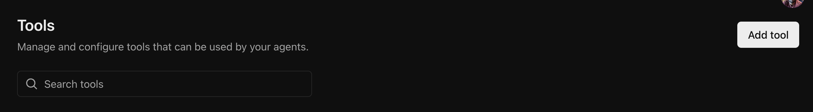
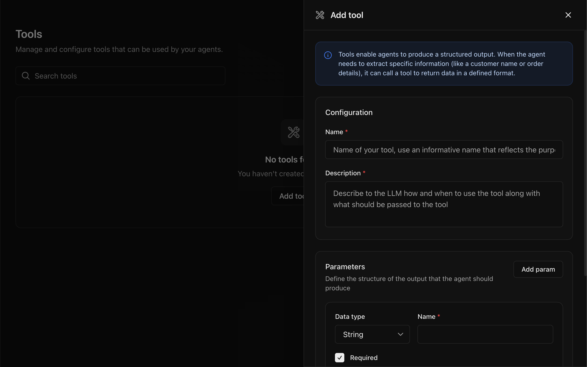
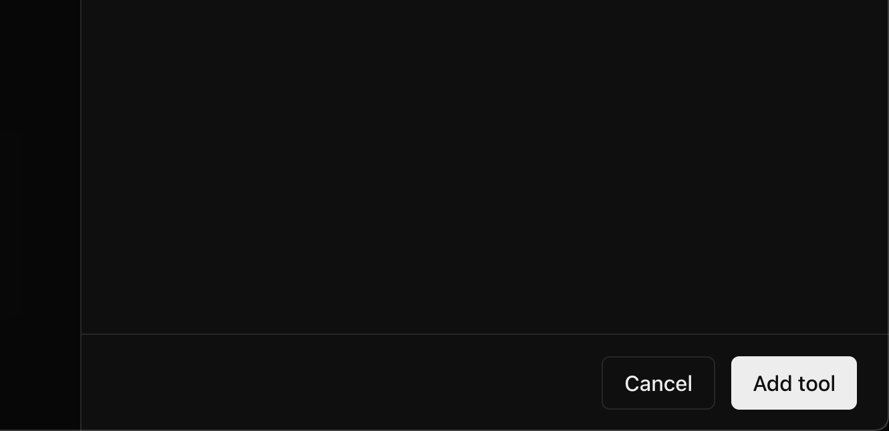

Tools enable your agents to produce structured outputs. They define the parameters and format for extracting information from conversations.

## Creating a Tool

### Step 1: Navigate to Tools

From the sidebar, click **Tools** to view your existing tools.

<Frame>
  
</Frame>

### Step 2: Click "Add tool"

Click the **Add tool** button in the top right corner. A sidebar panel will open.

<Frame>
  
</Frame>

### Step 3: Configure the Tool

Add the name and description of the tool describing when to call it along with the parameters which define the structure of the output that the agent should return.

<Frame>
  
</Frame>

### Step 4: Save the Tool

Click **Add tool** to create the tool.

<Frame>
  
</Frame>

## Inbuilt Tools

Some tools are built into the platform and enabled by default:

| Tool                 | Description                      |
| -------------------- | -------------------------------- |
| **End conversation** | Allows the agent to end the call |

## Next Steps

<CardGroup cols={2}>
  <Card title="Configure Agents" icon="robot" href="/core-concepts/agents">
    Learn how to create and configure agents
  </Card>
  <Card
    title="Run Tests"
    icon="flask"
    href="/quickstart/text-to-text#create-a-tool-invocation-test"
  >
    Test tool invocations with your agent
  </Card>
</CardGroup>
