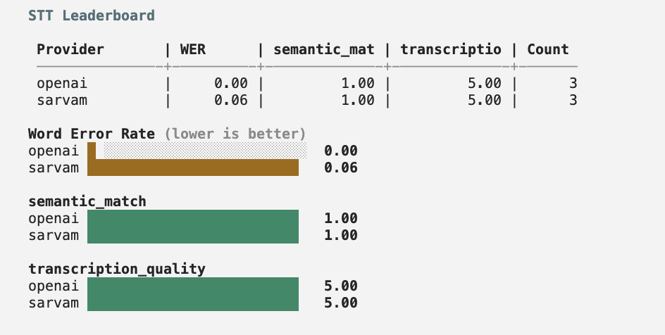
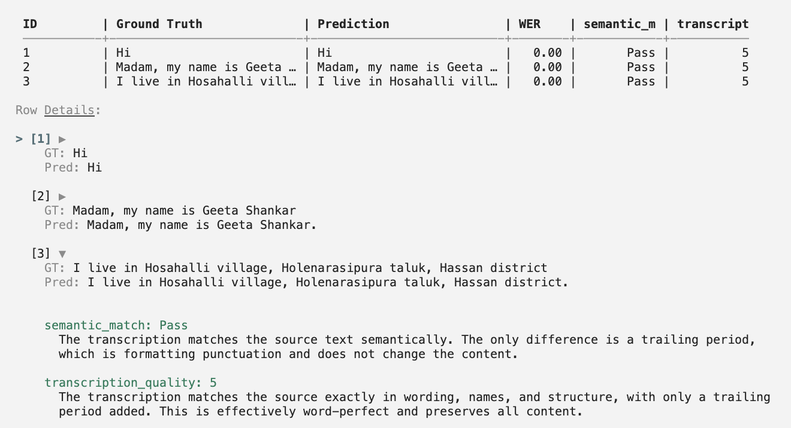

## Get started

```bash
calibrate-agent stt -p deepgram google -l english -i ./data -o ./out
```

<iframe
  className="w-full aspect-video rounded-xl"
  src="https://www.youtube.com/embed/pFdsOMo_J2s"
  title="CLI Speech-to-Text Evaluation Walkthrough"
  allow="accelerometer; autoplay; clipboard-write; encrypted-media; gyroscope; picture-in-picture"
  allowFullScreen
></iframe>

The command takes:

- `-p`/`--provider`: one or more providers to evaluate (space-separated). Only providers that support the chosen language are run.
- `-l`/`--language`: one of the 10+ supported Indic languages (defaults to `english`).
- `-i`/`--input-dir`: path to the directory containing your audio files and reference transcripts.
- `-o`/`--output-dir`: where results are saved (defaults to `./out`).

The input directory should have this structure:

```
/path/to/data/
├── stt.csv
└── audios/
    ├── audio_1.wav
    └── audio_2.wav
```

The **stt.csv** file contains the reference transcriptions:

| id      | text                            |
| ------- | ------------------------------- |
| audio_1 | Hi                              |
| audio_2 | Madam, my name is Geeta Shankar |

<Note>
  All audio files should be in WAV format. The evaluation script expects files
  at `audios/<id>.wav` where `<id>` matches the `id` column in your CSV.
</Note>

Refer to the [sample dataset](https://github.com/ARTPARK-SAHAI-ORG/calibrate/blob/main/examples/stt/sample_input) for a template.

Set the API keys for the selected providers in your environment (or a `.env` file in the directory you run the command from). The evaluation runs providers in parallel, showing the transcriptions as they are generated.

Once all the providers have completed, it displays a leaderboard measuring key metrics along with bar charts for better visualization.

<Frame>
  
</Frame>

Each provider output directory includes:

- `results.csv` with one row per input audio. In addition to `id`, `gt`, `pred`, WER, evaluator scores, and evaluator reasoning, STT runs include `audio_duration_seconds`, plus a `ttfs` latency column when the `pipeline` engine is used.
- `metrics.json` with aggregate `wer`, evaluator summaries, and a `cost` object. The cost object includes `provider`, `pricing_model`, `currency`, `billing_unit`, `total_seconds`, `audio_minutes`, `cost_per_minute_usd`, and `cost_usd`. Cost is a proportional estimate from bundled rates; provider invoices may differ because of per-file rounding, minimums, tiers, or regional pricing.
- `leaderboard/stt_leaderboard.xlsx` with scalar cost columns in the summary sheet: `audio_minutes`, `cost_per_minute_usd`, and `cost_usd`.

You can also view the generated transcript and metrics for each row of your dataset including the LLM judge score and reasoning.

<Frame>
  
</Frame>

<Card
  title="Learn more about metrics"
  icon="chart-bar"
  href="/core-concepts/speech-to-text#metrics"
>
  Detailed explanation of all metrics and why using an LLM Judge is necessary
</Card>

## How it works

Each provider can be run through one of two engines, chosen with `--engine`:

- **`pipeline`** (the default) streams every clip through a real pipecat agent pipeline at real-time pace, using the same STT configuration your live voice agent deploys. It reflects the accuracy and behavior an agent actually sees in production, and it also measures time-to-final-transcript (TTFS) latency. Because it runs in real time, it is slower.
- **`direct`** sends each clip straight to the provider's transcription SDK. It is much faster and is good for a quick accuracy-only comparison, but it does not measure latency.

```bash
calibrate-agent stt -p deepgram google -i ./data -o ./out --engine direct
```

Both engines evaluate multiple providers at once and multiple clips per provider at once. `--max-parallel` controls how many providers run together and `--max-concurrency` how many clips per provider. The `pipeline` engine defaults both to `1` so the latency numbers stay uncontended; `direct` defaults higher since it has no latency to protect.

This methodology follows the [pipecat STT benchmark](https://github.com/pipecat-ai/stt-benchmark).

## Evaluator configuration

By default, a built-in **`semantic_match`** evaluator uses a text LLM judge to check whether each transcription matches the reference text semantically. You can customize the judge model and add multiple evaluators by passing an optional config file with `--config`:

```bash
calibrate-agent stt -p deepgram google -i ./data -o ./out --config config.json
```

Each evaluator's `system_prompt` is sent as the system message to its own dedicated LLM judge call (one call per evaluator, run in parallel). The user message contains the source/transcription pair.

The config file supports:

```json
{
  "evaluators": [
    {
      "id": "semantic-match-id",
      "name": "semantic_match",
      "system_prompt": "You are a highly accurate evaluator. You will be given a source text and a transcription. Mark True if the values represented by both strings match semantically.",
      "judge_model": "openai/gpt-5.4-mini"
    },
    {
      "id": "completeness-id",
      "name": "completeness",
      "system_prompt": "You are a highly accurate evaluator. You will be given a source text and a transcription. Mark True if all information from the source text is present in the transcription.",
      "judge_model": "openai/gpt-5.4-mini"
    }
  ]
}
```

| Key                          | Type   | Description                                                                                                                                       |
| ---------------------------- | ------ | ------------------------------------------------------------------------------------------------------------------------------------------------- |
| `evaluators`                 | array  | List of evaluators. Each one becomes its own LLM call per row.                                                                                    |
| `evaluators[].id`            | string | Optional unique id. Output `config.json` includes the raw `evaluators` list and an `evaluators_map` from id to name.                              |
| `evaluators[].name`          | string | Unique evaluator name. Becomes the column name in the leaderboard.                                                                                |
| `evaluators[].system_prompt` | string | Full system prompt used for this evaluator's LLM judge call.                                                                                      |
| `evaluators[].judge_model`   | string | OpenRouter model id for this evaluator (default: `openai/gpt-5.4-mini`). Use any model in the [OpenRouter catalog](https://openrouter.ai/models). |

Each evaluator also accepts:

| Key         | Type    | Description                                                |
| ----------- | ------- | ---------------------------------------------------------- |
| `type`      | string  | `"binary"` (default) or `"rating"`                         |
| `scale_min` | integer | Required when `type` is `"rating"`. Lowest allowed score.  |
| `scale_max` | integer | Required when `type` is `"rating"`. Highest allowed score. |

Binary evaluators produce per-row pass/fail and a mean pass-rate. Rating evaluators produce an integer score on your scale and a mean score in the leaderboard.

When multiple evaluators are defined, each is scored independently (one LLM call per evaluator per row, all run in parallel) and appears as a separate column in the results and leaderboard.

Every judge call routes through [OpenRouter](https://openrouter.ai/), so set `OPENROUTER_API_KEY` in your environment before running.

Refer to the [sample config](https://github.com/ARTPARK-SAHAI-ORG/calibrate/blob/main/examples/stt/config.json) for a template.

<Note>
  The `--config` flag is optional. When omitted, a single built-in
  `semantic_match` evaluator scores semantic match between source and
  transcription.
</Note>

<AccordionGroup>
  <Accordion title="semantic_match (default evaluator system prompt)">
    Matches [`DEFAULT_STT_EVALUATOR`](https://github.com/ARTPARK-SAHAI-ORG/calibrate/blob/main/calibrate/judges.py) in `calibrate/judges.py` when no `--config` is passed.

    ```text
    You are a highly accurate evaluator evaluating the transcription output of an STT model.

    You will be given two strings - one is the source string used to produce an audio and the other is the transcription of that audio.

    You need to evaluate if the two strings are the same.

    # Important Instructions:
    - Check whether the values represented by both the strings match. E.g. if one string says 1,2,3 but the other string says "one, two, three" or "one, 2, three", they should be considered the same as their underlying value is the same. However, if the actual values itself are different, e.g. for the name of a person or address or the value of any other key detail - that difference should be noted.
    - Ignore differences like a word being split up into more than 1 word by spaces. Look at whether the values mean the same in both the strings.
    - Minor differences in values of entities (e.g. proper nouns, numbers) matter and should be considered an error.
    - If all the "values" for the strings match, mark it as True. Else, False.
    ```

  </Accordion>
</AccordionGroup>

## Additional accuracy judges

Alongside classic WER/CER, every run also computes a set of LLM-based judges tuned for Indian-language ASR. They all run by default; pass `--skip-llm-judges` to report WER/CER only.

- **Sarvam intent & entity preservation** and **Sarvam LLM WER/CER**: adapted from Sarvam's [Evaluating Indian language ASR](https://www.sarvam.ai/blogs/evaluating-indian-language-asr), which argues that raw WER understates real agent quality for Indic speech.
- **Semantic WER**: a meaning-aware word error rate in the style of the [pipecat STT benchmark](https://github.com/pipecat-ai/stt-benchmark).

These surface as extra columns (`sarvam_intent_score`, `sarvam_entity_score`, `sarvam_llm_wer`, `sarvam_llm_cer`, `semantic_wer`) in `metrics.json` and the leaderboard, on top of the `semantic_match` evaluator above.

## Evaluate an existing dataset

Already have transcriptions from a prior run or another tool? Skip inference and run only the judges on a dataset of `{id, gt, pred}` pairs with `--eval-only`:

```bash
calibrate-agent stt --eval-only --dataset gt_pred.json -o ./out
```

`--dataset` points at a JSON list of `{"id", "gt", "pred"}` items. Add `--config` to customize the evaluators, or `--skip-llm-judges` to report WER/CER only.

## Options

| Option | Type | Default | Description |
| --- | --- | --- | --- |
| `-p, --provider` | string(s) | — | STT provider(s) to evaluate, space-separated. Only providers supporting the language run. |
| `-l, --language` | string | `english` | Evaluation language (one of the supported Indic languages). |
| `-i, --input-dir` | string | — | Directory containing `stt.csv` and an `audios/` folder. |
| `-o, --output-dir` | string | `./out` | Where results are written. |
| `-f, --input-file-name` | string | `stt.csv` | Reference-transcript CSV filename inside the input directory. |
| `-c, --config` | string | — | JSON config defining custom evaluators. |
| `--skip-llm-judges` | flag | off | Skip the extra LLM judges (Sarvam intent/entity, Sarvam LLM-WER/CER, semantic WER); report WER/CER only. |
| `--leaderboard` | flag | off | Generate a leaderboard after a single-provider run (multi-provider runs always do). |
| `-s, --save-dir` | string | — | Directory to write the leaderboard workbook. |
| `--engine` | `pipeline` \| `direct` | `pipeline` | Transcription engine. `pipeline` streams each clip through a real pipecat agent pipeline (agent-faithful, measures TTFS latency); `direct` calls the provider SDK directly (faster, no latency). |
| `--max-parallel` | integer | pipeline `1`, direct `2` | Providers to evaluate concurrently (env `CALIBRATE_STT_MAX_PARALLEL`). |
| `--max-concurrency` | integer | pipeline `1`, direct `4` | Clips per provider to transcribe concurrently (env `CALIBRATE_STT_MAX_CONCURRENCY`). |
| `--overwrite` | flag | off | Ignore a prior `results.csv` and start a clean run instead of resuming. |
| `-d, --debug` | flag | off | Evaluate only the first N rows. |
| `-dc, --debug_count` | integer | `5` | Number of rows in debug mode. |
| `--ignore_retry` | flag | off | Don't retry failed transcriptions. |
| `--eval-only` | flag | off | Skip transcription; judge a `{id, gt, pred}` dataset (needs `--dataset`). |
| `--dataset` | string | — | Path to the `--eval-only` dataset JSON. |

## Resources

<Card title="Integrations" icon="microphone" href="/integrations/stt">
  See the full list of supported providers and their configuration options
</Card>
