Pense lets you simulate entire conversations with your agent using simulated users matching the personas of your target audience for specific scenarios defined by you. This guide walks you through setting up and running your first simulation.

## Create an agent

From the sidebar, click **Agents** → **New agent**. Configure the system prompt, select your STT, TTS, and LLM providers and add [tools](/core-concepts/tools) to the agent.

<Tip>
  Learn more about agent configuration in [Core Concepts:
  Agents](/core-concepts/agents)
</Tip>

<Frame>
  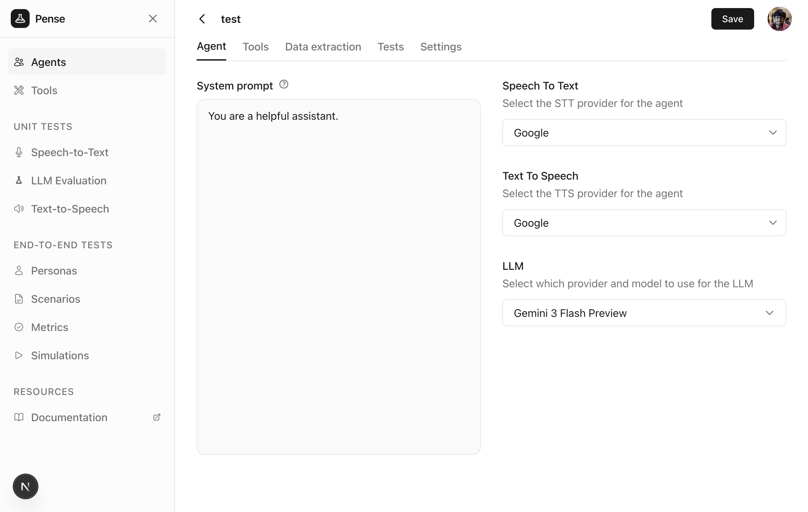
</Frame>

## Create personas

From the sidebar under **End-to-End Tests**, click **Personas** → **Add persona**.

<Frame>
  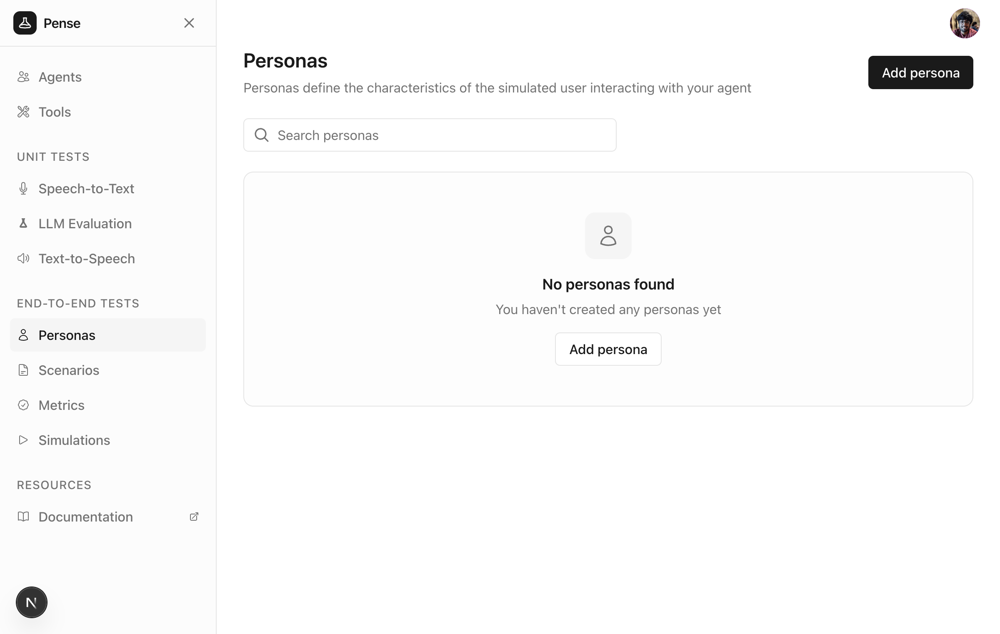
</Frame>

Define `WHO` the simulated user is - their personality, speaking style, and behavior.

<Tip>
  Learn more about personas in [Core Concepts -
  Personas](/core-concepts/personas)
</Tip>

<Frame>
  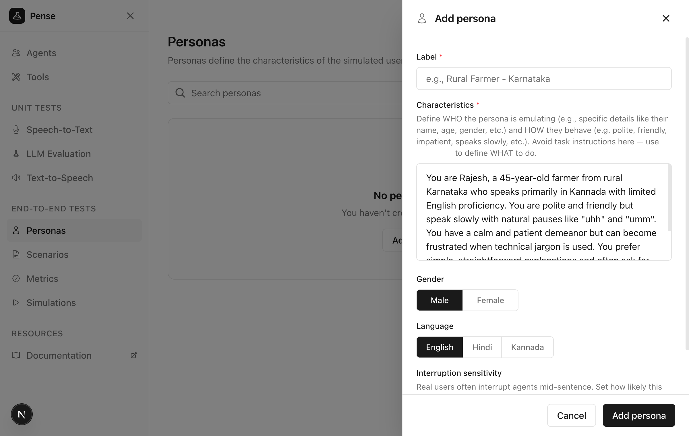
</Frame>

## Create scenarios

Click **Scenarios** → **Add scenario**.

<Frame>
  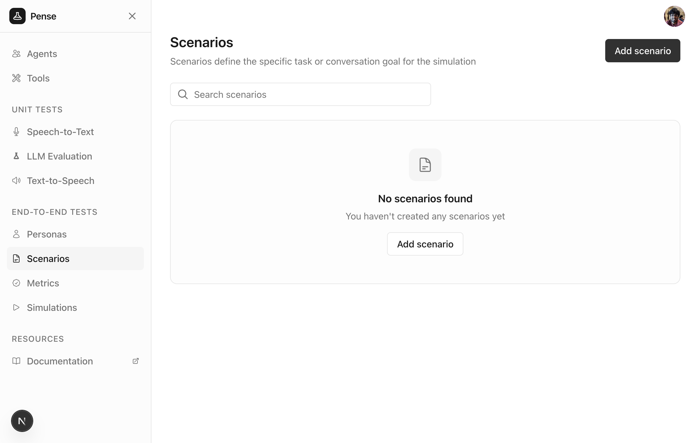
</Frame>

Define `WHAT` the simulated user should accomplish during the conversation.

<Tip>
  Learn more about scenarios in [Core Concepts -
  Scenarios](/core-concepts/scenarios)
</Tip>

<Frame>
  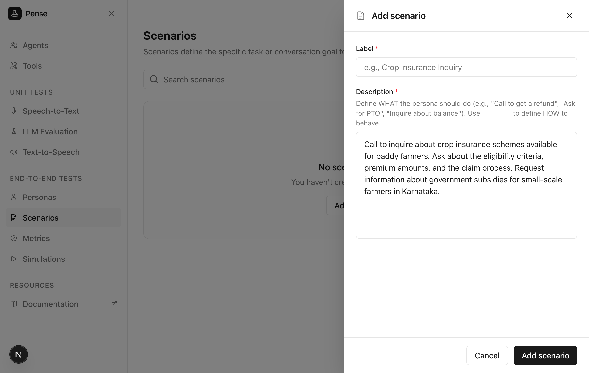
</Frame>

## Create metrics

Click **Metrics** → **Add metric**.

<Frame>
  
</Frame>

Define how to evaluate whether the agent performed well.

<Tip>
  Learn more about metrics in [Core Concepts - Metrics](/core-concepts/metrics)
</Tip>

<Frame>
  
</Frame>

## Create a simulation

Click **Simulations** → **Add simulation** and enter a name.

<Frame>
  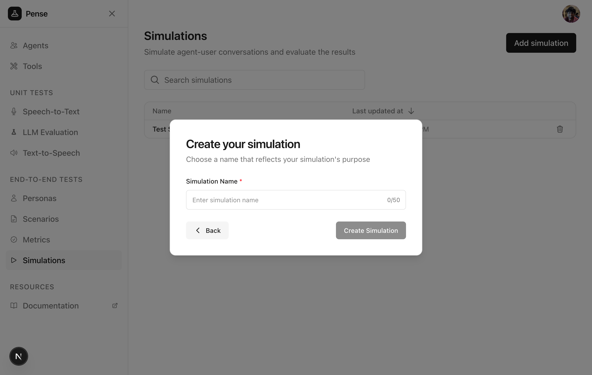
</Frame>

Select the agent, personas, scenarios, and metrics for your simulation.

<Frame>
  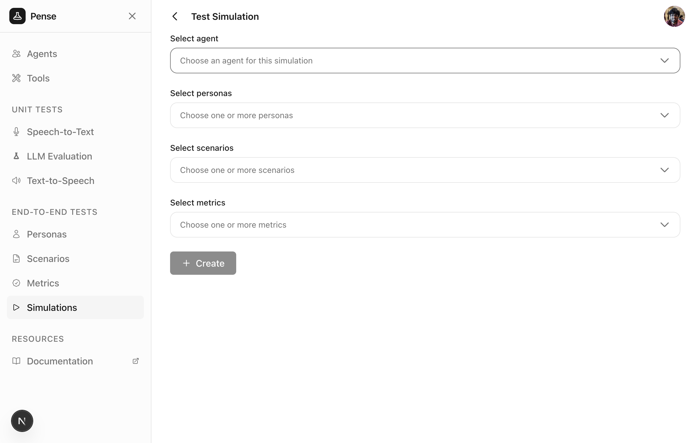
</Frame>

Click **Create** after filling in the details to save the simulation configuration. This creates the simulation but does not run it yet.

## Run the simulation

After creating, you'll see a **Launch** button. Click it to start a simulation run and choose between:

- **Text simulation** — text-only conversations (faster)
- **Voice simulation** — full STT/TTS pipeline with latency metrics

<Frame>
  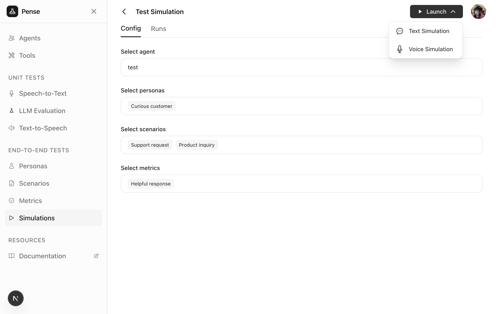
</Frame>

Each run creates one simulated conversation for each persona × scenario combination.

### Text simulation

After launching a text simulation, the run page opens showing each conversation streaming in real-time.

<Frame>
  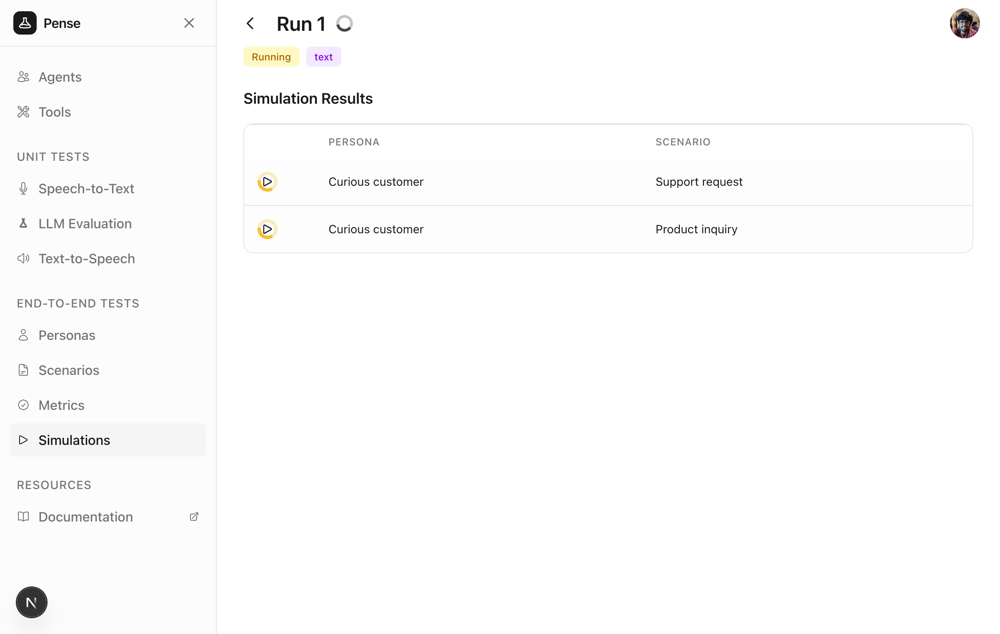
</Frame>

Once conversations complete, results show the metric evaluations for each row.

<Frame>
  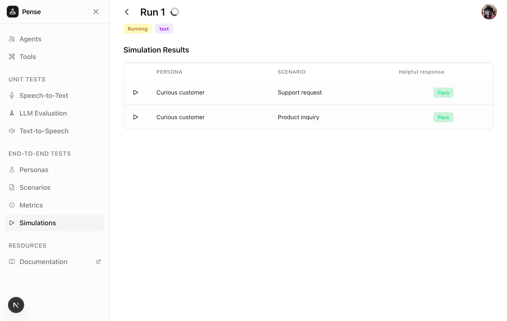
</Frame>

Click any row to view the full transcript.

<Frame>
  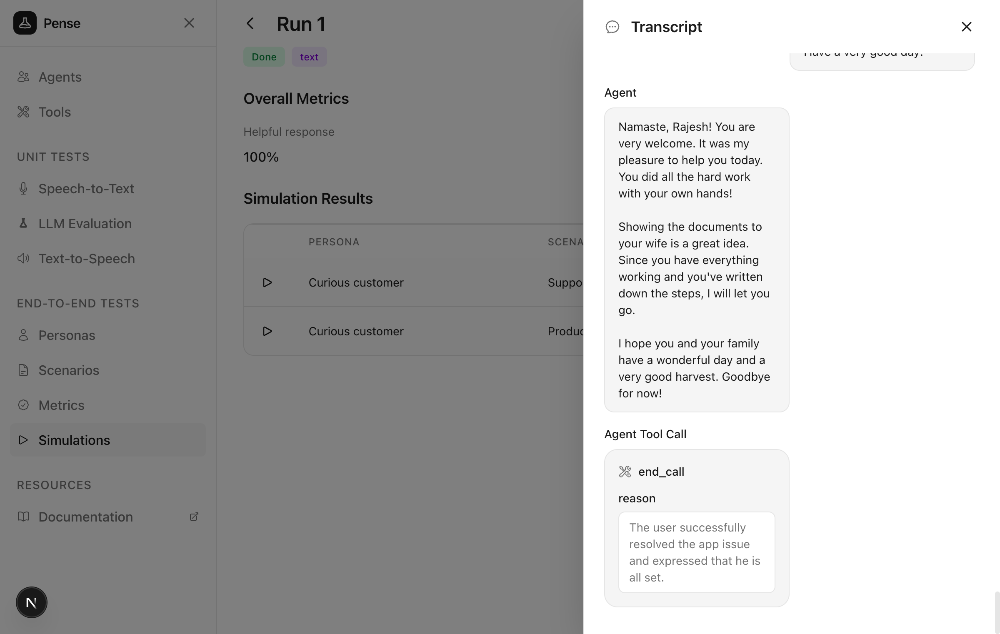
</Frame>

The **Overall metrics** show the aggregated values for each metric across all conversations.

### Voice simulation

Voice simulations use the full STT/TTS pipeline for more realistic testing. After launching, conversations stream in real-time like text simulations.

<Frame>
  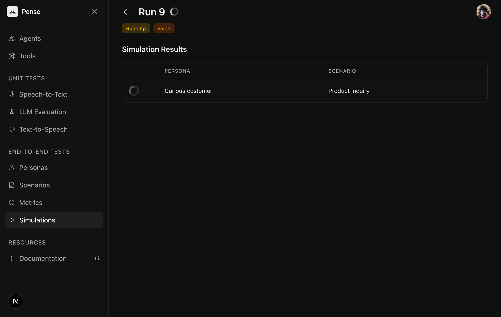
</Frame>

Click any row to view the transcript with audio playback for each turn and the full conversation.

<Frame>
  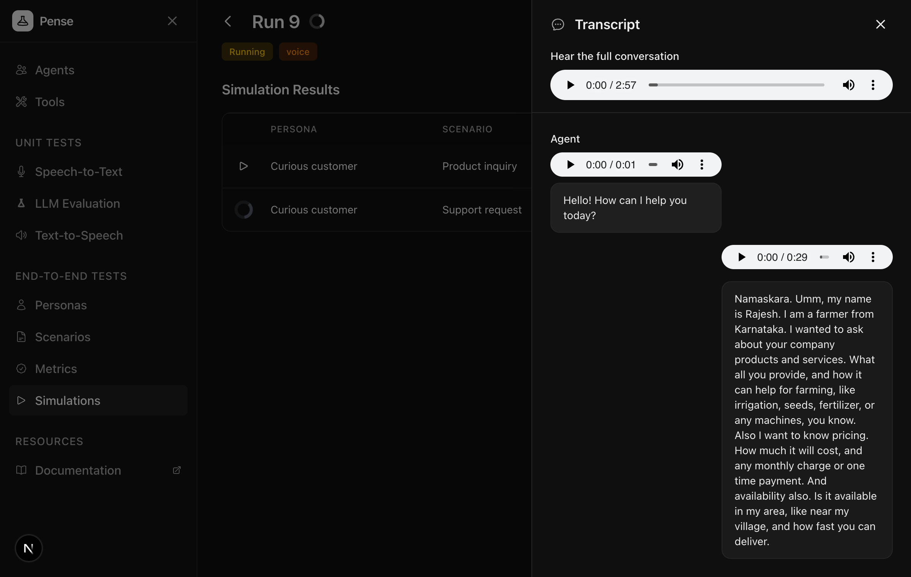
</Frame>

Once complete, voice simulations show results with the **Performance** tab displaying aggregated evaluation metrics across all conversations.

<Frame>
  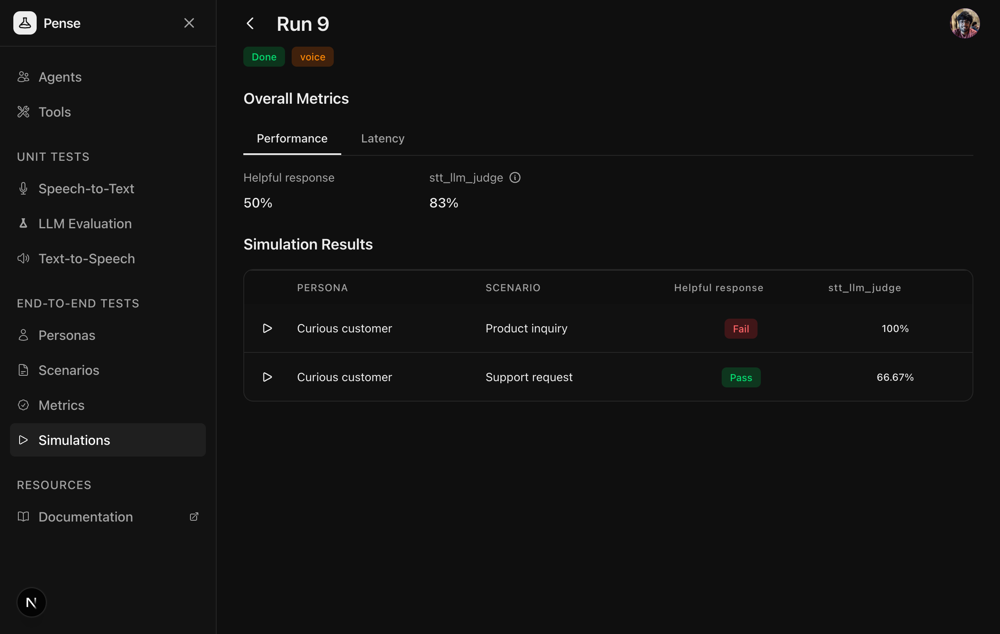
</Frame>

Switch to the **Latency** tab to view detailed timing metrics for each component:

- **stt/ttft** and **stt/processing_time** — Speech-to-Text latency
- **llm/ttft** and **llm/processing_time** — LLM response latency
- **tts/ttft** and **tts/processing_time** — Text-to-Speech latency

<Frame>
  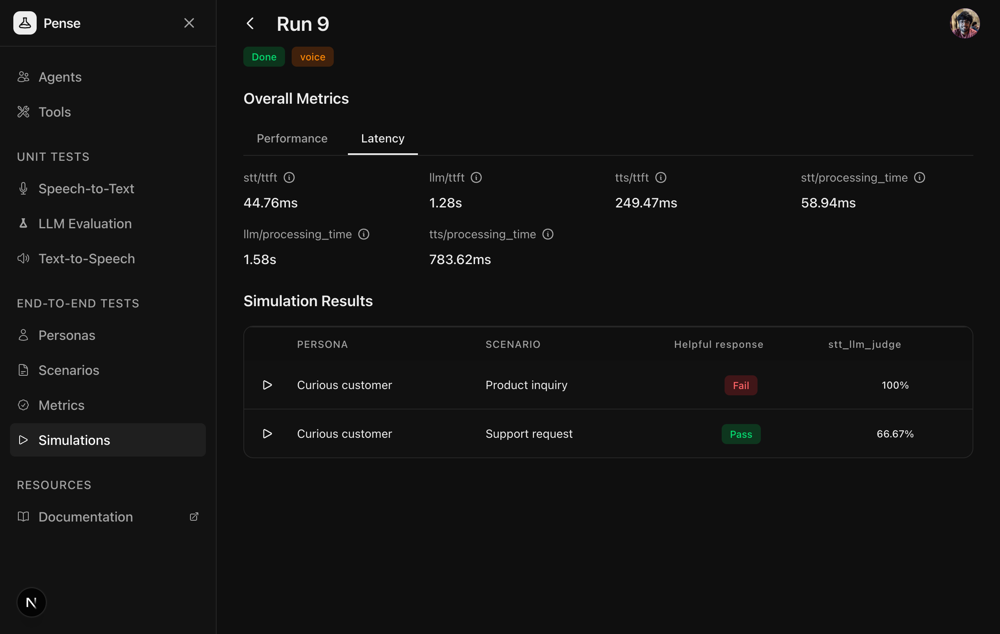
</Frame>

<Tip>
  Voice simulations take longer than text simulations due to the full audio
  pipeline, but provide more realistic testing of your agent's voice experience.
</Tip>

## Next steps

<CardGroup cols={2}>
  <Card
    title="Personas"
    icon="user"
    href="/core-concepts/personas#best-practices"
  >
    Best practices for creating realistic personas
  </Card>
  <Card
    title="Scenarios"
    icon="list"
    href="/core-concepts/scenarios#best-practices"
  >
    Best practices for creating effective scenarios
  </Card>
</CardGroup>
