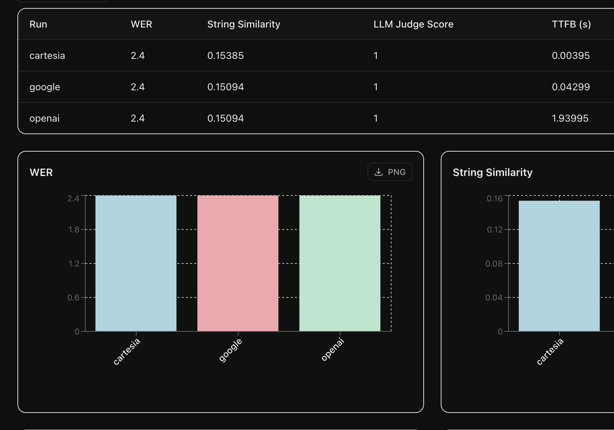
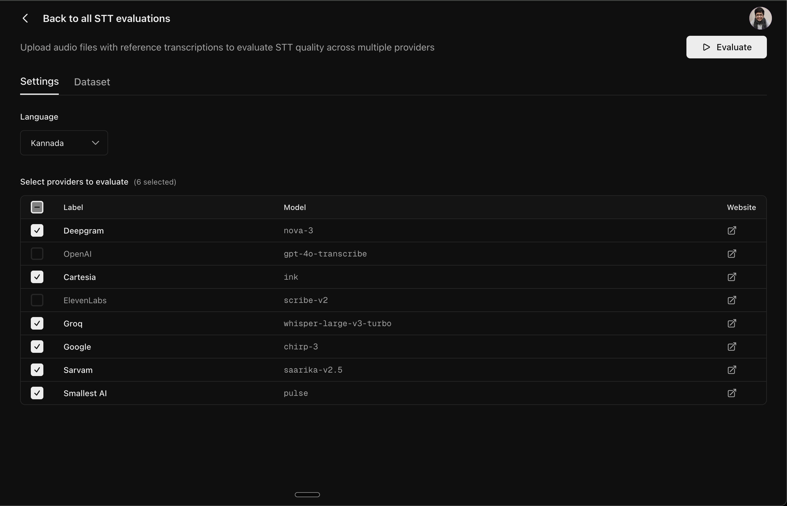

Pense lets you evaluate multiple STT providers simultaneously using your own dataset. This guide will walk you through creating an evaluation for your dataset.

<Frame>
  
</Frame>

## Start a new evaluation

From the sidebar, click on **Speech to Text** to view all your evaluations. Click the **New evaluation** button to create a new evaluation.

<Frame>
  
</Frame>

## Configure settings

On the **Settings** tab, select the language and providers you want to compare:

<Frame>
  
</Frame>

## Upload your dataset

Switch to the **Dataset** tab to add your audio samples along with the reference transcriptions.

<Frame>
  
</Frame>

You can also bulk upload your dataset as a ZIP file having the following structure:

```
your_dataset.zip
|-- audios/
|   |-- sample_1.wav
|   |-- sample_2.wav
|   |-- sample_3.wav
|-- data.csv
```

The `data.csv` should have two columns:

| audio_file   | text                                              |
| ------------ | ------------------------------------------------- |
| sample_1.wav | This is the reference transcription for sample 1. |
| sample_2.wav | This is the reference transcription for sample 2. |
| sample_3.wav | This is the reference transcription for sample 3. |

<Tip>
  Click **Download sample ZIP** to get a template with the correct structure
</Tip>

## Run evaluation

Click the **Evaluate** button to start the evaluation. You'll be redirected to the results page where you can monitor progress in real-time. The **Outputs** tab streams the results for each file as it completes for each provider:

<Frame>
  
</Frame>

## Leaderboard

Once all providers complete, the **Leaderboard** tab shows a comparison across all of them.

<Frame>
  
</Frame>

## Next Steps

<CardGroup cols={2}>
  <Card
    title="Core Concepts"
    icon="chart-bar"
    href="/core-concepts/speech-to-text"
  >
    Learn about the core concepts of STT evaluation
  </Card>
  <Card title="Text to Text" icon="volume-high" href="/quickstart/text-to-text">
    Find the best LLM for your agent
  </Card>
</CardGroup>
