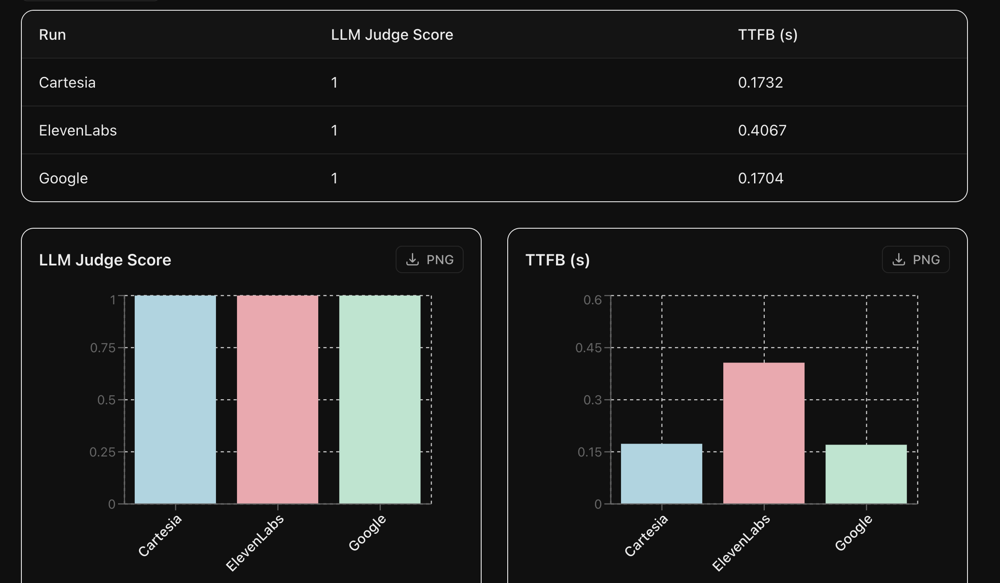
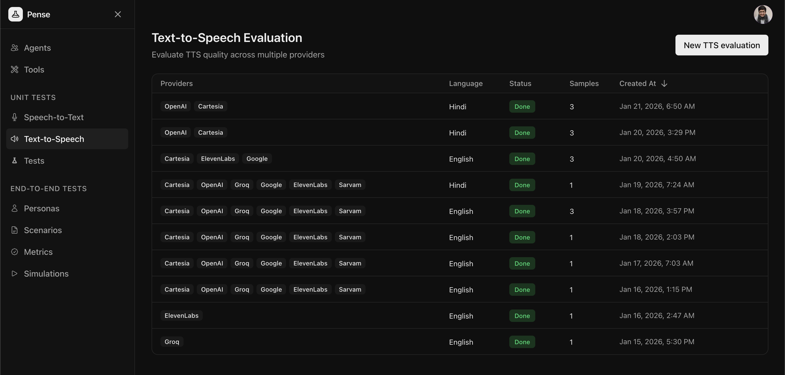
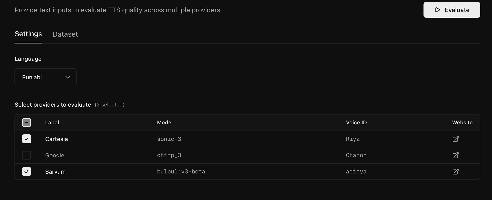
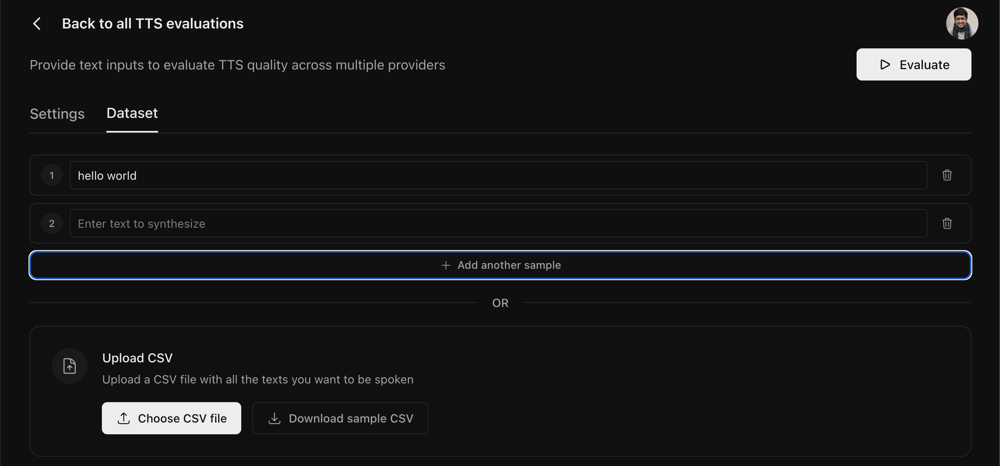
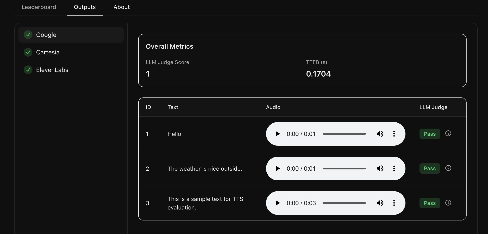
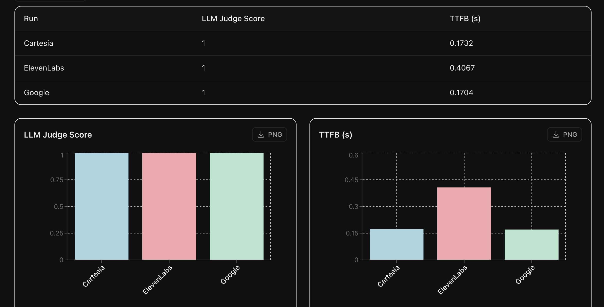

Calibrate lets you evaluate multiple TTS providers simultaneously using your own dataset. This guide will walk you through creating an evaluation for your dataset.

<Frame>
  
</Frame>

## Start a new evaluation

From the sidebar, click on **Text to Speech** to view all your evaluations. Click the **New evaluation** button to create a new evaluation.

<Frame>
  
</Frame>

## Configure settings

On the **Settings** tab, select the language and providers you want to compare.

<Frame>
  
</Frame>

## Upload your dataset

Switch to the **Dataset** tab to add your text samples for synthesis.

<Frame>
  
</Frame>

You can also bulk upload your dataset as a CSV file with the following format:

```csv
text
Hello, how can I help you today?
Your appointment is confirmed for tomorrow at 3 PM.
Thank you for calling. Have a great day!
```

<Tip>
  Click **Download sample CSV** to get a template with the correct structure
</Tip>

## Run evaluation

Click the **Evaluate** button to start the evaluation. You'll be redirected to the results page where you can monitor progress in real-time. The **Outputs** tab streams the results for each text sample as it completes for each provider:

<Frame>
  
</Frame>

## Leaderboard

Once all providers complete, the **Leaderboard** tab shows a comparison across all of them.

<Frame>
  
</Frame>

## Next Steps

<CardGroup cols={2}>
  <Card
    title="Core Concepts"
    icon="chart-bar"
    href="/core-concepts/text-to-speech"
  >
    Learn about the core concepts of TTS evaluation
  </Card>
  <Card title="Simulations" icon="microphone" href="/quickstart/simulations">
    Run simulated conversations with your agent
  </Card>
</CardGroup>
