This guide shows you how to set up automated evaluations for your LLM based on your use case.

## Create an agent

From the sidebar, click **Agents** → **New agent**. Configure your agent and add [tools](/core-concepts/tools) to it.

<Tip>
  Learn more about agent configuration in [Core Concepts:
  Agents](/core-concepts/agents)
</Tip>

<Frame>
  
</Frame>

## Create your first test case

Open the **LLM Evaluation** tab and click on **Add test** to create a new test.

<Frame>
  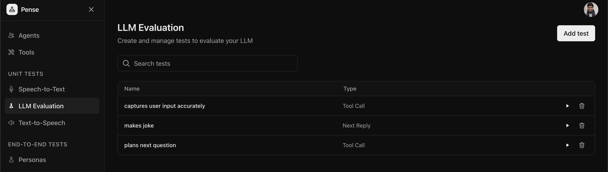
</Frame>

You can create two types of test cases:

<AccordionGroup>
  <Accordion title="Next Reply Test" icon="message">
    These tests verify your agent responds appropriately to the last user
    message given a conversation history defined by you by checking if the
    agent's response meets your criteria (for example, tone, content, or
    accuracy).
  </Accordion>
  <Accordion title="Tool Invocation Test" icon="wrench">
    These tests verify that your agent calls the correct tools with the right
    parameters given a conversation history defined by you.
  </Accordion>
</AccordionGroup>

### Create a next reply test

Next reply tests verify that your agent response adheres to your criteria given a conversation history defined by you.

<Frame>
  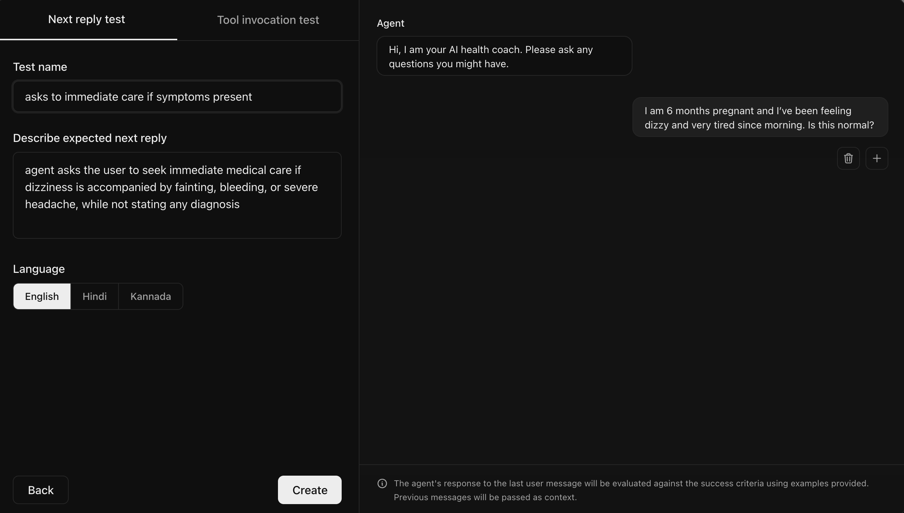
</Frame>

As shown in the image, you need to create the conversation history for the edge case you need to test and add the success criteria for the agent's next response.

### Create a tool invocation test

Tool invocation tests verify that your agent calls the correct tools with the right parameters given a conversation history defined by you.

<Frame>
  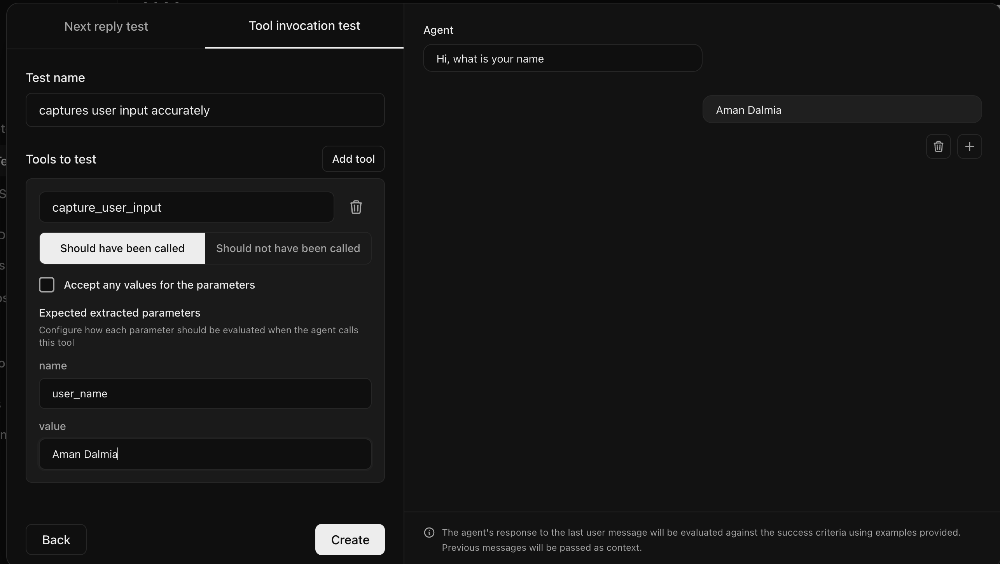
</Frame>

As shown in the image, you need to create the conversation history for the edge case you need to test and select the tools that must be called along with the correct parameters.

## Run one test on one agent

Once the test is created, you can click on the play button to run that test.

<Frame>
  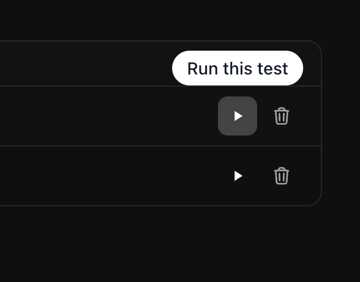
</Frame>

Select the agent from the dropdown in the dialog box that appears and hit **Run test**.

<Frame>
  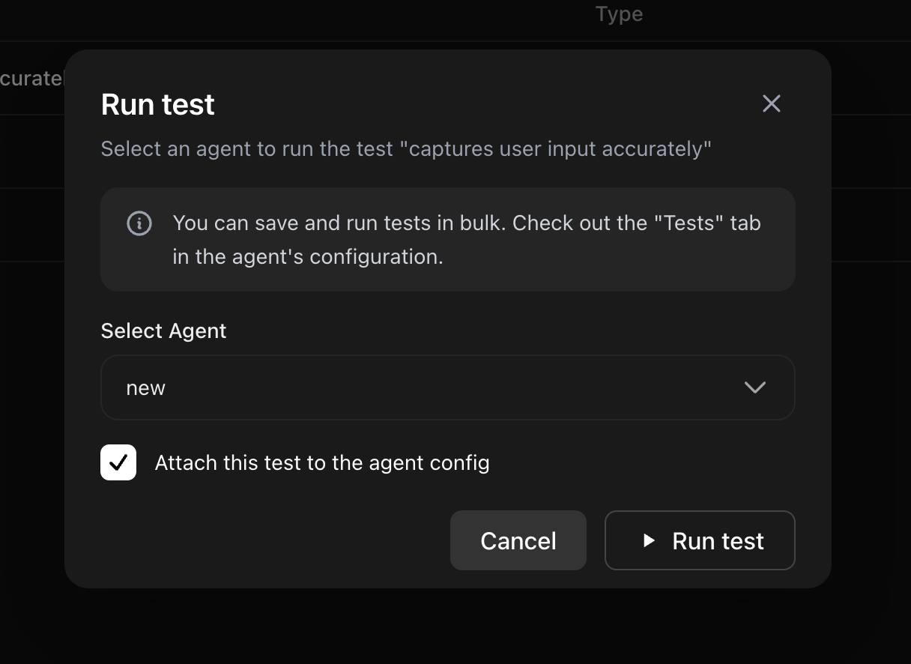
</Frame>

<Note>
  Selecting the `Attach this test to the agent config` checkbox will attach the
  test to the list of all tests for the selected agent
</Note>

A test runner will open up with the status of the test updating once it
completes. By clicking on a test case, you can view the agent's response and whether it passed the test.

<Frame>
  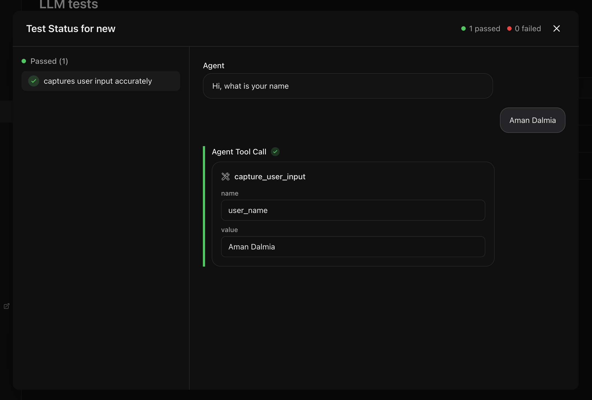
</Frame>

## Run all tests for one agent

Navigate to the **Tests** tab of the agent you want to test. You can add new tests by selecting the **Add test** button or run the existing tests by clicking the **Run all tests** button.

<Frame>
  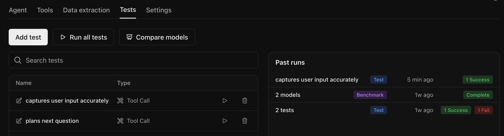
</Frame>

A test runner will open up with the status of each test case updating as it completes. By clicking on a test case, you can view the agent's response and whether it passed the test.

<Frame>
  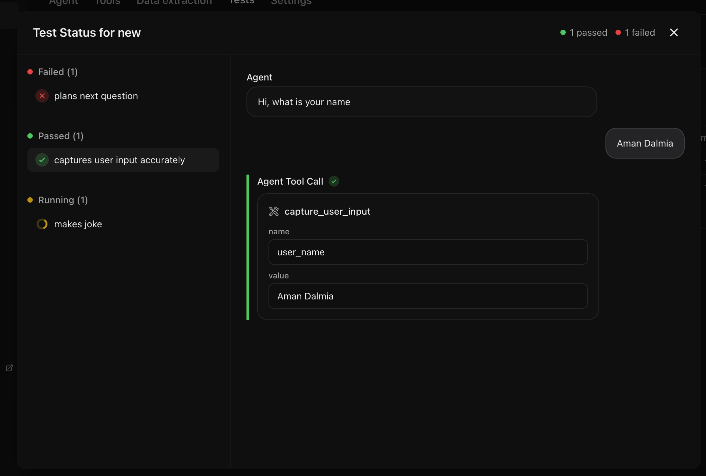
</Frame>

You can view all the past test runs for that agent and their results.

<Frame>
  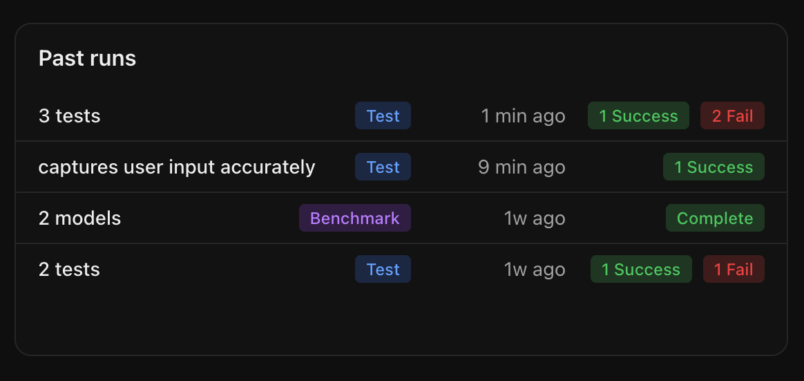
</Frame>

## Find the best LLM for your agent

The tests above are run using the LLM configured for that agent. But it may not be the optimal model for your use case. You can compare the performance of different LLMs on your tests by clicking the **Compare models** button.

<Frame>
  
</Frame>

You can select upto 5 models that you want to compare and select **Run comparison** to start the evaluation.

<Frame>
  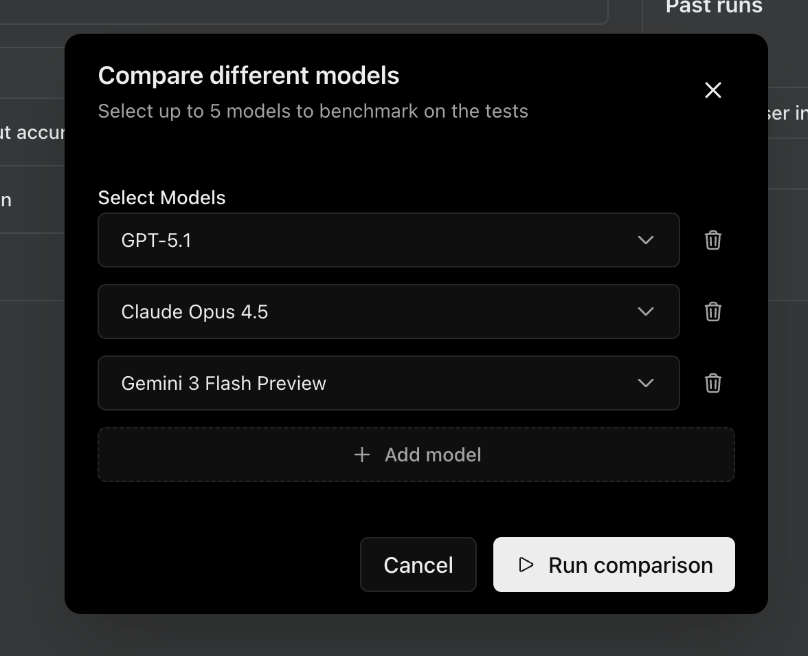
</Frame>

You will see the status of each test for each provider updating as it completes.

<Frame>
  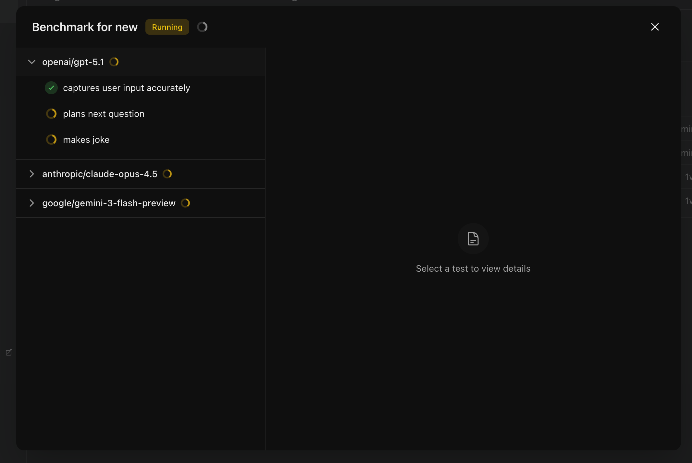
</Frame>

Once the tests for all the providers are complete, a leaderboard will be displayed with the results.

<Frame>
  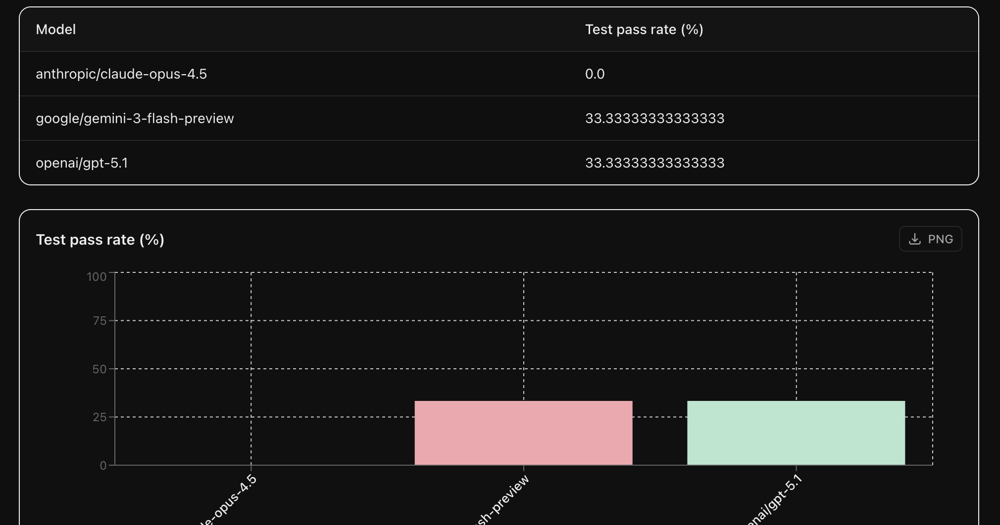
</Frame>

The pass rate for each model indicates the % of tests passed.

## Next Steps

<CardGroup cols={2}>
  <Card
    title="Text to Speech"
    icon="microphone"
    href="/quickstart/text-to-speech"
  >
    Evaluate TTS providers on your dataset
  </Card>
</CardGroup>
